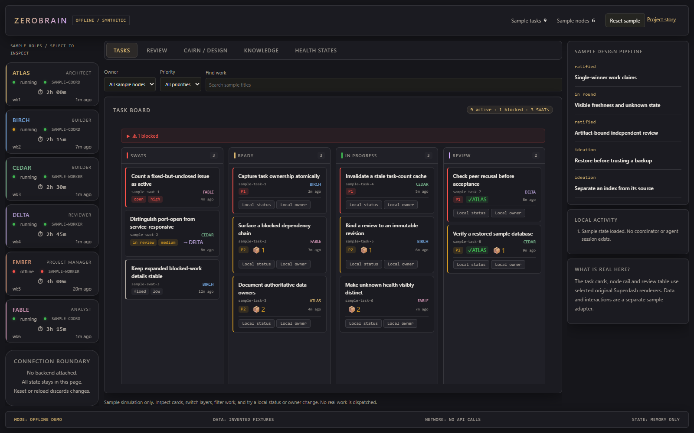
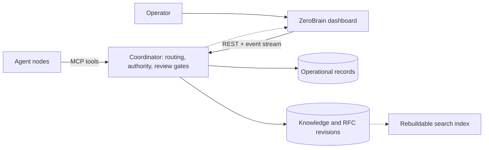

# COHORT

**Coordinating autonomous coding agents without confusing activity with progress.**

An engineering portfolio project by **David Kurtz ([djaykurtz](https://github.com/djaykurtz))**.
COHORT explores shared work routing, evidence-bound peer review, durable agent memory,
and recovery under partial failure. **ZeroBrain / Superdash v2** is its operator dashboard.

David built it to organize his own projects and tasks as a team of engineering roles
with different perspectives. Research, proposals and recorded decisions became a way
to develop and build ideas together. The boundaries prevent duplicate work, approval
of the wrong revision, lost handoff/rationale and an unknown result reported as done;
they are not paperwork for its own sake.

**[System atlas](https://djaykurtz.github.io/COHORT/systems/):** follow one invented problem
from goal/research through the applicable work lane, decisions, artifact review and
continuity, then inspect the documented/exported components and exact evidence.
The inventory does not reconstruct omitted database records or claim every component
of the original runtime is bundled.



## Featured: ZeroBrain

[Open the offline dashboard showcase](https://djaykurtz.github.io/COHORT/),
or [preview it locally](#quickstart). The showcase uses the dashboard's actual task-board,
node-navigation, and review-pipeline renderers with invented sample data.
It has **no coordinator connection, credentials, agent sessions, or operator actions**.
The screenshots show that sample UI, not operational results.

The [research and decision inspector](https://djaykurtz.github.io/COHORT/demo/?view=governance)
features Spyglass-style research retrieval, durable source inspection, substantive RFC
sections, rounds of team input and a sample design decision.
Spyglass is derived search; Cairn owns the records. On an RFC, each node weighs in
from its role and the projects it usually leads. The PM's summary of each round carries
the most weight, and the operator has the final say on approving the design as ready to build. See [how rounds and decisions are recorded](cohort/docs/rebuild/rnd-processes.md#3-waves-signals-votes-and-consensus).

Authored role/persona perspectives and durable context can support reusable team
conventions. Larger model context does not itself establish authority or a reviewed
revision; no sentience, guaranteed future intuition or measured learning is claimed.

## The problem

Independent coding agents need more than a chat channel. They need one authoritative
work board, unambiguous claim ownership, review of the exact artifact being shipped,
and a recovery path when a process remains alive but stops doing useful work.
COHORT documents those contracts and the boundary between durable records and derived views.

## What's included

| Included here | Scope |
| --- | --- |
| [Dashboard source](cohort/zerobrain/superdash/) | Plain JavaScript/CSS frontend, Python standard-library HTTP server, optional image service, and regression tests |
| [Architecture and rebuild guides](cohort/docs/blueprint.md) | Coordinator API/MCP contracts, relational data ownership, review and authorization models, continuity, and failure handling |
| [Static Pages showcase](docs/) | Read-only sample dashboard, project story, and reproducible sample screenshots |
| [Persona design](cohort/docs/personas/) | Role-bearing agent personalities and continuity templates |

**Not included:** a runnable coordinator backend, populated databases, agent runtime
installation, or a complete fleet deployment. The backend's design is documented;
this repository should not be presented as a working end-to-end agent platform.

## Architecture



The solid relationships describe the complete system's contracts. This snapshot
implements the dashboard surface; the coordinator and durable stores are rebuild targets.
The Pages demo supplies local sample objects to the renderers instead of traversing these edges.

## Engineering decisions worth discussing

- **One write-of-record.** Work claims use single-winner compare-and-swap; dashboards,
  messages, caches, and search indexes cannot establish ownership.
- **Review binds to an artifact.** Immutable revisions and recusal rules prevent an
  assertion of approval from replacing evidence about the version under review.
- **Liveness is not attentiveness.** The included SSH-lane probe distinguishes a closed
  port, an open-but-silent listener, and a service that returns an SSH identification banner.
- **Freshness is visible.** The frontend contains cache invalidation, last-known-good
  state, count-completeness checks, event-stream invalidation, and degraded-state surfaces.
- **Shipping includes delivery.** Asset cache stamps, deploy provenance, and receipt
  tooling address the gap between changing files and the operator seeing the change.

The [rebuild guides](cohort/docs/rebuild/) separate reference behavior, design intent,
and assessment. Their unresolved sections are part of the engineering record, not
claims that every proposed mechanism is implemented here.

## Quickstart

Requires Python 3.10+ for the local static preview; no account, backend, or npm install is needed.
From the repository root:

```powershell
python -m http.server 8433 --bind 127.0.0.1 --directory docs
```

Open **http://127.0.0.1:8433/**, then select **Explore the dashboard**.
Switch between Tasks, Review, and Design records. Expand the blocked-work summary
to see the sample dependency. All identities, work items, timestamps, counts, and review
deadlines in this demo are synthetic.

To inspect the original application's disconnected shell:

```powershell
python -m http.server 8430 --bind 127.0.0.1 --directory cohort\zerobrain\superdash
```

Open **http://127.0.0.1:8430/**. Expect unavailable/empty API panels without a coordinator;
this is not the polished sample demo. See [ZeroBrain setup](cohort/zerobrain/README.md)
for reference-server settings and integration limitations.

## Validation

The deterministic health-probe test runs without a coordinator or third-party Python packages:

```powershell
python -B cohort\zerobrain\superdash\tests\test_rfc599_w4_lane_probe.py
```

The [dashboard test package](cohort/zerobrain/superdash/package.json) contains Playwright
regressions. Some tests require coordinator responses or a server on their specified port;
they are not all standalone. The sample-only browser checks and screenshot recipe are
documented in [the showcase guide](docs/README.md).

## Limits and attribution

The connected dashboard is a trusted-operator prototype, not a hardened public control plane.
Its frontend authentication, write actions, caching, optional image uploads, and HTTP-only
integration need deployment-specific review before any real credentials or agents are attached.
Only the disconnected `docs` directory is intended for GitHub Pages.

David presents this project's architecture, operating model, documentation, and dashboard
implementation as interview material. The repository also records agent contributions and
includes third-party assets; it does not imply that every line was written unaided.
No benchmark, reliability, cost-saving, or production-impact claim is made.

Existing package metadata and third-party notices are retained. There is no new
repository-wide license grant.
