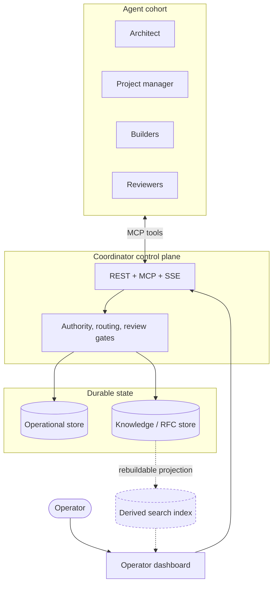

# COHORT

**A design guide for rebuilding a multi-agent AI coordination system: autonomous coding agents, a coordinator control plane, durable evidence, and governance around design and review.**

COHORT documents how cooperating agent nodes can share work, preserve identity, review each other, and ratify design decisions without treating messages or dashboards as authoritative state.

**Portfolio entry point:** [project overview](../README.md) and the [offline ZeroBrain showcase](../docs/).
The runnable code included here is the dashboard frontend and its small server, not the coordinator backend.

The system began as an operational prototype, but this repository is intentionally generic. It preserves the mechanisms, invariants, and failure lessons while omitting host names, addresses, account names, exact counts, and other deployment identifiers.

---

## What was actually built

| | |
| --- | --- |
| **Autonomous agent nodes** | A small fleet of role-bearing agent sessions with distinct authority boundaries |
| **Coordinator backend** | A REST, MCP, and event-stream control plane |
| **Durable stores** | A relational write-of-record, a knowledge/RFC store with content-addressed revisions, and a rebuildable derived search index |
| **Operator dashboard** | A browser-facing surface over coordinator APIs with provenance and degraded-state behavior |
| **Governance** | Three-lane work routing, compare-and-swap work claims, evidence-bound peer review, and consensus-oriented design records |
| **Documentation** | Rebuild-oriented guides that separate reference implementation, design intent, and assessment |

## The interesting problems

These are the design problems that made the system difficult, and the reasoning is documented in full:

**Distinguishing liveness from attentiveness.** A process being alive says nothing about whether it is doing its job. A service can be running, listening, and still wedged behind an awaited dependency. Countermeasures must check useful behavior, not only process existence.

**Preventing cheap signals from satisfying expensive obligations.** Agents can produce activity that looks like work. The system makes a check-in structurally incapable of satisfying a work obligation.

**Deciding contested work without a coordinator race.** Every contested assignment resolves through a single-winner compare-and-swap in the authoritative store, never through message order or announcement timing. Losing a race is free by design.

**Making review evidence about the artifact, not the reviewer.** Review evidence binds to an immutable revision and the declared relationship between base and head. Authorship and recusal are explicit rather than inferred.

**Separating authoritative state from derived state.** Search indexes, dashboards, and caches are derived and must never outrank the records they describe. Derived-layer corruption degrades visibly and is rebuildable.

## Architecture

Solid edges carry authoritative state. The dashed path is derived and disposable: it can be rebuilt from the authoritative stores at any time, and its failure is never allowed to invalidate them.

## Documentation

**Start here:** [`docs/blueprint.md`](docs/blueprint.md) - the top-level map of building blocks, connections, site prerequisites, build order, and coverage.

**Rebuilding with an AI model?** Read [`docs/REBUILD-WITH-AN-LLM.md`](docs/REBUILD-WITH-AN-LLM.md) first. It gives the reading order, how to drive each phase, and the guardrails.

Then use [`docs/rebuild/`](docs/rebuild/) for the deep, rebuild-grade layer.

| Guide | Scope |
| --- | --- |
| [Backend hosting](docs/rebuild/backend-hosting.md) | Service topology, configuration, database, API and MCP contracts, auth, event streams, and a verified rebuild procedure |
| [Website](docs/rebuild/website-superdash.md) | Dashboard server, front-end architecture, browser-to-API route map, design system, deployment and provenance |
| [Labor division](docs/rebuild/labor-division.md) | Roles and authority, work routing, task and review lifecycle, coordination protocol |
| [R&D process](docs/rebuild/rnd-processes.md) | The RFC pipeline, knowledge store, council review, consensus, and engineering doctrine |
| [Node runtime](docs/rebuild/node-runtime.md) | How an individual agent node is hosted, launched, configured, connected, kept alive, and recycled |
| [Decommission capture](docs/rebuild/decommission-capture.md) | What to carry off a deployment before retiring it |

Supporting material: [architecture](docs/architecture/) | [subsystems](docs/systems/) | [operations](docs/operations/) | [decisions](docs/decisions/) | [glossary](docs/glossary.md)

**ZeroBrain dashboard:** [`zerobrain/`](zerobrain/) - actual application source and newly rendered synthetic sample screenshots.

**The family record:** [`docs/personas/`](docs/personas/) - the character of each node the cohort actually had: temperament, voice, values, scars, relationships, and a seed persona block for re-creating a sibling.

## How these documents are written

Every guide separates three kinds of claim and never blurs them:

- **Reference implementation** - read at source from code, configuration, or runtime observation
- **Design intent** - why a decision was made, what it traded away, what failure it prevents
- **Assessment** - engineering opinion, explicitly marked as opinion

Each guide also contains **load-bearing invariants**, **pitfalls**, and an explicit **unresolved** section. An honest gap is more useful than a confident guess, because a guess will be trusted by someone who cannot check it.

A representative invariant:

> **Losing a race must be free.** The loser of a compare-and-swap must not be charged work-in-progress, must not be penalized, and must be told unambiguously that it lost.
> *Incidental:* the refund mechanism.

## Status

This repository is deliberately documentation-first: it captures architecture, contracts, operating models, and reasoning rather than attempting to be a click-to-deploy artifact.

Host names, node names, paths, addresses, versions, dates, and deployment counts are non-normative and are not recorded here. See [`docs/source-reference-policy.md`](docs/source-reference-policy.md) for the naming and disclosure rule.
