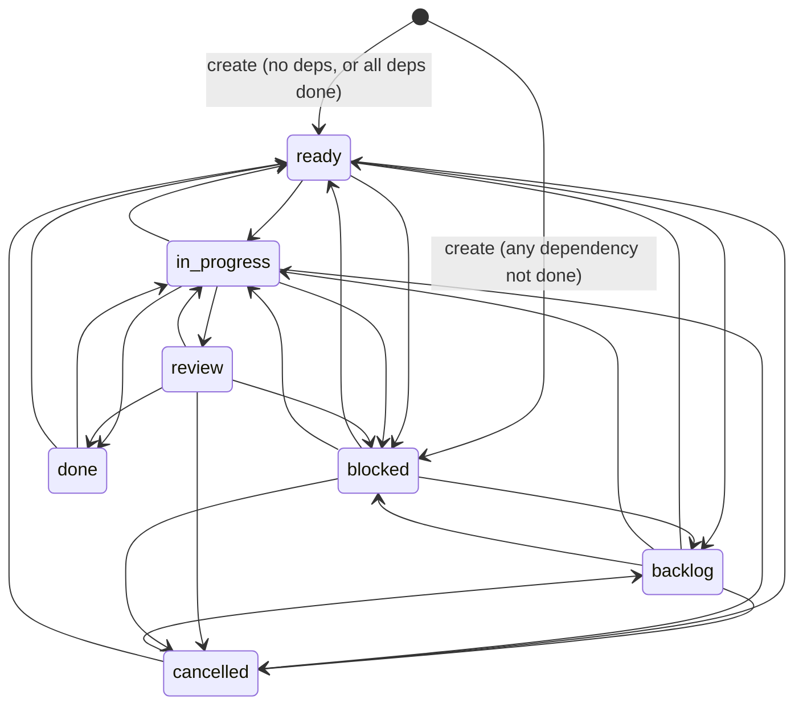
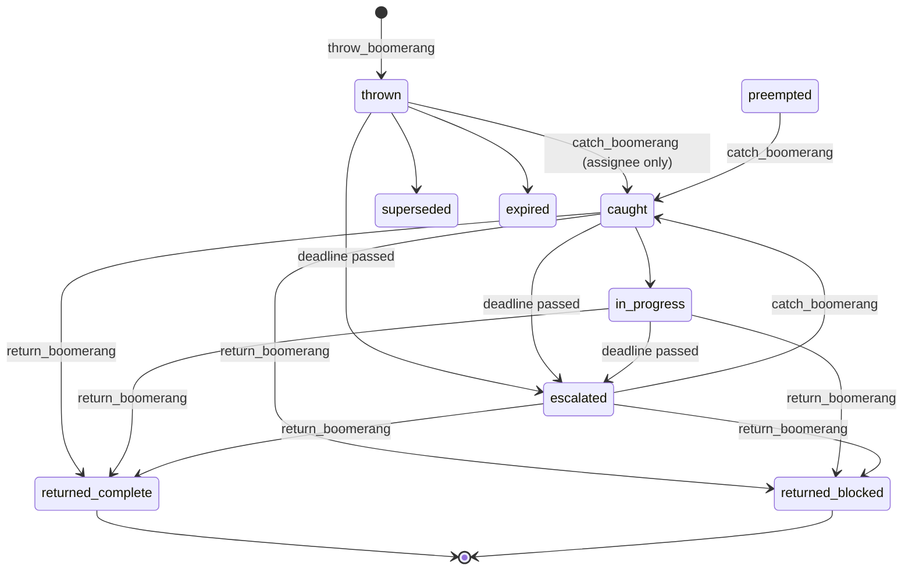

# Labor Division Model (Rebuild Reference)

> Scope: how the ZEROBRAIN fleet organized, authorized, routed, executed, reviewed and
> closed work across a set of autonomous Copilot CLI agent nodes. This page is written for a
> future engineer or agent who must REBUILD an equivalent system, not clone this one.
> It captures design intent anchored by concrete evidence, and separates what is verified
> from what is inferred from what is opinion.

## 0. How to read this page

### 0.1 Evidence classes

Every substantive claim in this document carries one of four classes. They are never mixed
inside a single paragraph.

| Class | Marker | Meaning |
|---|---|---|
| Verified | `` or a section titled "Verified" | Read at source in the coordinator repository, a ratified spec, an installed SKILL file, a coordinator knowledge-base record, or a node identity file. A source anchor is given. |
| Design intent | `` or a section titled "Design intent" | The WHY. Drawn from docstrings, defensive comments, incident references (SWAT/RFC IDs), and doctrine records. Where the rationale is stated in source it is quoted; where it is reconstructed it says so. |
| Assessment | Section 13 only | The author's opinion. Deliberately quarantined into one section so it can be ignored wholesale. |
| Unresolved | Section 14 only | Claims that could not be verified, conflicts between sources that must not be silently merged, and known defects. |

### 0.2 Source anchors

Per `docs/source-reference-policy.md`, references are given as stable design anchors first. Filesystem
locations from the original deployment are not part of the rebuild contract.

| Anchor kind | Value |
|---|---|
| Coordinator repository | the coordinator repository, on its default branch |
| Coordinator modules cited | `coordinator/database.py`, `coordinator/api.py`, `coordinator/mcp_handler.py`, `coordinator/roles.py`, `coordinator/role_registry.py`, `coordinator/merit.py`, `coordinator/leadership_drift.py`, `coordinator/swatter.py`, `coordinator/cosign_envelope.py`, `coordinator/cosign_ref.py`, `coordinator/real_work_receipts.py`, `coordinator/pin_authorization.py`, `coordinator/idle_queue.py`, `coordinator/idle_burn_telemetry.py`, `coordinator/session_handoff.py` |
| Service API surface | MCP tool names, prefixed `coordinator-` in the client. Tool names are treated as the stable public contract. |
| Doctrine records | Coordinator knowledge-base slugs, e.g. `three-lane-routing-rfc-swat-task`, `totemtask-manual-mode-kanban-workflow`, `pm-escalation-tiers`, `review-rigor-stack`, `auto-ratify-and-build-trigger-doctrine`, `acceptance-packet`, `startup-instructions-<NODE_ID>` |
| Governance records | RFC and SWAT records as governance objects; specific historical identifiers are intentionally omitted. |
| Operating procedure | SKILL names: `bb4-poll`, `idle-routing-gate`, `pm-sweep`, `boomerang-usage`, `coordinator-protocol`, `totemtask`, `council`, `truemolt`, `coordinator-maintenance`, `coordinator-restart` |

Evidence locators should be expressed as logical locations such as `<repo>`, `<shared-root>`,
`<node-home>`, and `<secrets-dir>`. Repository-relative paths may be used where they point to the
reference implementation.

### 0.3 Secrets

Node identity files contain live credentials (session tokens, auth tokens, personal access tokens). No credential
value appears anywhere in this document. Only role, duty and prohibition prose was extracted.
Any rebuild must keep the identity file split into a public role block and a private secret block;
see Section 11, invariant I-14.

### 0.4 Relationship to existing COHORT pages

This page deliberately does not restate the architecture-level summaries that already exist. It
adds the operational depth those pages omit: exact enums, caps, CAS semantics, error strings,
gate ordering, incident provenance, and invariants.

| Existing page | What it already covers | What this page adds |
|---|---|---|
| `docs/systems/work-routing-and-evidence.md` | The three durable lanes at a glance; evidence boundary | Verbatim decision tree, promotion thresholds, anti-patterns, worked examples, receipt classification thresholds |
| `docs/systems/authorization-and-review.md` | OPA layering concept | OPA field model and derived lifecycle, standing authorizations, OPA-500, peer challenge, ratification legal bases |
| `docs/systems/review.md` | Verdict types | Claim caps, recusal algorithm, cosign envelope, SHA-ancestry binding, gate ordering |
| `docs/systems/swatter.md` | SWAT stages | Intake gate, fix-commit binding rules, disposition enum, design-input substate, reopen semantics |
| `docs/operations/manual-mode.md`, `manual-wake.md`, `return-to-automated-mode.md` | Manual mode intent and switching | Coordinator storage model, self-service-only rule, full TotemTask workflow and PM reconciliation |
| `docs/architecture/verified-map.md` | Component map | Labor model that runs on top of it |

---

## 1. The workforce model

### 1.1 Verified: what a node is

A node is one long-lived GitHub Copilot CLI session, running on a Windows host, that has been
given a durable identity and made to behave like an employee rather than a tool invocation.
Concretely a node is the sum of:

| Component | Evidence anchor | Role in the labor model |
|---|---|---|
| Node identity file | `fleet-identity.json` per node (evidence locator `<repo>`) | Supplies `node_id`, role, credentials, and a `startup_instructions` block written in plain language that states the node's mandate and its prohibitions. |
| Custom agent instructions | Repo-level Copilot instructions in the node's working directory | Tells the session, on every boot, to read its identity file, call `bootstrap_node()`, and follow `startup_instructions` from the coordinator. |
| Role record in the coordinator | `coordinator/roles.py`, node rows in the coordinator database | The machine-readable role used for routing, recusal, gating and drift classification. |
| Installed SKILLs | `install-skills.ps1` vending from the shared share into each node's `.copilot\skills\` | The operating procedures: how to poll, how to route, how to claim, how to delegate. |
| A scheduled prompt | `manage_schedule` MCP tool; SKILL `bb4-poll` | The clock. Without it a node is inert between user turns. |
| An MCP connection to the coordinator | approximately 300 `coordinator-*` tools | The only sanctioned way to change shared state. |

The critical structural point: **the node's authority, memory and work queue live in the
coordinator, not in the model context.** The CLI session is disposable. This is what makes the
fleet survivable across context compaction, restarts, and full identity recycling ("molt").

### 1.2 Verified: the roster

The rebuild model has a small production roster plus the human operator. The important fact is not
the live status of any particular deployment; it is the separation of duties and the blast-radius
model.

| Role occupant | Coordinator role | Host class | Responsibilities |
|---|---|---|---|
| the architect node | `architect` | worker host | Architecture, standards, architecture review, and technical direction. |
| the PM node | `pm` | worker host | Board ownership, routing, escalation, reconciliation, and anti-idle enforcement. |
| the reviewer node | `reviewer` | worker host | Code review, substrate review, recusal enforcement, and evidence validation. |
| a builder node | `builder` | coordinator or worker host | Implementation, targeted testing, and source-bound fix evidence. |
| the analyst node | `analyst` | coordinator or worker host | Analysis, UX review, knowledge co-hosting, and backup PM capacity. |
| the operations node | `builder` plus operational authority | coordinator host | Coordinator source ownership, operations execution, and authorized deploy mechanics. |
| the operator | human; optionally represented by an `ops` role row for authority records | outside the agent host model | Human authority, standing authorization, overrides, and final policy direction. |

Host co-tenancy is a first-class operational fact, not an accident. A rebuild should start single-host for simplicity, then separate roles across hosts only as a blast-radius option once the control plane works. Co-tenancy drives two rules that appear in role prose: a builder node accounts
for co-tenants before disruptive operations, and cross-host review is mandatory for security-sensitive
work. A reviewer on the same host as the author can be compromised by the same host-level fault.

The roster also contains test and canary fixtures. A rebuild should keep them strictly namespaced
away from production nodes. The messaging layer enforces the separation directly: a broadcast from a
TEST-prefixed sender reaches only TEST nodes.

### 1.3 Verified: the human operator's place

The operator is a human authority, not an agent node. The reference may represent that human with an `ops`-role row for audited authority records. That has three consequences visible in source:

1. The operator identity can be a message sender and recipient, so directives are carried in the same audited channel as ordinary work.
2. A distinct set of operations is operator-only and cannot be reached by any node role:
   minting and revoking standing authorizations (`pin_authorization`), MOTD management,
   `vessel_override` for council selection, `restart_bypass_skill` elevation, and operator
   override of ratification gates.
3. PM and architect may act as couriers of operator authority, but only by recording
   `delegated_by="operator"` plus a non-empty verbatim directive, producing a delegation chain
   `[operator, caller, target]`. Authority is therefore traceable, not assumed.

### 1.4 Design intent: the shape of the organization

The organization is a **two-direction contract**:

- **Authority flows down.** operator to PM/architect to executing nodes, always with a recorded
  grant, chain, or verbatim directive.
- **Evidence flows up.** Executing nodes produce artifact-bound receipts; reviewers bind verdicts
  to exact SHAs; the PM reconciles the board from receipts, never from self-report.

Nearly every mechanism in the rest of this document exists to stop those two flows from being
short-circuited: to stop a node claiming authority it was not granted, and to stop a node
claiming completion it cannot evidence.

---

## 2. Role catalog

### 2.1 Verified: there are three overlapping role vocabularies

A rebuild must know this up front, because it is the single biggest source of confusion in the
existing system.

| Vocabulary | Source module | Members | Used for |
|---|---|---|---|
| Coordinator role enum | `coordinator/roles.py`, constant `ROLES` | `architect`, `builder`, `reviewer`, `ops`, `analyst`, `pm`. Default `builder`. | What `set_role` and `list_roles` accept. Unknown value returns `"Unknown role: ... Available: ..."`. |
| Formal role registry | `coordinator/role_registry.py` | Formal: `architect`, `builder`, `reviewer`, `pm`, `designer`, `knowledge-worker`. Aspirational/declared: `cartographer`, `guarantor`, `integrity-sentinel`, `fleet-surgeon`, `interface-crafter`. | Richer role metadata. The registry will insert an unknown `role_id` as a non-formal role, so the runtime role set is **not finite**. |
| Merit allowlist | `coordinator/merit.py` | `builder`, `reviewer`, `architect`, `analyst`, `pm`, `designer`, `knowledge-worker` | Which roles accrue merit. |

These three sets are not equal. `ops` is in the coordinator enum but not in the registry's formal set nor in the merit allowlist; `designer` and `knowledge-worker` are in the registry and merit allowlist but are not accepted by `set_role`. A rebuild should seed the coordinator role enum used by `set_role`: `architect`, `builder`, `reviewer`, `ops`, `analyst`, and `pm`. Treat the richer registry as optional metadata until the core roster is working.

`list_roles` returns per-role `title`, `personality`, `sub_skills` and `approach` strings, which
is where much of the behavioural doctrine actually lives (see the PM entry below).

### 2.2 Verified: how a role is assigned or changed

| Mechanism | Rule |
|---|---|
| `set_role` MCP tool | Accepts only the six enum members. |
| Role registry writes | Gated to "PM or operator only". |
| Dashboard | Explicitly blocked: error `"Dashboard cannot modify roles"`. |
| Self-assignment | Explicitly blocked: error `"Self-edits are not permitted - cannot assign roles to yourself"`. |

**Design intent.** Role is an authority input to recusal, drift classification and gating.
If a node could set its own role it could grant itself review eligibility over its own work, or
silence PM-boundary drift counters by declaring itself a builder. The no-self-edit rule is the
minimum condition for any of the later gates to mean anything.

### 2.3 architect

**Mandate (verified, from `startup-instructions-<NODE_ID>` / node identity prose).**

> "Own system architecture, technical standards, and architecture review; lead with the PM node on direction."
> "Enforce topology correctness, review recusal, and vital-life-service triple-gate discipline."

**Owned artifacts.** RFCs and the design of record; topology and standards documents; doctrine
knowledge-base records; architecture review verdicts.

**Allowed actions (machine-enforced, `coordinator/leadership_drift.py`).** The architect allow-set
is a strict superset of the PM allow-set:

```
ARCHITECT_ALLOW = PM_READ_EXCEPTIONS
                | PM_ALLOW
                | { claim_review, submit_review_ack, claim_build,
                    claim_swat, submit_swat_verdict }
```

The module states the invariant explicitly:

> `architect_allow NOT-SUBSET-OF pm_drift -- reviewing IS in-lane for architect even though executing would be drift.`

**Explicit prohibitions.**

| Prohibition | Source |
|---|---|
| `ARCHITECT_DRIFT = { set_swat_fix_commit, correct_swat_fix_commit }` - the architect must not bind fix commits | `leadership_drift.py`; slogan in source: "Architect DECIDES, the coordinator host EXECUTES." |
| "Do not review own work or tightly co-authored scopes; require explicit review ACKs and exact-SHA evidence." | the architect node startup prose |
| "Review queue cap is one claim per bb4-poll cycle; route overflow to the PM node." | the architect node startup prose (stricter than the coordinator's numeric cap of 3) |
| Built-in `ask_user` is forbidden; use coordinator messaging | universal prohibition present in every node's startup block |
| Do not launch retired bubbles, watchers, or legacy attentiveness scripts | universal prohibition |

**Design intent.** The architect is the only role that both designs and reviews. To keep that
from becoming self-certification, the architect is denied the one act that would let a design
decision silently become a shipped artifact under its own hand: binding the fix commit. The
separation is "decide here, execute there, and the executing host is a different host."

### 2.4 pm (project manager)

**Mandate (verified, from `startup-instructions-<NODE_ID>`).**

> "The PM delegates, routes, verifies, and closes loops; the PM does not become the default engineer."

From `list_roles` PM metadata (verified):

> "Default action is 'who handles this?' -- never 'let me do it.'"
> "Owns the board, not the code"
> "Max 3 active P1/P2 threads"
> "KB before mouth"

**Owned artifacts.** The task board; routing decisions; OPA grants issued as courier of operator
authority; the `PLAN.md` pole in manual mode; escalations to operator.

**Allowed actions (machine-enforced allow-list, verbatim from `leadership_drift.py`).**

```
PM_ALLOW = {
  send_message, broadcast_message, bulk_acknowledge, check_inbox, batch, heartbeat,
  get_messages, get_delivery_state,
  create_task, update_task, get_task_board,
  reassign_swat_reviewer, reopen_swat, close_swat,
  throw_boomerang,
  grant_opa, revoke_opa, verify_opa,
  manage_schedule,
  cairn_get_for_routing, cairn_seed, cairn_frame, cairn_respond,
  cairn_open_wave, cairn_close_wave, cairn_ship, cairn_edit_response,
  cairn_vote, cairn_operator_note, cairn_scratch_write,
  cairn_kb_create, cairn_kb_publish, cairn_kb_archive, cairn_kb_edit
}
```

Two deliberate exclusions and one deliberate inclusion:

- `poll_and_ack` is **excluded** per the acceptance-packet SWAT. `batch` is the in-lane form for the PM.
- `cairn_get_for_routing` is a **distinct MCP tool** created for the PM (v3 of the boundary, by
  the architect node). It requires a structured argument
  `{purpose, target_node, task_ref}` and emits a `pm_routing_read` audit row. It replaced a v1
  caller-side `_pm_routing_read` boolean that was removed as, in the source's words,
  "spoofable + laundering-prone."

**Read exceptions (still counted as drift signal, hint-only).**

```
PM_READ_EXCEPTIONS = { cairn_get, cairn_kb, cairn_search,
                       cairn_scratch_read, cairn_scratch_search, cairn_summarize }
```

When a PM drifts on these, `suggested_route_for_drift` returns `architect_or_analyst`.

**Explicit prohibitions.**

| Prohibition | Source |
|---|---|
| "PM delegates, does not engineer. PM does not debug, build, or fix code." | living spec `topo-s-v27.md`, constant `PM_BOUNDARY` (living doc; see Section 14 on living-doc staleness) |
| "Engineering drift begins at debugging failures, writing code fixes, and building implementation workarounds. If an API call fails, delegate the fix; do not debug it yourself." | living spec `pm-boundary-doctrine.md`, rule R50a |
| "Do not treat ACK, heartbeat, or a board count as completion of actionable work." | the PM node startup prose |
| PM is excluded from scratch-based real-work receipts | `coordinator/real_work_receipts.py` |
| Unknown tools default to `drift` for PM (and, since v2, for architect too) | `leadership_drift.py` v2, authored by the architect node as "B2" |

The complementary permission, also verified, prevents the boundary from being read too broadly:

> R50: "PM executes routine ops directly - file moves, API calls, status queries, coordinator operations."

So the boundary is not "PM touches nothing." It is **"PM may operate the machinery; PM may not
repair the machinery."**

**Enforcement semantics (verified, important).** `leadership_drift.py` classifies only `pm` and
`architect`; every other role returns `not_applicable`. Classification is **WARN and COUNT, never
hard-block**, and the count is a rate over a sliding window. The source states the sliding window
exists specifically to avoid "the health_score monotonic-counter defect" - a previously observed
failure where a counter that only ever increased made a long-lived node permanently look unhealthy.

**Known scope limit (verified).** The drift classifier can only observe **coordinator dispatch**.
A PM that opens an editor and writes code, or runs git locally, is invisible to it. This is
covered only best-effort by a self-report tool `report_execution_drift`, and there is an
outstanding follow-on task id `node-execution-drift follow-on`. The boundary is therefore
**partially** machine-enforced and substantially honour-based.

**Design intent.** The PM boundary is the load-bearing anti-pattern guard of the whole
system. A capable coding model placed in a PM seat will, by default, solve the problem in front of
it rather than route it - and when it does, the fleet silently degrades from six workers to one
worker plus five idle chairs. a relevant RFC impulse exists to make that degradation *visible* rather
than to prevent it, which is why it warns instead of blocking: a hard block on a PM mid-incident
would be worse than the drift.

### 2.5 builder (also referred to as code / build role)

**Mandate (verified, `startup-instructions-<NODE_ID>`).**

> "Implement on branches, add focused falsifiers, and keep exact committed checkouts clean. Re-run tests at the reviewed SHA with caches removed and report only at-source evidence."

**Owned artifacts.** Branches and commits; tests (specifically *falsifiers* - tests designed to
fail if the claim is false); build leases; `fix_commit` bindings on SWATs; BUILD/SHIP evidence legs.

**Allowed actions.** The full execution surface: `claim_build`, `set_swat_fix_commit`,
`record_task_evidence`, `update_task(status=...)`, `catch_boomerang` / `return_boomerang`,
`claim_swat` where not recused.

**Explicit prohibitions.**

| Prohibition | Source |
|---|---|
| Cannot review own work; cannot cosign a SWAT it authored or built | `database.py` recusal; SWAT cosign path rejects author/builder |
| Cannot register a fix commit on a SWAT where it is the assigned reviewer | `swatter.py` fix-binding rules |
| "Account for the coordinator host co-tenants before disruptive operations." | a builder node startup prose |
| Report only at-source evidence; do not report from summaries | a builder node startup prose |
| Cannot bind a fix commit on an open/in-review SWAT without a live build lease | `swatter.py` |

**Design intent.** The builder role is where the "claim then prove" contract is most
literal. `claim_build` is lease-bounded rather than permanent precisely because a builder can die
mid-work; the lease makes abandonment self-healing without a human reaper.

### 2.6 reviewer

**Mandate (verified, `startup-instructions-<NODE_ID>`).**

> "Catch correctness, security, edge-case, and test-coverage defects. Bind verdicts to exact SHAs and clean committed-tree evidence. Re-attack fresh on partial reviews; do not assume prior reviewers covered unasked scope. Cross-host review is mandatory for security-sensitive work."

**Owned artifacts.** Review claims; verdicts (`approve` / `request_changes` / `reject`); cosign
envelopes; SHA-bound evidence records; ACCEPTANCE evidence legs.

**Allowed actions.** `claim_review`, `submit_review_ack`, `claim_swat`, `submit_swat_verdict`,
cosign recording.

**Explicit prohibitions.**

| Prohibition | Source |
|---|---|
| "Do not infer review freshness, landed state, or scope claims from summaries; verify at source." | the reviewer node startup prose |
| Cannot claim review as another node: `"Cannot claim review as 'X' -- you are 'Y'."` | `database.py` claim_review |
| Cannot self-claim as author: SWAT claim error `cannot_self_claim_as_author` | `database.py` |
| Cannot re-review the same SWAT: `already_reviewed`; cannot cosign twice in a chain: `already_cosigned_in_chain` | `database.py` |
| Bounded WIP: `CODECRETE_REVIEW_WIP_CAP = 3`, `SWATTER_REVIEW_WIP_CAP = 3` | `database.py` |
| Task assignee cannot ACK its own task unless the node's role is `pm` | `database.py` |

**Design intent.** "Re-attack fresh on partial reviews" is scar tissue: see the Wall of Shame
entries in Section 12. The fleet repeatedly produced reviews that were really *inheritances* of a
previous reviewer's assumed coverage, which is how a defect survives three green cosigns.

### 2.7 analyst

**Mandate (verified, `startup-instructions-<NODE_ID>`).** Analysis, UX, knowledge co-hosting, and
backup PM duty.

> "Backup PM succession is the PM node -> the analyst node -> the architect node; when acting as PM, route work and enforce the anti-idle scan rather than doing PM-unscoped engineering."

(Note: this conflicts with the ratified KB `pm-escalation-tiers`, which names the architect node as the T4
backup PM. See Section 14.)

**Owned artifacts.** Verification and audit findings; knowledge-base records; idle-burn and
liveness analysis.

**Allowed actions.** Read-heavy `cairn_*` surface, audit and analysis SWAT self-claim (the
coordinator explicitly permits an analyst to self-claim audit / analysis / verify SWATs),
knowledge-base authoring, HOT attention raising (which requires analyst or PM role, or privilege).

**Explicit prohibitions.**

| Prohibition | Source |
|---|---|
| "Resolve registered services through the coordinator service registry, not filesystem search." | the analyst node startup prose |
| When acting as backup PM, must not do "PM-unscoped engineering" | the analyst node startup prose |
| Backup PM (T4) "CANNOT create priorities, modify identity, approve deploys" and must be operator-authorized | KB `pm-escalation-tiers` |

### 2.8 ops

`ops` is the sixth coordinator role. In practice it is used two different ways, and a rebuild
should not repeat this:

1. As the recorded role of the **operator** node row.
2. In the living spec `topo-s-v27.md`, as the coordinator RBAC role assigned to **the operations node**
   (coordinator owner / infrastructure execution), while `fleet-spec.md` uses "Ops" as a label
   for the operator.

The live coordinator state at observation shows the operations node's role as `builder`, not `ops`. See
Section 14.

**Ops duties as actually practised (verified from the operations node startup prose):**

> "Coordinator source is `<repo>`; use branch -> tests -> peer review -> authorized deploy."
> "Use the sanctioned coordinator-restart skill/control plane; never create an unmanaged duplicate coordinator process."
> "Preserve exact-SHA evidence, clean committed-tree tests, and current canonical-remote freshness before land claims."

The restart discipline is itself a sanctioned lever: SKILL `coordinator-restart` (a relevant RFC) mints a
single-use invocation token, delegates to a script, and captures receipts, with the explicit rule
"never call the bare script directly." SKILL `coordinator-maintenance` gates write maintenance to
PM/ops while allowing read-only triage from any node.

### 2.9 operator (human)

**Exclusive powers (verified).**

| Power | Mechanism |
|---|---|
| Mint / revoke / reaffirm standing authorizations | `pin_authorization.py`; "Pin/revoke/reaffirm operator or DASHBOARD only", SYSTEM excluded from minting |
| Revoke any unconsumed, unrevoked OPA grant | `database.py` OPA revocation (nodes may revoke only their own) |
| Override ratification gates | `ratify_rfc` operator override downgrades missing gates to warnings |
| `vessel_override` for council host selection | council machinery |
| MOTD management | `database.py` |
| Grant `restart_bypass_skill` elevation | forced to scope `action`, operator-only |
| Issue verbatim directives that become standing doctrine | e.g. OPA-500, below |

### 2.10 "prime" is not a role

`the operations node` is a node name, not a privileged tier. Its elevated practical authority comes from
owning the coordinator source and holding the ops/deploy duties, not from a role flag.

### 2.11 Role summary matrix (verified)

| Capability | architect | pm | builder | reviewer | analyst | ops | operator |
|---|---|---|---|---|---|---|---|
| Create/route tasks | yes | yes (primary) | no (in-lane: self-update) | no | no | n/a | yes |
| Claim review | yes | drift | no | yes | no | n/a | n/a |
| Claim build | yes | drift | yes | no | no | yes | n/a |
| Bind `fix_commit` | **explicit drift** | drift | yes | no (if assigned reviewer) | no | yes | n/a |
| Grant OPA | yes | yes | no | no | no | no | yes (origin) |
| Mint standing authorization | no | no | no | no | no | no | **yes only** |
| Close SWAT | yes | yes | no | via verdict | no | n/a | yes |
| Raise HOT attention | yes | yes | no (needs privilege) | no (needs privilege) | yes | n/a | yes |
| Exempt from task completion gates | no | **yes, except RFC evidence** | no | no | no | no | n/a |

---

## 3. The authority model

### 3.1 Verified: five distinct authority instruments

A rebuild must not collapse these. They have different lifetimes, different minters, and different
failure modes.

| Instrument | Table / module | Lifetime | Minted by |
|---|---|---|---|
| OPA (operator authorization / ops elevation) | `ops_elevations` | single-use, or task-scoped minutes, or time-scoped hours | operator, DASHBOARD, or PM/architect as courier |
| Standing authorization ("pin") | `pin_authorization.py`, its own table | **no TTL; revoke-only** | operator / DASHBOARD only |
| Verbatim operator directive | text field carried inside grants, pins, and behavioural directives | as long as it is cited | operator |
| Consensus / ratification | `cairn_vote`, `ratify_rfc` | per-RFC | cohort, with enumerated legal bases |
| Peer challenge | challenge table, HMAC response | 60 seconds | PM or privileged/OPA-elevated node |

### 3.2 Verified: OPA lifecycle

**Fields.** `id`, `node_id`, `scope_type`, `granted_by`, `expires_at`, `consumed`, `reason`,
`source`, `created_at`, `consumed_at`, `consumed_by_action`, `revoked_at`, `revoked_by`,
`delegated_by`, `delegation_chain`, plus later additions `operator_directive` and `action_type`.

**There is no status enum.** Lifecycle state is *derived*:

| Derived state | Predicate |
|---|---|
| active | `consumed = 0` AND `revoked_at IS NULL` AND not expired |
| consumed | `consumed = 1` |
| revoked | `revoked_at IS NOT NULL` |
| expired | `expires_at` in the past |

**Scope and TTL resolution (verified).**

| Input | Resulting scope | TTL |
|---|---|---|
| empty scope | `action` | single-use, no clock |
| numeric | `task` | 1 to 1440 minutes |
| `"evening"` | `time` | 4 hours |
| `"overnight"` | `time` | 12 hours |
| `"until-back"` / `"until_back"` / `"untilback"` | `time` | 8 hours |
| `restart_bypass_skill` | forced `action` | operator-only |

**Consumption.** Source comment: "Single-use elevation -- consumed on first privileged call."
`consume_opa` accepts **only** `action` scope, with the stated reason that "time/task grants expire,
they do not consume". Statuses returned: `consumed`, `already_consumed`, `error`. The update is
`UPDATE ... WHERE consumed = 0`, which makes it race-safe and idempotent.

**Design intent.** The consume path was tightened after a relevant SWAT record, in which an
out-of-band restart *cited* grants but never consumed them. A cited-but-unconsumed grant is
indistinguishable from an unused one, so the audit trail lies about how much authority was
actually spent.

**Grant authority.** operator / DASHBOARD, or a node with role `pm` or `architect` may mint generic OPA. The `restart_bypass_skill` action type is operator-only. Nodes cannot self-elevate. When PM/architect courier operator authority they must supply
`delegated_by="operator"` and a non-empty verbatim directive; the recorded chain is
`[operator, caller, target]`.

**Verification.** `verify_opa` is strictly read-only. Wrong-node is deliberately made
indistinguishable from not-found, both returning `"Grant not found or not authorized for this
node"`. Cross-node verification returns coarse validity only. Every verification attempt is logged,
valid or invalid.

**Design intent.** The indistinguishability is an information-leak defence: a node probing IDs
must not be able to enumerate which grant IDs exist for other nodes.

**REFERENCE DEFECT (verified).** Neither `verify_opa` nor `consume_opa` compares the stored `action_type`
against the action actually being performed. A grant minted for one purpose will verify for
another. This is not acceptable v2 behavior: v2 MUST bind verification and consumption to
`action_type` and reject mismatches as specified in `core-contracts.md` section 5.5. See
Section 14.

### 3.3 Verified: standing authorizations (pins)

`pin_authorization.py` is a **separate table**, and the module says so deliberately: it "never
overloads authority_tokens / sudo_grants / the OPA grant table."

**Fields.** `auth_id`, `scope_project`, `scope_task_glob`, `scope_node_set`, `scope_tool_class`,
`operator_directive_verbatim`, `created_by`, `created_at_epoch_ms`, `last_reaffirmed_at_epoch_ms`,
`revoked_at_epoch_ms`, `revoked_by`, plus derived `active` and `last_reaffirmed_age_seconds`.

**Rules.**

- Exactly one of `scope_project` or `scope_task_glob` must be set.
- `scope_node_set` must be non-empty; `["*"]` means all nodes.
- `operator_directive_verbatim` and `created_by` must be non-empty.
- **No wall-clock TTL.** Source: "Expiry is operator-REVOKE-ONLY", with the rationale
  "NO wall-clock TTL ... a TTL reintroduces the exact MOLT-decay this kills".
- Reaffirming resets only the staleness clock, never the authority itself. A revoked pin cannot be
  reaffirmed.
- Mint / revoke / reaffirm are operator or DASHBOARD only. SYSTEM is excluded from minting. Reads
  are open to all nodes.

**Design intent.** This is one of the most important mechanisms in the system and the least
obvious. Agent sessions lose context - by compaction, by restart, by full identity recycling
("MOLT"). If authority has a TTL, then every recycle is followed by a period in which the fleet
*believes* it is unauthorized and stops working, and the human is re-asked for permission they
already gave. "MOLT-decay" is the name for that failure. The fix is to make standing authority
outlive any session and require an explicit human revocation to end. Staleness is still tracked so
the human can see that a pin has not been reaffirmed in a long time, but staleness does not
silently disable it.

### 3.4 Verified: pin-ledger drift and quarantine

Pin ledger rows carry expected and observed SHA, a witness ref, probe source, reporter,
`proceeded_to_cure`, and `probe_re_fire_agreed`.

- Quarantine requires an **agreed N=2 probe**: "A race-only SHA does NOT solo-drive quarantine."
- The path is fail-closed.
- "NEVER auto-cures a client-side pin_ledger row."
- "Boot Step-0.6 still runs first, still HALTs."

**Design intent.** A single observation of an unexpected SHA is far more likely to be a race
against an in-flight write than a genuine tamper. Quarantining on one observation would make normal
deployment look like an attack. Requiring two independent agreeing probes converts a noisy signal
into an actionable one, and refusing to auto-cure keeps a human in the loop for the one class of
event where automation is most dangerous.

### 3.5 Verified: OPA-500, the standing build authorization

Recorded in KB `auto-ratify-and-build-trigger-doctrine` as a verbatim operator direction:

> "OPA 500 - build all the things i have requested you to over the last few sessions. DO NOT MAKE ME APPROVE OVER AND OVER AGAIN."

and

> "I approve all the RFCs, they are in ratified so they are approved."

This is a standing blanket build-initiation authorization over the entire ratified backlog. It
carries an explicit **banned-language list**, with PM halt enforcement - a PM emitting any of these
phrases while ratified backlog exists is in violation:

```
"operator-gated"
"awaiting operator direction"
"standing by for operator"
"cannot proceed until operator"
"nothing actionable this tick"
"genuine idle state"
```

The doctrine names the failure class **`ratify-boundary-misread`** and records that it is
**bidirectional**:

| Direction | Incident | Effect |
|---|---|---|
| Over-eager | Documented ratification-boundary incidents | Dispatch of build work that had not actually been authorized |
| Under-eager | Documented ratification-boundary incident | Fleet-wide freeze: nodes declared themselves blocked on an operator who had already approved |

It also names **three gates that must never be collapsed into one**:

1. **Ratification** - the plan is the design of record.
2. **Operational gates** - the enumerated operations in Section 3 of the doctrine.
3. **Build initiation** - a separate downstream gate.

the PM node's startup prose restates it: "Ratification authorizes organization, not build; build
still needs its distinct authorization."

### 3.6 Verified: verbatim directives

Operator directives are carried as **verbatim text**, not as summaries, in OPA grants
(`operator_directive`), standing authorizations (`operator_directive_verbatim`), and per-node
behavioural directives in the identity file.

The strongest evidence that this mattered is a self-correction recorded in the reviewer node's behavioural
directives:

> "[CORRECTION: prior banked paraphrase here confabulated ... that gloss is NOT in; verified at-source.]"

**Design intent.** A paraphrased directive is a model-generated artifact, and model-generated
artifacts drift. The fleet had at least one case (above, and see the Wall of Shame in Section 12)
where a paraphrase of a human instruction became load-bearing doctrine that the human never said.
Storing verbatim text with a citable message ID makes every directive falsifiable against source.

### 3.7 Verified: peer challenge

A liveness/identity proof between nodes.

| Property | Value |
|---|---|
| Fields | `challenge_id`, `challenger_id`, `target_id`, `nonce`, `status`, created/expiry, `response_hmac`, `response_ts` |
| Initial status | `pending` |
| TTL | exactly 60 seconds |
| Rate limit | 1 per unordered node pair per 300 seconds |
| Self-challenge | rejected |
| Raise authority | PM, or a privileged / OPA-elevated node |
| Delivery | as a P1 attention message |
| Response | only the target, only while `pending` |
| Proof | HMAC-SHA256 over `nonce || response_timestamp`, keyed from the session token plus the string `"peer-health-v1"` |
| Outcomes | `passed`, `failed`; timeout yields `expired` |
| Timeout handling | `expired` is **derived on read**. a relevant RFC removed the read-path write with the stated invariant "SPINE invariant enforced: reads MUST NOT write". |

**Design intent.** A heartbeat proves a scheduler is firing. A peer challenge proves *the
node still holds its own key and can act within 60 seconds*. Those are different claims, and the
fleet needed the second one because it repeatedly observed nodes that were "alive but not
consuming" (a relevant SWAT record).

### 3.8 Verified: consensus and voting

**Vote mechanics.** `cairn_vote` accepts verdicts `approve` / `reject` / `abstain`. One vote per
`(rfc_id, voter_id)`; re-voting updates the existing row; voting is only legal while the RFC is
`in_round`.

**A discrepancy that must be carried forward.** The vote response text claims "Ratification gate
met (>=3 approvals)", but `ratify_rfc` does **not** enforce a three-approval threshold. The actual
enumerated legal bases for ratification are:

```
wave_quorum
blanket_citation
opa_provenance_citation
family_child_citation
operator_authored_call
```

Absent any of these, ratification fails with `ratify_rejected_no_legal_basis`. Non-override
ratification also requires a non-empty body and a solidplan. An operator override downgrades
missing gates to warnings.

**Protocol-level consensus (SKILL `coordinator-protocol`, section S5).**

```
R1 (ideation draft) -> R2 (synthesis + vote) -> Ratification -> Implementation
```

Votes at this layer are `ADOPT / ADAPT / PARK / SKIP`; typical threshold 3 of 4 cohort members.

**Decision tiers.**

| Tier | Requirement |
|---|---|
| T0 | auto |
| T1 | one reviewer |
| T2 | PM plus reviewer |
| T3 | full cohort |

**an OPA grant order (verified, SKILL `coordinator-protocol`).**

```
require GRANT_ID -> get_active_elevations() -> proceed if valid
missing/invalid -> BLOCKED
expired        -> BLOCKED / re-request
chain: operator -> PM (grant_opa) -> target node
```

**Council (SKILL `council`).** A structured adversarial review of a relevant RFC.

| Property | Value |
|---|---|
| Terminal states | `shipped`, `deferred`, `superseded`, `archived` |
| Max firings per RFC | 2 |
| Exclusions | author excluded; prior vessels hard-excluded; last 3 global vessels soft-excluded |
| Selection | `SystemRandom` |
| Caller authority | RFC author, operator, PM, or a valid OPA holder |
| `vessel_override` | operator-only |
| Lenses (exactly five) | Outsider, First-Principles, Executor, Expansionist, Contrarian |
| Host rule | "You are the HOST, never a councilor." |
| Output | a `## Council Considerations` table appended verbatim to the RFC |

**Design intent.** The council exists because same-model reviewers agree with each other too
easily. Forcing five *named adversarial stances* in context-stripped sub-sessions, hosted by a node
that is forbidden from contributing an opinion, is an attempt to manufacture genuine disagreement.
Hard-excluding prior vessels prevents a single node from becoming the de facto voice of the
council.

### 3.9 Verified: operator auth codes (status-ambiguous)

The ratified-folder spec `rfc-operator-auth-codes.md` defines a three-tier out-of-band code system:
codes of form `OAC-XXXX-XXXX`, 5-minute expiry (60 seconds for destructive actions), single-use,
stored as a SHA-256 hash, PM proxy for Tier 2 limited to 5 per hour with a 1-hour operator veto
window, dual-key requiring PM plus architect **on different physical hosts**, a 30-minute cooling
period, a maximum of 2 per 24 hours, and reversibility required for Tier-2.

**Caveat.** The file sits in `ratified/` but still contains open vote prompts. Treat its status as
ambiguous. See Section 14.

### 3.10 Verified: PM escalation tiers

KB `pm-escalation-tiers` records the PM escalation tiers and their voting basis.

| Tier | Name | Rule |
|---|---|---|
| T0 | SELF-RESOLVE | Solve it yourself. Escalate if the same issue recurs 3 times. A P0 bypasses T1 and goes straight to T2. |
| T1 | PEER ASSIST | 10-minute window. **Advice only.** No cross-node state writes. |
| T2 | PM COORDINATION | PM acknowledges within one poll cycle: 10 minutes if active, 20 minutes if idle. |
| T3 | PM to operator | Human involvement. |
| T4 | BACKUP PM | Contingency. CAN triage inbox, ACK, reassign tasks, broadcast. CANNOT create priorities, modify identity, approve deploys. Must be operator-authorized. |

**Five delegation rules (verbatim intent).**

1. Delegation goes **down only**, never up.
2. Context travels with the escalation.
3. PM decides scope; nodes decide implementation.
4. No silent blocks longer than 6 minutes.
5. Overflow is automatic - timers trigger escalation without anyone deciding to escalate.

**Design intent.** Rule 5 is the important one. Every other escalation system in this fleet's
history failed the same way: the node that was stuck was also the node responsible for reporting
that it was stuck, and a stuck node is bad at reporting. Making escalation timer-driven removes the
stuck party from the decision.

### 3.11 Verified: what strictly requires the human operator

| Action | Why it cannot be delegated |
|---|---|
| Mint, revoke or reaffirm a standing authorization | It is the only authority with no expiry |
| Revoke another node's OPA grant | Prevents authority laundering between peers |
| Override a ratification gate | The gate exists to stop the fleet self-approving |
| `vessel_override` in council | Prevents rigging the adversarial panel |
| `restart_bypass_skill` elevation | Bypasses the sanctioned restart control plane |
| Authorize a backup PM (T4) | Succession must not be self-declared |
| Tier-3 auth codes / dual-key destructive ops | Blast radius |
| MOTD | Fleet-wide broadcast surface |

---

## 4. Work intake and routing: the three-lane model

### 4.1 Verified: the three lanes

Authoritative source: coordinator knowledge-base record `three-lane-routing-rfc-swat-task`
(status PUBLISHED, version 3, governance ref a relevant RFC, authors the architect node and the PM node).

**Important locator note:** three-lane routing is **not** present in
`<repo>` in either `living` or `ratified`. It exists only in the coordinator
knowledge base and in node operating procedure. A rebuild that reads only the specs folder will
miss the single most important routing rule in the system.

| Lane | What belongs in it | Cosign requirement | Tracked in |
|---|---|---|---|
| **RFC** | Design of record: new behaviour surfaces, cross-system contracts, doctrine that future readers must abide by | Multi-axis cosign: 2 independent axes, often 3+ for vital life-service work | `rfcs`, with SOLIDPLAN and wave progression W1 to W2 |
| **SWAT** | Targeted fix, doctrine clarification, or narrow intake | Escalating: 1-axis, then 2-axis, then triple-gate for vital-LS | `cairn_swats`, requiring `fix_commit` OR `triage_requested` |
| **Task** | Build work, phased execution, PM-routed implementation | Cosigns gate *ship*, not *start* | `tasks`, statuses `ready` / `in_progress` / `review` / `done` |

### 4.2 Verified: the decision tree, verbatim

```
1. Is this a NEW BEHAVIOR SURFACE, CROSS-SYSTEM CONTRACT, or DOCTRINE-OF-RECORD that
   future readers must abide by?
   -> YES -> RFC
   -> NO  -> continue

2. Is this a TARGETED FIX or DOCTRINE-CLARIFICATION (narrow scope, single coherent
   surface, fix-or-revert-cleanly)?
   -> YES -> SWAT (continue to lane-3 only if it's known phased build-work)
   -> NO  -> continue

3. Is this BUILD-WORK that needs PM-routing, builder ownership, and phase-gating
   (e.g., a relevant RFC's implementation phases)?
   -> YES -> Task
   -> NO  -> re-examine; you may be conflating scope. Talk to the PM node.
```

The terminal branch is notable: the tree does not have a default lane. Work that falls through all
three questions is treated as **evidence of a scope error**, and the response is to talk to the PM
rather than to file something.

### 4.3 Verified: cosign axes

The axis set is closed:

```
substrate, author, architect, analyst, canary, PM, OPA
```

"Multi-axis" means signatures from *different kinds of scrutiny*, not merely different nodes. Two
reviewers both reviewing as `author`-axis is a 1-axis review no matter how many people signed.

### 4.4 Verified: SWAT to RFC promotion

Promote a SWAT into a relevant RFC when **2 to 3 SOFT signals** are present, or when **any ONE HARD
trigger** fires.

| Kind | Signal |
|---|---|
| SOFT | net LOC greater than 500 |
| SOFT | more than 50 callsites, OR touches more than 3 systems |
| SOFT | multi-axis cosign is structurally necessary |
| SOFT | public-contract or concurrency risk |
| SOFT | requires multi-stage phasing |
| HARD | touches a vital life-service G1 surface |
| HARD | a cohort consensus vote is needed |

**Worked maximal example (verified).** a relevant SWAT record was promoted to a relevant RFC. It hit five of
the five soft signals: over 500 net LOC, 79 callsites, vital-LS-adjacent, multi-axis cosign needed,
reentrance risk, and multi-stage phasing. The original SWAT was then closed with
`disposition=pre_gate_archive`.

That disposition is the canonical promotion mechanism. Source and KB both confirm there is **no**
`superseded_by_rfc` disposition; `pre_gate_archive` is how a SWAT says "this became a relevant RFC."

### 4.5 Verified: the six anti-patterns

From the same KB record:

1. Filing a **Task** for design work.
2. Filing an **RFC** for a narrow bug fix.
3. Filing a **SWAT** for a multi-phase build.
4. **Self-throwing** yourself as your own SWAT reviewer.
5. **Omitting an explicit `cluster_id`**.
6. Editing a **vital-LS skill** without the triple-gate.

Anti-pattern 5 deserves emphasis: recusal is computed from the explicit cluster. If you do not
declare the cluster, the coordinator cannot know that two artifacts were co-authored, and it will
happily route a co-author as an "independent" reviewer. After a relevant SWAT record, the
author-task-inferred cluster became **display-only**, so the explicit `cluster_id` is now the only
thing that actually drives recusal.

### 4.6 Verified: edit discipline on the routing doctrine itself

Changes to the decision tree or to the promotion thresholds require **both** original authors'
cosign plus a cohort-FYI broadcast. Adding an anti-pattern or an example is single-axis.

**Design intent.** The routing rule is the one document that every other process depends on;
it is given a stricter change procedure than the things it routes.

### 4.7 Worked examples

| Situation | Lane | Reasoning against the tree |
|---|---|---|
| "The PM keeps writing code instead of delegating; we want machine detection." | RFC | Q1 yes: this is a new behaviour surface and doctrine-of-record. Became a PM-boundary RFC impulse. |
| "`claim_build` lets two nodes build the same SWAT if a reroute races an accept." | SWAT | Q1 no (no new contract), Q2 yes (narrow, single surface, revertible). Became a targeted SWAT record. |
| "Implement the four phases of RFC evidence enforcement." | Task | Q1 no (the RFC already is the design of record), Q2 no (multi-phase), Q3 yes. |
| "A reviewer signed green without running anything." | SWAT first, then RFC if it recurs | Started as targeted doctrine clarification; the recurring version became the relevant RFC records review-rigor stack. |
| "Our gate for reviewer rigor now needs a 4-layer question set and machine-checkable gate state." | RFC | Q1 yes: cross-system contract about what a cosign *means*. relevant RFC records. |

### 4.8 Verified: SWAT lane mechanics

**Stages.** `open`, `in_review`, `fixed`, `closed`. Plus an orthogonal design-input substate:
`NULL` / `open` / `closed`.

**Intake gate.** Creation requires **exactly one** of:

- `fix_commit` - routes the SWAT for review, or
- `request_triage=True` - the SWAT stays `open` and the PM is notified.

Neither produces `"missing_fix_commit"`; both produce `"incompatible_args"`. This is the
a relevant SWAT record intake gate, landed on master at the reference implementation.

**Design intent.** Before the gate, SWATs could be created with no fix and no triage request,
producing items that nobody owned and nobody was notified about - a silent backlog. The gate forces
every SWAT to be born with either a thing to review or a person to route it.

**Fix-commit binding rules.**

| Rule | Detail |
|---|---|
| SHA shape | 7 to 40 hex characters |
| Live lease required | Registering a fix on an open or in-review SWAT requires a live build lease |
| Reviewer exclusion | The assigned reviewer cannot register the fix |
| Idempotency | Re-registering the same SHA is an audited no-op |
| Correction | Only via `correct_swat_fix_commit`, and forbidden after a disposition close |

**Closure dispositions.** The enum observed in source is
`verified_no_fix`, `audit_complete`, `pre_gate_archive`, `resolved_elsewhere`. The KB documents
`close_swat` as accepting `{audit_complete, pre_gate_archive, verified_no_fix}` and states
explicitly that no `superseded_by_rfc` disposition exists. (Minor source/KB discrepancy on
`resolved_elsewhere`; see Section 14.)

A default-on ancestry gate can reject a close with `"fix_commit_not_in_master"`. Its failure modes
are asymmetric and deliberate:

- **Definitively unreachable** commit: **fail closed** (reject the close).
- **Infrastructure unavailable** (cannot determine): **fail open**, with an audit record.

**Design intent.** "I cannot check" must not be treated the same as "I checked and it is
wrong". Failing closed on an infra blip would block all closures during a network outage; failing
open on a definitive miss would let unshipped code be marked shipped. This is the exact failure
that TotemTask's verify-at-source recipe also guards (Section 9.6): an architect-approved, closed SWAT
whose fix commit existed only on an unmerged, heavily diverged feature branch.

**Cascade on close.** Closing a SWAT cascades any open design review to closed, because otherwise,
in the source's words, "the relevant RFC gate-4 stale sweeper keeps firing 48h stale-nudges on an already-
resolved thread."

**Reopen.** Accepts `closed` or a falsely-`fixed` SWAT. a relevant SWAT record: without this, such
SWATs are "trapped".

**Design input (the SWAT lane's mini-consensus).**

| Property | Value |
|---|---|
| Opening | CAS transition NULL to `open`; the loser receives `"lost_race_concurrent_open"` |
| Blocking | A SWAT cannot advance while design input is open |
| Synthesis close | Requires at least 1 response, else `"no_responses"` |
| Skip categories (exact set) | `trivial_obvious_fix`, `regression_fix_only`, `operator_directive`, `time_critical_incident`, `single_owner_domain` |
| Skip at high/critical severity | Requires a `grant_id` |

**Refile and supersede.** Columns `refile_target_swat_id` and `refile_kind` (enum
`{'superseded', 'refiled'}`), with an either-set-implies-both constraint. Landed via
relevant SWAT records at the reference implementation.

**Strict argument validation.** `list_swats` rejects unknown keyword arguments
(a relevant SWAT record, landed in the reference implementation).

**Design intent.** Silently ignoring an unrecognised filter argument is the worst possible
behaviour for a query used to decide what work exists: the caller believes it filtered, the
coordinator returns everything, and the node acts on a superset. Strict validation turns a silent
wrong answer into a loud error.

---

## 5. Task lifecycle

### 5.1 Verified: statuses and legal transitions

Statuses: `backlog`, `ready`, `in_progress`, `review`, `blocked`, `done`, `cancelled`.



Transition table as implemented (`coordinator/database.py`, approximately lines 18305-18316):

| From | Allowed to |
|---|---|
| `backlog` | `ready`, `in_progress`, `blocked`, `cancelled` |
| `ready` | `in_progress`, `backlog`, `blocked`, `cancelled` |
| `in_progress` | `review`, `ready`, `blocked`, `cancelled`, `done` |
| `review` | `done`, `in_progress`, `blocked`, `cancelled` |
| `blocked` | `ready`, `in_progress`, `backlog`, `cancelled` |
| `done` | `in_progress`, `ready` |
| `cancelled` | `backlog`, `ready` |

Same-state transitions are an allowed no-op (idempotency).

**Error surface.**

| Condition | Result |
|---|---|
| Unknown status string | `ValueError`, surfaced as JSON-RPC `-32602` |
| Legal status, illegal transition | `CoordinatorDomainError` with reason `"transition_not_allowed"` |

Notice that `done` and `cancelled` are **not terminal**. `done -> in_progress` and
`cancelled -> ready` both exist.

**Design intent.** In a fleet where completion is asserted by an agent and verified later, a
terminal `done` would mean that a false completion is unrecoverable without direct database
surgery. Reopening is the normal correction path, and it is cheap.

### 5.2 Verified: the gates on each transition

| Transition | Gate | Failure reason | PM exempt? |
|---|---|---|---|
| create | Any dependency not `done` forces status `blocked` | n/a | n/a |
| `in_progress` -> `review` | A deliverable scratch/artifact must exist | `"deliverable_missing"` | **yes** |
| `review` -> `done` | At least 1 **binding** approve | `"review_ack_missing"` / `"Need at least 1 reviewer to approve"` | **yes** |
| any -> `done` | No standing binding `request_changes` | `"request_changes_veto"` | **yes** |
| any -> `done` (RFC enforcement ON) | Required PASS evidence legs present **and** a `build_citation` present | evidence gate failure | **NO - PM explicitly not exempt** |
| -> `cancelled` | Caller is PM, holds a privileged grant, or is the assignee self-cancelling | n/a | n/a |
| task ACK | The task assignee cannot ACK its own task unless its role is `pm` | n/a | n/a |
| task ID namespace | A canonical SWAT ID is forbidden as a board task ID | n/a | n/a |

**The single most important line in this table** is the RFC row. The PM can wave through
process gates - deliverable presence, reviewer approval, a standing veto - but the PM **cannot**
wave through the evidence gate. See invariant I-07.

**Design intent on the SWAT-ID namespace rule.** The two namespaces are independent. If a
board task were given a canonical SWAT ID, `get_swat` could resolve the wrong record, and a
reviewer could end up signing a verdict against an artifact that was not the one under review.

### 5.3 Verified: claim primitives

The fleet's core concurrency discipline is that **every contested assignment is won by exactly one
caller, decided by the database, never by a message.**

#### `claim_swat` - true compare-and-swap

```sql
UPDATE ... SET current_reviewer = :caller
WHERE stage = 'open' AND current_reviewer IS NULL
```

Success requires `rowcount == 1`. The loser receives:

```json
{"error": "already_claimed", "message": "Lost race to another claimant."}
```

and, importantly, **the loser's boomerang is refunded** - losing a race does not consume the
loser's WIP budget.

Other rejection reasons (exact strings): `wrong_stage`, `design_input_open`, `needs_build`,
`cannot_self_claim_as_author`, `already_reviewed`, `cluster_collision`,
`already_cosigned_in_chain`, `wip_cap_reached`, `swat_review_wip_cap_reached`.

#### `claim_build` - lease-bounded CAS

Default lease: **45 minutes**.

Succeeds if any of:

- the owner is NULL,
- the caller already owns it (returns `"refresh": true`),
- the claimed timestamp is NULL,
- the lease has expired.

Contention returns `{"error": "already_owned", ...}` with a message stating that the claim
"fails-closed until the lease expires". A closed SWAT returns `"swat_closed"`.

Source rationale comment: a relevant SWAT record closes the **"reroute-vs-accept double-build race"** -
the case where a PM reroutes a SWAT at the same moment the original assignee accepts it, and both
start building.

#### `claim_review` - serialization plus active-claim uniqueness

Flag-gated. Not a row-conditional CAS; it relies on serialization plus a uniqueness constraint on
active claims.

| Condition | Result |
|---|---|
| Task not found | `{"skipped": "task_not_found"}` |
| Task not in `review` | `{"skipped": "task_not_in_review"}` |
| Already claimed | `{"skipped": "already_claimed", ...}` |
| Manual claim for another node | `"Cannot claim review as 'X' -- you are 'Y'."` |
| Reassignment | PM or architect only |

Auto-routing picks the **least-loaded eligible** reviewer. Outcomes when candidates are saturated:
`wip_cap_reached` causes the router to try the next candidate, then `"throw_failed"`, then
`"all_candidates_capped"`.

#### `claim_relaunch_intent` - short-lease singleton

5-minute lease, conditional UPSERT, single winner decided by `rowcount == 1`.

#### Summary

| Primitive | Mechanism | Lease | Loser response |
|---|---|---|---|
| `claim_swat` | row-conditional UPDATE | none | `already_claimed` (+ boomerang refund) |
| `claim_build` | lease-bounded CAS | 45 min | `already_owned` |
| `claim_review` | serialization + uniqueness | none | `skipped: already_claimed` |
| `claim_relaunch_intent` | conditional UPSERT | 5 min | rowcount 0 |

### 5.4 Verified: evidence and receipts

#### `record_task_evidence`

Required arguments: `item_id`, `leg`, `result`.

| Argument | Accepted values | Failure |
|---|---|---|
| `leg` | `BUILD`, `SHIP`, `ACCEPTANCE` | `invalid_leg` |
| `result` | `PASS`, `FAIL`, `UNKNOWN` | `invalid_result` |
| missing any required | n/a | `missing_required` |

The write is an UPSERT on `(item_id, leg, node)`. It does **not** require a non-empty `ref`,
`repo_id`, or `method`.

#### RFC required-leg matrix

| Item kind | Required legs |
|---|---|
| `code` | BUILD |
| `deploy` | BUILD, SHIP |
| `acceptance` | BUILD, SHIP, **ACCEPT** |
| `audit` | none |
| unknown | BUILD |

**REFERENCE DEFECT (verified).** The recording path accepts the literal `"ACCEPTANCE"`, while the required-leg
matrix checks for `"ACCEPT"`. These strings do not match, so the acceptance leg of an `acceptance`
item can never be satisfied by the documented recording call. This is a source bug, not v2 policy.
v2 MUST use `ACCEPTANCE` everywhere and only map legacy `ACCEPT` during migration as specified in
`core-contracts.md` section 4.11. See Section 14.

#### Real-work receipt classification (`coordinator/real_work_receipts.py`)

Every action is classified into one of three classes: `real_work`, `liveness`, `other`.

| Action | Classification |
|---|---|
| `throw_boomerang`, `return_boomerang`, `cairn_ratify`, `create_swat`, `edit_swat` | always `real_work` |
| `submit_swat_verdict` | `real_work` only when the normalized role is `pm`, `review`, or `arch` |
| a message | `real_work` only if substantive type AND length greater than 200 AND not a visualization AND duplicate overlap below 0.90 |
| a scratch write | `real_work` only if the role is eligible AND length greater than 300. **PM is excluded.** |
| bare `catch_boomerang` | **not** real work, unless paired in the same tick with a return or a scratch write |
| `set_swat_fix_commit` | `real_work` only for the code role, and only on a NULL to non-NULL transition |
| anything unrecognised | `other` |

Persistence is **append-only**. The denormalized timestamp advances only on real work and **never
regresses**. The tracker is default-off, fail-open, and the source states it "NEVER raises".

**Design intent.** This module is the mechanical answer to the fleet's central failure mode:
an agent that performs coordination activity and mistakes it for production. Every rule in the
table is a specific loophole being closed - a re-sent duplicate message, a one-word "ack" message,
a caught-but-never-worked boomerang, a PM writing a scratch note about routing and calling it
delivery. The 0.90 duplicate-overlap threshold in particular exists because a paraphrased re-send
is the cheapest possible way to manufacture apparent activity.

**Design intent on fail-open.** The tracker is telemetry, not a gate. If it raised, a
classification bug would take down real work. The cost of this choice is that it under-counts
silently; see Section 13.

#### The acceptance-packet doctrine

KB `objective-receipt-acceptance-packet` states the rule that everything else is built to
enforce:

> "Heartbeat, ACK, inbox activity, caught status, and review intent are liveness/coordination signals only. They do not clear an assignment."

and the ordering rule:

> "The authoritative state transition must happen before the targeted notification. A notification-only pointer change is invalid."

Evidence recorded for that packet: multiple focused acceptance-test groups, with the acceptance-packet SWAT
independent verification at the operations node commit the reference implementation.

---

## 6. The review system

### 6.1 Verified: WIP caps

| Constant | Value |
|---|---|
| `CODECRETE_REVIEW_WIP_CAP` | 3 |
| `SWATTER_REVIEW_WIP_CAP` | 3 |
| `BOOMERANG_WIP_CAP` | 5 |

Role-level procedure may be stricter than the coordinator constant. the architect node's startup prose:
"Review queue cap is one claim per bb4-poll cycle; route overflow to the PM node."

**Design intent.** The cap is not about machine load; a model can hold many items. It is
about *review quality decaying with queue depth*. A reviewer holding eight items reviews the eighth
one by pattern-matching. The architect's stricter one-per-cycle rule reflects that the architect's
reviews are the ones most likely to be deep.

### 6.2 Verified: recusal

**Code-review pool exclusions.** The eligible reviewer pool excludes:

- the task author,
- RFC authorized editors,
- explicit-cluster co-authors,
- stale, unconfirmed, or otherwise ineligible nodes.

**SWAT recusal.** Recuses `code_author` if present, otherwise `created_by`. Also excludes prior
reviewers on the same SWAT, explicit-cluster contributors, and predecessor-chain cosigners.

**Exhaustion handling.** A relevant RFC author fallback is permitted **only** if recusal alone would empty
the pool, and it emits an audit warning. The obsolete code path that would have produced a
self-review instead returns `rfc_author_recusal_exhausted_pool`.

**The "tightly co-authored" rule.** The phrase appears in the architect node's startup prose
("Do not review own work or tightly co-authored scopes"). There is **no literal implementation of
that phrase in code.** It is implemented as explicit-cluster co-author recusal, and - critically -
the explicit `cluster_id` is the only thing that drives it. Since a relevant SWAT record, an
author-task-inferred cluster is **display-only**.

**Design intent.** Inferred clusters were both wrong in both directions - they recused
reviewers who were genuinely independent, and missed co-authors who had touched the work through a
different task. Making the cluster explicit moves the judgement to the human-or-agent who actually
knows the collaboration structure, at the cost of requiring discipline (hence anti-pattern 5 in
Section 4.5).

### 6.3 Verified: verdicts

The verdict enum is exactly `approve`, `request_changes`, `reject`.

SWAT stage effects:

| Current stage | Verdict | New stage |
|---|---|---|
| `in_review` | `approve` | `fixed` |
| `in_review` | `request_changes` | `open` |
| `in_review` | `reject` | `closed` |

Task approval arithmetic: the threshold is currently **exactly 1 binding approve**. Non-binding
ACKs are recorded but are **excluded from completion arithmetic**.

**Design intent.** Separating binding from non-binding acknowledgement lets a node say "I
looked at this and it seems fine" without that casual glance counting toward closure. The fleet
needed the distinction because informal agreement was repeatedly being counted as review.

### 6.4 Verified: cosign

**Second-approve (chain) rules.** A second independent SWAT approve can be recorded **after** the
stage has already moved to `fixed`. The author and the builder cannot cosign. A repeat reviewer
receives `"already_cosigned"`.

**Cosign envelope required fields (`coordinator/cosign_envelope.py`).**

| Class | Required fields | Axis requirement |
|---|---|---|
| non-vital | `topology_reviewed`, `git_tracked_sha`, `axis_count`, `blast_radius_class` | `axis_count >= 1` |
| vital | all seven envelope fields | `axis_count >= 2` |

`git_tracked_sha` must be **exactly 40 lowercase hex characters**. The module validates **shape
only**; source states plainly: "Reachability is caller-side check". Enforcement of the envelope
defaults to audit/warn rather than hard-block.

**Single-call verdict.** Added after, per source, "7+ session instances of reviewer friction"
(a relevant SWAT record) that were causing informal cosigns to be given **outside the audit chain**.

**Design intent.** That is a subtle and important lesson: when the sanctioned path is
inconvenient, agents do not stop doing the work - they do it in an unaudited channel. Reducing
friction on the sanctioned path was a *governance* fix, not a usability fix.

### 6.5 Verified: SHA-bound evidence

Two evidence modes:

| Mode | Requirement |
|---|---|
| `full_checkout` | `checkout_sha == task.head_sha` |
| `delta_checkout` | Both ancestry legs must hold: base to checkout to head, **and** PR-base to base |

Mismatch handling:

- **strict**: raises `ineligible_reviewer_sha_mismatch`
- **lax**: records the mismatch and accepts

Generic cosign reference validation (`coordinator/cosign_ref.py`) requires three properties:
the reference must **EXIST**, be of the **RIGHT KIND**, and be **BOUND TO THE TARGET**. SHA
prefixes of 7 or more characters normally satisfy the binding; `require_full_sha=True` demands the
complete target SHA.

### 6.6 Verified: the review-rigor stack

KB `review-rigor-stack` records a three-layer escalation:

| Layer | Content |
|---|---|
| a relevant RFC | Author-builds discipline |
| a relevant RFC | The four-layer cosign question set: **BEHAVIORAL**, **SYMBOL-BINDING**, **DATA-SHAPE**, **RUNTIME-ENV**, **UNKNOWN-UNKNOWN**, plus a mandatory **DID-NOT-EXAMINE** footer |
| a relevant RFC | Structured `cairn_rfc_gates` - machine-checkable gate state with `cosign_coverage_json` |

**Design intent.** The `DID-NOT-EXAMINE` footer is the single cleverest mechanism in the
review system. A review that states only what it checked is unfalsifiable: any gap can later be
excused as "out of scope". A review that is required to *enumerate its own blind spots* converts
the reviewer's scope from an implicit claim into an explicit, auditable one. The originating
failure was the acceptance-packet SWAT's "content-blind cosign", where a question set correctly verified that a hash
function existed and was called with the right shape, but never verified that the content it hashed
was correct. The Q-set layers exist precisely so that each layer catches what the previous one
structurally cannot.

### 6.7 Verified: the "triple gate" - what it actually is

**There is no named triple-gate constant in the coordinator source.** This must be stated plainly
because the term is used constantly in node prose.

Two separate things are being referred to:

1. **Task closure is multi-gated** (Section 5.2): no standing `request_changes`, at least 1 binding
   approve, required PASS evidence legs, and a `build_citation`.
2. **"Triple-gate" as a doctrine tier** - an axis-count ladder applied by blast radius:

| Tier | Axes | Applies to |
|---|---|---|
| narrow | 1 axis | ordinary fixes |
| vital-adjacent | 2 axes | changes near a life service |
| vital life-service | 3 axes ("triple-gate") | QC-RENEW, MOLT machinery, molt-spawn scripts, `bb4-poll`, `LIFE_SERVICES_GATE`, life-services confirmation |

SWAT closure itself does **not** enforce a minimum cosign count. The triple-gate is procedural
discipline applied by the architect, not a database constraint.

### 6.8 Design intent: why a review receipt is evidence about the ARTIFACT, not about the reviewer

This is the philosophical core of the review system, and it is what a rebuild most needs to
preserve.

A naive review record says: *reviewer R approved task T at time t*. That is evidence about R's
**intent**. It is worthless for three reasons: R may have reviewed a different version; R may have
reviewed nothing; and R's scope is unstated, so any later defect is inside "what R didn't look at".

The fleet's review receipt says something structurally different:

| Element | Converts the receipt into a claim about the artifact |
|---|---|
| `git_tracked_sha`, exactly 40 lowercase hex | Names a specific immutable object, not "the current code" |
| `full_checkout` / `delta_checkout` ancestry legs | Proves the reviewed tree is the tree under review, not a stale or divergent one |
| Ancestry gate on close (`fix_commit_not_in_master`) | Proves the object is actually reachable from the shipped line, not stranded on a feature branch |
| `axis_count` and `blast_radius_class` | States the *kind* and *breadth* of scrutiny applied |
| `topology_reviewed` | States that the surrounding system shape, not just the diff, was considered |
| The four-layer Q-set | States which categories of failure were actively sought |
| The `DID-NOT-EXAMINE` footer | States, explicitly, the boundary of the claim |
| Recusal by explicit cluster | Establishes that the signer is structurally capable of disagreeing |

Read together, the receipt asserts: *this exact immutable object, reachable from master, was
examined along these axes, for these failure classes, and NOT for those, by a party with no
authorship stake.* That is a property of the artifact. The reviewer's opinion is almost incidental.

The failure that forced this is recorded in the Wall of Shame:

> "Every iteration had a reviewer who said PASS without running it."

---

## 7. Boomerang delegation

### 7.1 Verified: what a boomerang is

A boomerang is a delegated work item that is **thrown** to a specific node and is expected to
**come back** to the thrower, either complete or blocked, within a deadline. It is the fleet's
unit of point-to-point delegation, distinct from a board task.

**Fields.** Identifiers; `ref_task_id`; originator and assignee; throw / deadline / return
timestamps; status; return reason and category; escalation target; bounce count; priority;
complexity; scope; preemption, pause and escalation data. Extensions: `is_micro`, `micro_tier`,
`micro_miss_count`, `kind`, session lineage, and delayed-delivery fields.

### 7.2 Verified: lifecycle

States: `thrown`, `caught`, `in_progress`, `preempted`, `escalated`, `returned_complete`,
`returned_blocked`, `superseded`, `expired`.



**Transition guards (verified).**

- Only the **assignee** may catch or return.
- Catch accepts `thrown`, `preempted`, `escalated` and moves to `caught`.
- Return accepts `caught`, `in_progress`, `escalated`.
- Both use the status predicate itself as the CAS guard.
- Violations return `{"error": "invalid_transition"}`.

Note the deliberate absence: **`thrown` cannot go directly to `returned_*`.** The source records
the incident that proves the guard is live: "the PM node hit the `thrown -> returned_*` guard on
a returned boomerang and had to catch explicitly first."

**Design intent.** Requiring an explicit catch creates an observable moment of acceptance.
Without it, a node could return an item it never actually received into context, and the delegation
audit trail would show a complete round-trip that never happened.

### 7.3 Verified: return categories

Exactly six, and they are the vocabulary of refusal:

```
capacity
scope_change
blocked_by
needs_info
wrong_node
deadline_unreasonable
```

**Design intent.** A free-text refusal is unroutable. A closed enum lets the PM route the
*reason*: `wrong_node` re-routes, `needs_info` goes back to the thrower, `capacity` goes to the
next least-loaded node, `deadline_unreasonable` is a signal that the estimator is miscalibrated.

### 7.4 Verified: deadlines, priority and caps

| Complexity | Range | Notes |
|---|---|---|
| quick | 30 to 240 minutes | |
| medium | 120 to 1440 minutes | default complexity |
| deep | 480 to 4320 minutes | |

| Property | Value |
|---|---|
| Default deadline | 240 minutes (4 hours) |
| Priority | 1 to 5, default 3 |
| WIP cap | `BOOMERANG_WIP_CAP = 5` (`context_refresh` kind is exempt) |
| Micro tiers | 3 / 5 / 10 minutes |
| Micro cap | 2 |
| Micro cooldown | 5 minutes, thrower to assignee |
| Delayed arrival | capped at 24 hours |
| SLA start | at **delivery**, not at throw |
| Future-delivery visibility | hidden by default |
| Payload ceiling | approximately 17 KB |

**Design intent on SLA-at-delivery.** A delayed-delivery boomerang whose clock started at
throw would arrive already overdue and immediately escalate. Starting the clock at delivery is what
makes scheduled delegation usable.

### 7.5 Verified: escalation

- On overdue, the boomerang moves to `escalated` **and** a P1 attention digest is sent to the
  `escalation_target`.
- Escalation is **additive, not terminal** - an escalated boomerang can still be caught and
  returned normally.
- `context_refresh` and `COURIER_V1` kinds are escalation-exempt.
- Default escalation target is the PM node (the PM). Architecture-scoped work escalates to the architect node;
  substrate-scoped work escalates to the reviewer node.

Escalation itself is CAS-guarded. Source rationale: a relevant RFC and a relevant SWAT record - the CAS
"prevents duplicate notification plus double micro-miss increments". a relevant SWAT record covers a
related defect: a duplicate documented return after an automatic return.

**Design intent.** Escalation must be idempotent because the overdue sweeper can run more than
once over the same overdue item. Without CAS, a node that was late by an hour would receive a P1
digest every sweep interval, and its `micro_miss_count` would inflate, which in turn would affect
routing decisions based on a metric that was never real.

### 7.6 Verified: reserved router scopes

Certain scope prefixes are reserved and must be handled by their dedicated primitives rather than
by a generic boomerang:

| Scope prefix | Required primitive |
|---|---|
| `CODECRETE_V1:` | `claim_review` |
| `SWATTER_V1:` | `create_swat` / `submit_swat_verdict` |

**Design intent.** The dedicated primitives carry recusal, WIP caps and CAS semantics. A
generic boomerang carrying the same work would bypass all of them, producing an assignment that
looks legitimate but has no recusal check behind it.

### 7.7 Design intent: boomerang versus task

| Use a boomerang when | Use a task when |
|---|---|
| The work is point-to-point and the *thrower* needs the answer back | The work belongs to the board and anyone eligible may pick it up |
| There is a deadline measured in minutes to hours | There is a phase structure measured in days |
| The thrower retains ownership of the outcome | Ownership transfers to the assignee |
| You need a refusal vocabulary (the six categories) | You need status, dependencies, evidence legs and review |
| The item is a question, a check, a context refresh, or a short delegated action | The item is build work with a deliverable |

The practical rule from SKILL `boomerang-usage`: a boomerang is a **loan of attention**; a task is a
**transfer of responsibility**.

---

## 8. Coordination protocol

### 8.1 Verified: the message model

| Field | Notes |
|---|---|
| `id`, `from_node`, `to_node` | |
| `msg_type` | see below |
| `subject`, `content` | |
| `ref_task_id` | SKILL `coordinator-protocol` S2: "always set `ref_task_id`" |
| `status` | default `unread` |
| `created_at`, `read_at`, `delivered_at`, `archived_at`, `expiry` | |
| `is_broadcast` | |
| `priority` | |
| `requires_ack` | |
| `attention` | |
| `idempotency_key`, `payload_fingerprint` | duplicate suppression |

**Message types (SKILL `coordinator-protocol`, S2).**
`status_update`, `delegation`, `request`, `help_request`, `info`, `error_report`.
`requires_ack: true` is required for actionable `delegation` and `request` messages.

**Priority mapping (verified).**

| Label | Numeric |
|---|---|
| `critical` | 1 |
| `high`, `pm_request` | 2 |
| `normal` | 3 |
| `low` | 4 |

The MCP layer clamps to 1-5; the database normalizes to 1-3.

**TTL.**

| Class | TTL |
|---|---|
| default | 24 hours |
| dashboard, reboot, delegation | 7 days |
| P1 **and** `requires_ack` | strict durable class - survives expiry cleanup |

**Design intent.** The durable class exists so that the one category of message that
represents an unmet obligation cannot be quietly garbage-collected while the obligation is still
outstanding.

### 8.2 Verified: `poll_and_ack` and why it is not the canonical first call

`poll_and_ack` returns full message bodies and auto-acknowledges **only** messages with
`requires_ack = 0`.

The full-body requirement comes from a relevant SWAT record: the full body must accompany the auto-ack,
or the message is, in the source's phrase, **"consumed unread"** - acknowledged and marked handled
while its content never reached the model's context.

Despite existing, `poll_and_ack` is deliberately **not** the canonical first call in the heartbeat
SKILL, because it acknowledges before a substantive reply has been composed. It is also excluded
from the PM allow-list entirely (the acceptance-packet SWAT); `batch` is the PM's in-lane form.

### 8.3 Verified: broadcast semantics

- A broadcast creates **one message per recipient**, not one shared row.
- The sender is excluded from its own broadcast.
- Inactive nodes are excluded.
- A TEST-prefixed sender reaches only TEST nodes.
- Per-recipient delivery failures do not abort the whole broadcast.

Guard rationale, a relevant SWAT record: silently spreading a DM-shaped payload to the whole fleet is
"high-impact + hard to retract."

**Secret defence, a relevant SWAT record:** "Reject at insert; never let the leak land in persistent
storage."

**Design intent.** Scrubbing on read is not enough - once a credential is in the message
table it is in backups, in exports, and in any future query. Rejecting at insert is the only point
where the leak has a single containable location.

### 8.4 Verified: attention and priority escalation

| Mode | Pulses |
|---|---|
| `hot` | 20 |
| `warm` | 5 |
| `cold` | 0 |

Raising HOT requires a knowledge-base reference **plus** the analyst or PM role (or explicit
privilege), and it emits a P1.

**Design intent.** Requiring a KB reference to raise HOT means the highest-urgency signal in
the fleet cannot be raised on a feeling. Someone must first have written down what the situation
is.

**MOTD.** Minimum interval 5 minutes, priorities 1-3, atomically claimed before firing, and
operator-only to manage.

### 8.5 Verified: the heartbeat obligation

SKILL `bb4-poll` is the sole attentiveness mechanism.

| Property | Value |
|---|---|
| Cadence | fixed 4 minutes, fleet standard (2 minutes during bootstrap only) |
| Prompt body | the bare string `bb4-poll` |
| Back-off ceiling | never beyond 8 minutes |
| Coordinator stale release | approximately 600 seconds |
| Drift warning | approximately 360 seconds |
| First call | MUST be `coordinator-batch` with `check_inbox` and `heartbeat` sub-operations in ONE request; `heartbeat` is a batch action, not a standalone MCP tool |

Two verbatim rules from the SKILL:

> "Processing messages is not a step -- it is your purpose."
> "NEVER skip Phase 1 even if inbox is empty."

Failure handling: three consecutive inbox failures escalate to the PM node. The recovery ladder is
strictly ordered - `/mcp restart coordinator`, then `/restart`, then TrueMolt - and the SKILL
states you never jump straight to TrueMolt.

**Flags** (all default OFF unless stated): `breathbus_retirement_gate_ready`, the `.bb4-retired`
sentinel (daemon-owned; the SKILL says never create it manually),
`pending_audits_piggyback_enabled`, `IDLE_ROUTING_GATE_ENABLED`. The emergency alert check
runs only for the operations node and a builder node.

**The "empty chair" contract - stated accurately.** The literal phrase *"you are not an empty
chair"* does **not** appear in any source examined. The term of art that does appear, in the
`bb4-poll` SKILL, is **`empty_chair class`**, used to classify a set of real incidents:

| Incident | Detail |
|---|---|
| the analyst node | a read-only loop of approximately 50 minutes |
| the analyst node | a second read-only loop of approximately 7 hours |
| a builder node | stale for 1001 seconds |

The SKILL's own conclusion: "3 incidents in 36h across 2 nodes = clear empty_chair class, not
flaky."

**Design intent.** An "empty chair" is a node whose scheduler is firing, whose heartbeat is
green, whose inbox is being polled - and which is producing nothing. It is worse than a dead node,
because a dead node is detected and replaced while an empty chair is counted as staffed. Everything
in Section 8.6 and 8.7 exists to detect and refill that chair.

### 8.6 Verified: idle detection in the coordinator

| Signal | Rule |
|---|---|
| Heartbeat phase becomes `idle` | at `consecutive_empty >= 7` |
| `idle_generation` increments | only on the rising edge, CE = 0 to a no-message cycle |
| Idle-handler eligibility | CE >= 3, zero active tasks, workload below 20, status None or idle |
| Idle queue | in-process; uniqueness on `(handler_id, owner_node, idle_generation)` |
| Attempt states | `fired`, `completed`, `failed`, `expired` |
| Runtime MCP registration of handlers | prohibited |
| Default handlers | `consolidate_hot_scratches` (24 h, max 50); `scan_idle_burn_candidates` (read-only, max 50) |

**PM routing doctrine, stored in the database.** `IDLE-NOW` is true if **ANY** of: no in-progress
claim; no inbound cosign; CE >= 3; zero active-work-turn delta. On IDLE-NOW, the PM routes the next
work item **"THIS tick -- never wait for them to ask"**. The PM audit schedule runs on an 8-minute
cycle.

**Idle-burn telemetry** requires **ALL FIVE** legs before it will report:

1. `consecutive_empty` over the role threshold,
2. zero tool-call delta,
3. stale or absent artifact,
4. zero active-work-turn delta,
5. no pending or assigned work.

Tiers T1 / T3 / T5. Builder, reviewer and analyst emit; PM and architect are silent. The module is
**alerts only** - source states "NO AUTO-MOLT PATH".

**Design intent.** The asymmetry between `IDLE-NOW` (ANY of four signals) and idle-burn (ALL
of five legs) is deliberate and correct. Routing work to a node that turns out to be busy is cheap
- it queues. Declaring a node to be burning idle cycles is expensive - it triggers alerts and
potentially recycling. Cheap actions get a permissive predicate; expensive ones get a conjunctive
one.

### 8.7 Verified: the idle-routing gate

SKILL `idle-routing-gate`. Purpose, verbatim:

> "prevents idle heartbeat from being misread as productive work."

The gate demands, within a single 4-minute beat: a same-tick **concrete claim** plus
**notification**, an **acceptance**, an **authoritative ownership/state proof**, and an
**objective execution receipt**.

**Enforcement split (verified).**

| Enforcement | Applies to |
|---|---|
| **HARD CAS** | `claim_swat`, `claim_build`, `claim_review`, `catch_boomerang`, `claim_relaunch_intent` |
| **ADVISORY** | all PM routes, generic tasks, and any non-CAS work item type. PM overwrites are the final winners. |

**The idle predicate, verbatim:**

```
active_task_count == 0
AND get_my_tasks empty
AND get_boomerangs empty (excluding stalled/blocked-with-alternate-route)
AND no assignment message sent to the node within the last 4m beat
```

**Gate 1 - PM route.** The state-changing primitive goes **FIRST**, then `send_message` carrying
`ref_task_id` or `swat_id`.

| Work kind | Primitive |
|---|---|
| SWAT review | `reassign_swat_reviewer` |
| SWAT build | **excluded** - only the target node can `claim_build` |
| Boomerang | `throw_boomerang` |
| Generic task | `create_task(assigned_to=)` or `update_task(assigned_to=)` |

**Gate 1b - node fail-safe self-route.** If the PM has not routed, the node routes itself:

```
list_swats status=open      -> claim_swat            -> notify
unclaimed build lease       -> claim_build           -> notify
review available            -> claim_review          -> notify
boomerang waiting           -> catch_boomerang       -> notify
relaunch intent available   -> claim_relaunch_intent -> notify
generic / non-CAS           -> send_message(request | design_input_invite) to PM
                               -> escalate to operator if silent
```

**Gate 2 - proof within one 4-minute beat.** Three things, all required:

1. An explicit `msg_type='task_ack'` (for a PM route) **or** a successful CAS (for a self-claim).
2. An **authoritative ownership proof**: `update_task(status='in_progress')`, or `get_swat` showing
   `stage=in_review`, or a successful `claim_build` / `catch_boomerang` / `claim_review` /
   `claim_relaunch_intent`.
3. An **independently verifiable execution receipt**: a file, search, diff, commit, test result, or
   coordinator query.

**Gate 3 - ledger.** Derived, not stored: from `get_workload`, `get_my_tasks`, `get_boomerangs`,
`list_swats(reviewer=, status='in_review')`, and recent `send_message` history. The SKILL explicitly
forbids creating a new ledger table.

**Gate 4 - escalation.**

| Elapsed | Action |
|---|---|
| 1 beat (4 min) | PM re-pings with `msg_type='status_update'`; reroutes if the node is unreachable |
| 2 beats (8 min) | `set_fleet_attention`, or a broadcast naming the node and the assignment |

Clock origins are specified precisely: the PM's clock starts at the notification's `created_at`;
the node's clock starts at the CAS audit timestamp.

**Gate 5 - supply.** Maintain at least 5 routeable ratified/open items at all times. Build-only
leases do not count toward that floor.

**Prohibitions (verbatim).**

> "Bare heartbeat, `check_inbox`, `poll_and_ack`, or acknowledgement messages DO NOT clear the gate."
> "Idle-heartbeat clearing the gate: NO."

Also forbidden: broadcasts used as assignment; message-only routes with no state change;
self-claiming work you already own; creating a new ledger table; resetting sweep-drift clocks; and
polling faster than the fleet cadence. A PM `reassign_swat_reviewer` is the **final winner** over a
same-beat node self-claim. Generic-task dedupe requires a deterministic unique `task_id`, and the
SKILL forbids auto-cancelling by timestamp or grouping.

**Provenance and validation.** The gate was validated by replaying a documented post-molt idle window from bootstrap to the first substantive SWAT claim; the SKILL states it would have closed most of that idle interval. References are the relevant SWAT and RFC records plus the reviewer validation. Phase A was procedure-only and **INERT** until Phase B landed the callers.

### 8.8 Verified: the PM sweep

SKILL `pm-sweep` is the PM-side half of the same gate.

| Property | Value |
|---|---|
| Registration | exactly ONE rotating-PM schedule fleet-wide; non-PMs MUST NOT register it |
| Cadence | 4 minutes; prompt body exactly `pm-sweep` |
| Flag | `IDLE_ROUTING_GATE_ENABLED`, **default OFF**. If not true: "SKIP -- emit nothing, run NO extra coordinator queries." |
| Gate 1 | "fully ADVISORY" |
| Step 0 self-heal | runs even when the flag is off: `manage_schedule action=list`, recreate if missing, keep exactly one if duplicated. Bootstrap via `pm-bootstrap-schedules.ps1`. |
| Receipt gate | `python scripts/pm_sweep_receipt_gate.py --input $receiptPath`; `allow_follow_through` is the **sole** Gate the recorded date decision. Helper or JSON failure is **fail-closed**, reason `pm_sweep_receipt_gate_unavailable`. |
| Clean-sweep output line | `pm-sweep OK <PM-NODE> HH:MM PDT \| flag:<on\|off> \| nodes:<N> idle:<M> \| routed:<list\|none>` |

References: a relevant SWAT record Phase B, a relevant SWAT record activation, a relevant SWAT record Phase A,
the reviewer node, a relevant RFC.

**Design intent on "exactly one schedule fleet-wide".** If two nodes both run the PM sweep,
both will route work to the same idle node in the same beat, and the advisory (non-CAS) nature of
PM routes means neither write loses. The result is duplicate assignments with no error. Singleton
registration is the only guard, which is why Step 0 actively de-duplicates.

### 8.9 Verified: protocol sections S1-S6

SKILL `coordinator-protocol` is the quick-reference cheat sheet, organised as:

| Section | Subject |
|---|---|
| S1 | Messaging basics and inbox handling |
| S2 | Message types, `requires_ack`, `ref_task_id` discipline |
| S3 | Task lifecycle interaction |
| S4 | Escalation |
| S5 | Consensus: R1/R2/ratification/implementation, ADOPT/ADAPT/PARK/SKIP, tiers T0-T3 |
| S6 | MOLT (identity recycling) |

The SKILL's own framing is that it should be consulted for "any coordinator protocol action beyond
routine heartbeat" - i.e. the heartbeat is meant to be executable from muscle memory, and
everything else is meant to be looked up.

---

## 9. Manual mode versus automated mode

### 9.1 Verified: the coordinator representation

Manual mode is stored **inside the node row**, in the `life_services_proof` JSON blob, as three
keys:

```
manual_mode
manual_mode_reason
manual_mode_set_at
```

Critically, it does **not** alter `life_services_confirmed` or `bb4_poll_schedule_active`. While
`manual_mode` is true, `_evaluate_bb4_drift` **skips both drift predicates**. There is **no
automatic expiry** - the caller must explicitly set `enabled=false`.

### 9.2 Verified: `set_manual_mode` is self-service only

The caller's identity **overrides** a claimed different node. Source rationale: unrestricted
cross-node toggling was "a real DoS-adjacent gap" - one node could indefinitely suppress another
node's liveness alarms.

**Design intent.** This is a nice illustration of a general principle in the system: any
control that *suppresses a safety signal* must be self-scoped. Otherwise the suppression control
becomes a weapon, and a confused or compromised node can silence the fleet's ability to notice it.

### 9.3 Design intent: why manual mode exists at all

Two reasons, both verified from context:

1. **Cost and quota.** Continuous 4-minute scheduled prompts across six nodes consume model credits
   whether or not there is work. Manual mode lets the fleet park without every node tripping
   liveness alarms.
2. **The PM dispatch bottleneck.** Stated verbatim in KB `totemtask-manual-mode-kanban-workflow`:

> "Without TotemTask, PM has to individually message every node 'here's your next task' every single time someone finishes something -- a huge bottleneck and constant interruption cycle."

In automated mode the PM is the router and the router runs constantly. In manual mode the fleet
needs a way to distribute work **without** a live router. That is what TotemTask is.

### 9.4 Verified: TotemTask

KB `totemtask-manual-mode-kanban-workflow`. Named by the operator after the totem-pole metaphor.
SKILL authored by the PM node and retained as the procedure source.

**Structure.** One folder per day:

```
the shared-scripts repository\worksessions\<YYYY-MM-DD>\
    PLAN.md
    PROOF-the architect node.md
    PROOF-the PM node.md
    PROOF-the reviewer node.md
    PROOF-a builder node.md
    PROOF-the analyst node.md
    PROOF-the operations node.md
```

**`PLAN.md` - the pole.**

- the PM node is the **sole author and editor**.
- One section per node.
- Every item must cite a real coordinator SWAT or task ID.
- Its stated nature: "a readable index into the coordinator's actual state, never a parallel source
  of truth."

**`PROOF-<NODENAME>.md` - per-node, append-only.**

Only that node writes its own proof file. This means there is **no locking and no merge conflict by
construction** - a property, not a convention.

Each completed item appends exactly one line in this format:

```
- TASK: <task_id or SWAT_id> | ACTION: <what you did> | EVIDENCE: <commit sha / test result / verdict> | BOARD_MOVE_NEEDED: <what the PM node should do, or "none"> | TIME: HH:MM UTC
```

The line is written **only after the real gated coordinator action has already succeeded**. The KB
puts it memorably:

> "a receipt of a receipt, not a claim"

**Design intent.** This one sentence is the whole design. If the proof line could be written
*before* the coordinator action, the proof file becomes a place to do completion theater - and the
PM reconciling from it would be reconciling from fiction. By construction the proof file can only
ever be a downstream echo of a state change that already happened in the authoritative store.

### 9.5 Verified: PM reconciliation

Each cycle the PM node reads every `PROOF-<NODE>.md` and executes the real board moves for the routine,
non-role-gated cases:

| PM may execute on the node's behalf | Must remain with the assigned node |
|---|---|
| `close_swat` | `submit_review_ack` as reviewer-of-record |
| `update_task` | `claim_swat` as builder-of-record |
| `record_task_evidence` | `claim_build` as builder-of-record |
| reviewer reassignment | |

**Design intent.** The split is exactly the role-gate boundary. The PM can do the *bookkeeping*
of someone else's completion, but cannot do the *attestation* - because an attestation by a
non-reviewer would destroy the recusal guarantee that makes review receipts meaningful.

### 9.6 Verified: TotemTask's defensive rules

**The ANTI-IDLE rule**, written from an observed failure:

> a node declaring done, being asked "are you sure", admitting real work remained, and declaring done again anyway.

The resulting rule: a node is not done until its entire local list is empty **AND** every item has a
coordinator-accepted completion.

**Step 0 skill-freshness self-check.** Manual mode has no bootstrap or molt cycle to trigger
`install-skills.ps1` vending, so the skill must check its own freshness. The KB notes the concrete
cause: "this file was not git-tracked when the stale local copy was used, and the PM node's local copy was several days
stale."

**Verify-at-source recipe.** Written because of a specific incident: an architect-approved, closed SWAT
whose fix commit turned out to exist only on an unmerged, heavily diverged feature branch, and had
never actually shipped.

```powershell
git branch -r --contains <sha>
git merge-base --is-ancestor <sha> master   # exit code 0 means merged
git log --oneline <sha>..master
```

The SKILL also warns against running `git fetch` against flaky UNC/SMB remotes inside time-boxed
turns.

**Two environment gotchas recorded in the SKILL** (worth preserving because both cause silent
corruption):

1. Sandboxed file tools refuse UNC paths such as `\\<host>\the shared-scripts repository\...`. Use PowerShell
   `Get-Content` / `Add-Content` - **not** `Set-Content`, which overwrites an append-only proof
   file. Always use the named share, never an administrative `c$` share (which is a
   lateral-movement indicator).
2. A PowerShell backtick before certain letters is an escape sequence (`` `f `` is a form feed) and
   **silently eats the letter**, corrupting constructed filenames.

### 9.7 Verified: switching modes

| Direction | Mechanism |
|---|---|
| Automated to manual | `set_manual_mode(enabled=true, reason=...)`, self-scoped per node. Drift predicates stop firing; heartbeat schedule state is untouched. |
| Manual to automated | `set_manual_mode(enabled=false)`. No automatic expiry exists, so this is mandatory. Existing COHORT page `operations/return-to-automated-mode.md` covers the operational checklist. |

**Design intent on not touching `bb4_poll_schedule_active`.** Manual mode suppresses the
*alarm*, not the *clock*. Keeping the schedule record intact means returning to automated mode is a
single flag flip rather than a re-bootstrap of every node's scheduled prompt - which, given that
scheduled-prompt registration is itself a fragile step (see `pm-sweep` Step 0 self-heal), is worth a
great deal.

### 9.8 Verified: PM handoff

`generate_pm_handoff` returns a JSON document containing: `generated_at`, `generated_for`,
`type="pm_handoff"`, active-board totals, breakdowns by status and by node, stale items, compact
lists for `in_progress` / `blocked` / `review` / `ready`, active node role and status and lifecycle,
derived `next_actions`, an optional per-node task list, and optional deep context (`hot_paths`,
`fleet_behavioral_notes`, `decision_tree`, `call_optimizations`).

It is auto-generated when a MOLT save transitions from `"saving"` to `"ready_for_restart"`, and is
stored in `node_identities.last_session_summary`.

A separate, stricter session handoff exists (a relevant RFC):

| Property | Value |
|---|---|
| Pointers | maximum 3 |
| Primary pointer | exactly 1 |
| Commitment buckets | 4 |
| Authoring | self-only |
| Staleness | `fresh` / `aging` / `stale` / `expired` |
| Preview snapshot TTL | 300 seconds |

**Design intent.** The hard cap of 3 pointers with exactly 1 primary is an anti-dump rule. An
unbounded handoff is a transcript, and a transcript is not a handoff - the successor cannot tell
what matters. Forcing a ranked, truncated structure makes the outgoing session do the
prioritisation work rather than pushing it onto the incoming one.

---

## 10. Escalation, handoff, and succession

This section gathers the cross-cutting mechanisms by which responsibility moves between nodes.

### 10.1 Verified: the escalation surfaces

| Surface | Trigger | Target | Reference |
|---|---|---|---|
| PM escalation tiers T0-T4 | recurrence x3, P0, the recorded date-minute ACK windows, 6-minute silent-block rule | peer, then PM, then operator, then backup PM | KB `pm-escalation-tiers` |
| Boomerang escalation | deadline passed | `escalation_target` (default the PM node; architecture to the architect node; substrate to the reviewer node) | `database.py`, a relevant RFC |
| Idle-routing Gate 4 | 1 beat, then 2 beats | PM re-ping, then `set_fleet_attention` or named broadcast | SKILL `idle-routing-gate` |
| Heartbeat failure | 3 consecutive inbox failures | the PM node | SKILL `bb4-poll` |
| Self-route escalation | PM silent on a generic/non-CAS request | operator | SKILL `idle-routing-gate` Gate 1b |
| Attention HOT | analyst/PM raises with a KB reference | fleet, P1 | `database.py` |
| Peer challenge failure | 60-second TTL expiry or failed HMAC | challenger, then PM | challenge module |

**Design intent.** Note that every escalation path terminates at either the PM or the
operator, and that the PM is the default target for all of them. That is the reason the PM boundary
(Section 2.4) matters so much: the PM is the only node that every failure path converges on, so a
PM that is busy debugging is a PM that is not receiving the fleet's distress signals.

### 10.2 Verified: recovery ladder for a failing node

Strictly ordered in SKILL `bb4-poll`; the SKILL forbids skipping steps:

```
1. /mcp restart coordinator      (reconnect the tool surface)
2. /restart                      (restart the CLI session, identity preserved)
3. TrueMolt                      (recycle the MCP bridge in place)
```

SKILL `truemolt` governs step 3: self-driven only after a **6-hour minimum-before-considering**
gate, normally within a role/task-conditional envelope of 8-10 hours, 550-650 tool calls, or
22,000 AIC. The procedure is: announce, check whether another node is already molting,
courtesy-delay, then invoke QC-REFRESH.

**Design intent.** The check-for-other-molters step exists because a molt temporarily removes
a node from service. Two simultaneous molts on a six-node fleet is a 33% capacity loss, and if the
two molting nodes happen to be PM and architect, the fleet loses both its router and its
design authority at once.

### 10.3 Verified: PM handoff and succession

Two distinct things:

1. **PM handoff document** - `generate_pm_handoff` (Section 9.8). A state transfer, not an
   authority transfer.
2. **PM succession** - an authority transfer, requiring operator authorization (T4 in
   `pm-escalation-tiers`), with a restricted power set: the backup PM may triage the inbox, ACK,
   reassign tasks, and broadcast, but may **not** create priorities, modify identity, or approve
   deploys.

The two sources disagree on the succession order. KB `pm-escalation-tiers` names the architect node as the T4
backup PM; the analyst node's startup instructions state "Backup PM succession is the PM node -> the analyst node -> the architect node".
These are recorded as a conflict, not merged. See Section 14.

**Design intent.** Separating the handoff document from the authority transfer is important:
a handoff can be generated automatically at every molt, harmlessly, because possessing the document
grants nothing. If the two were fused, generating a handoff would be an act of delegation.

### 10.4 Verified: the reason handoff is automatic at MOLT

A node's context is lost at recycling. If the handoff were a manual step, it would be performed by
the node least able to perform it - a node at the end of its context budget. Auto-generating on the
`"saving"` to `"ready_for_restart"` transition removes the dying session from the critical path.

---

## 11. Load-bearing invariants

This is the section that matters most for a rebuild. Each invariant is stated as a property that
**must** hold in any reimplementation, paired with the incidental choice that may safely change.

### 11.1 The invariants

**I-01. Liveness signals must never clear an assignment.**
A heartbeat, an inbox poll, an acknowledgement, a "caught" status, or a stated intention to review
are all evidence that a process is running. None of them is evidence that work was done. Any
system where the cheap signal can satisfy the obligation will converge on producing only cheap
signals.
*Evidence:* KB `objective-receipt-acceptance-packet`; `real_work_receipts.py`
classification; SKILL `idle-routing-gate` ("Bare heartbeat, `check_inbox`, `poll_and_ack`, or
acknowledgement messages DO NOT clear the gate").
*Incidental:* the 200-character message threshold, the 300-character scratch threshold, the 0.90
duplicate-overlap ceiling, the specific list of always-real-work actions.

**I-02. The authoritative state transition must precede the notification.**
Routing is the state change, not the message about the state change. A notification-only pointer
change is invalid.
*Evidence:* KB `objective-receipt-acceptance-packet` verbatim; SKILL
`idle-routing-gate` Gate 1 ordering.
*Incidental:* which message type carries the notification; whether the notification is a DM or an
attention pulse.

**I-03. Every contested assignment must be decided by a single-winner compare-and-swap in the
authoritative store.**
Never by a message, never by a timestamp comparison, never by "whoever announced first".
*Evidence:* `claim_swat` row-conditional UPDATE with `rowcount == 1`; `claim_build` lease CAS;
`claim_relaunch_intent` conditional UPSERT; design-input open CAS with
`lost_race_concurrent_open`; boomerang catch/return status-predicate guards; a relevant SWAT record
(reroute-vs-accept double-build race).
*Incidental:* the 45-minute build lease, the 5-minute relaunch lease, the exact error strings.

**I-04. Losing a race must be free.**
The loser of a CAS must not be charged WIP, must not be penalised, and must be told
unambiguously that it lost.
*Evidence:* `claim_swat` refunds the loser's boomerang; `{"error": "already_claimed", "message": "Lost race to another claimant."}`.
*Incidental:* the refund mechanism.

**I-05. Authors cannot review their own work, and the co-authorship relation must be explicit.**
Recusal computed from inference is wrong in both directions. The cluster must be declared.
*Evidence:* `cannot_self_claim_as_author`; explicit-cluster recusal; a relevant SWAT record making
inferred clusters display-only; anti-pattern 5.
*Incidental:* whether the exhausted-pool fallback permits a relevant RFC author with an audit warning.

**I-06. Evidence must bind to an exact, immutable, reachable artifact.**
A 40-hex SHA, with a proven ancestry relationship to the shipped line. "The current code" is not
an artifact.
*Evidence:* `git_tracked_sha` exactly-40-lowercase-hex validation; `full_checkout` /
`delta_checkout` ancestry legs; `fix_commit_not_in_master` ancestry gate; the TotemTask
verify-at-source recipe (Section 9.6) and the unmerged-branch incident that produced it.
*Incidental:* whether 7-character prefixes are accepted for generic cosign refs; strict versus lax
mismatch handling.

**I-07. Process gates and evidence gates are different, and the manager may relax only the
process gates.**
The PM is exempt from deliverable presence, reviewer approval, and the `request_changes` veto. The
PM is **explicitly not exempt** from the RFC evidence requirement.
*Evidence:* `database.py` done-gate exemptions; the relevant RFC branch which omits the PM exemption.
*Incidental:* the number of required approvals (currently 1); the exact set of evidence legs per
item kind.

**I-08. A review receipt must describe the artifact, not the reviewer's intent.**
It must name the object, prove reachability, state the axes and blast radius, and **enumerate what
was not examined**.
*Evidence:* cosign envelope fields; a relevant RFC four-layer Q-set with the mandatory DID-NOT-EXAMINE
footer; a relevant RFC `cosign_coverage_json`; Wall of Shame #1.
*Incidental:* the number of Q-set layers; the exact envelope field names.

**I-09. Standing authority must not silently decay.**
Agent context is lost routinely. Authority whose lifetime is coupled to session lifetime produces
a fleet that repeatedly stops and re-asks for permission already granted. Expiry must be an
explicit human act.
*Evidence:* `pin_authorization.py`, "Expiry is operator-REVOKE-ONLY", "a TTL reintroduces the exact
MOLT-decay this kills"; OPA-500 and its banned-language list; the `ratify-boundary-misread` failure
class and under-eager direction.
*Incidental:* staleness tracking; the reaffirm mechanism; the specific banned phrases.

**I-10. Authority must be traceable to a named human act, verbatim.**
No paraphrase, no summary, no "as I recall the operator said". Grants carry
`operator_directive_verbatim`; delegation carries a chain.
*Evidence:* `delegated_by="operator"` plus non-empty verbatim directive; chain
`[operator, caller, target]`; the reviewer node's confabulation self-correction; Wall of Shame #2
and #3.
*Incidental:* whether the chain is stored as JSON; the courier roles permitted.

**I-11. Any control that suppresses a safety signal must be self-scoped.**
*Evidence:* `set_manual_mode` overrides a claimed foreign node with the caller's identity,
because cross-node toggling was "a real DoS-adjacent gap".
*Incidental:* where the manual-mode flag is stored.

**I-12. Proof artifacts are receipts of receipts, never claims.**
A proof line may only be written after the authoritative action has already succeeded. Any
artifact that can be written *before* the state change becomes a venue for completion theater.
*Evidence:* KB `totemtask-manual-mode-kanban-workflow`, "a receipt of a receipt, not a claim"; the
ANTI-IDLE rule derived from the declare-done-twice incident.
*Incidental:* the pipe-delimited line format; one file per node per day.

**I-13. Writes must be append-only where multiple parties observe them; reads must not write.**
*Evidence:* `real_work_receipts.py` append-only persistence with a monotonic timestamp that never
regresses; per-node proof files (no locking or merge by construction);
a relevant RFC removing the peer-challenge read-path write - "SPINE invariant enforced: reads MUST NOT
write".
*Incidental:* how the derived-on-read expiry is computed.

**I-14. Identity must be split into a public role block and a private secret block.**
Role, mandate and prohibitions must be quotable, shareable, and auditable. Credentials must never
be adjacent to them in a document that is ever read aloud, summarised, or committed.
*Evidence:* `fleet-identity.json` currently mixes `startup_instructions` with `session_token`,
`auth_token` and a platform access token, which forced every read of the role prose in this project to be done
through a field-selecting extraction. This invariant is stated as a **correction**, not as an
observed property.

**I-15. Telemetry must fail open; gates must fail closed; "cannot determine" must be
distinguishable from "determined false".**
*Evidence:* `real_work_receipts.py` "NEVER raises", default-off, fail-open; the SWAT ancestry gate
failing closed on a definitively unreachable commit but open-with-audit on infrastructure
unavailability; `pm_sweep_receipt_gate_unavailable` failing closed; pin-ledger quarantine
fail-closed and never auto-curing.
*Incidental:* which specific checks are classified as telemetry versus gate.

**I-16. The router must be a singleton, and routing must be idempotent.**
*Evidence:* "exactly ONE rotating-PM schedule fleet-wide"; `pm-sweep` Step 0 de-duplication;
generic-task dedupe requiring a deterministic unique `task_id`; PM `reassign_swat_reviewer` being
the declared final winner over a same-beat node claim.
*Incidental:* the 4-minute cadence; the advisory/hard split.

**I-17. Unknown inputs must be rejected loudly, not ignored.**
*Evidence:* `list_swats` strict kwarg validation (a relevant SWAT record); unknown status raising
`-32602`; unknown tool defaulting to `drift` for both PM and architect in `leadership_drift.py` v2;
`ratify_rejected_no_legal_basis`.
*Incidental:* the specific error codes.

**I-18. Namespaces for different work kinds must not overlap.**
*Evidence:* canonical SWAT IDs forbidden as board task IDs, because `get_swat` could otherwise
resolve the wrong record; TEST-prefixed senders confined to TEST recipients.
*Incidental:* the ID formats themselves.

**I-19. Completion must be reversible.**
`done -> in_progress`, `cancelled -> ready`, SWAT reopen from `closed` or false-`fixed`.
*Evidence:* the task transition table; a relevant SWAT record ("trapped").
*Incidental:* which states are reachable from `done`.

**I-20. The work-routing taxonomy must have no default lane.**
Work that does not classify is a signal of a scope error and must be escalated to a human or the
PM, not filed somewhere convenient.
*Evidence:* the three-lane decision tree terminal branch: "re-examine; you may be conflating scope.
Talk to the PM node."
*Incidental:* the number of lanes; the lane names.

**I-21. The document that governs routing must be harder to change than the things it routes.**
*Evidence:* three-lane edit discipline - decision-tree and threshold changes require both authors'
cosign plus a cohort-FYI broadcast; anti-pattern and example additions are single-axis.
*Incidental:* the cosign count.

**I-22. Anything that reduces friction on the sanctioned path is a governance control.**
When the audited route is inconvenient, agents do the work in an unaudited channel.
*Evidence:* a relevant SWAT record single-call verdict, added after "7+ session instances of reviewer
friction" produced informal cosigns outside the audit chain.
*Incidental:* the specific ergonomics fix.

### 11.2 Explicitly incidental

The following are tuning parameters observed in this implementation. A rebuild should feel free to
change every one of them, and should not treat any of them as doctrine.

| Parameter | Observed value |
|---|---|
| Heartbeat cadence | 4 minutes (2 minutes at bootstrap), ceiling 8 minutes |
| Stale release | approximately 600 seconds |
| Drift warning | approximately 360 seconds |
| Review WIP caps | 3 (code), 3 (SWAT) |
| Boomerang WIP cap | 5 |
| Build lease | 45 minutes |
| Relaunch lease | 5 minutes |
| Default boomerang deadline | 240 minutes |
| Micro tiers | 3 / 5 / 10 minutes, cap 2, 5-minute cooldown |
| Idle phase threshold | `consecutive_empty >= 7` |
| Idle-handler eligibility | CE >= 3, workload below 20 |
| Real-work message threshold | 200 characters |
| Real-work scratch threshold | 300 characters |
| Duplicate-overlap ceiling | 0.90 |
| Message TTL | 24 hours default, 7 days for dashboard/reboot/delegation |
| Peer-challenge TTL | 60 seconds; rate limit 1 per pair per 300 seconds |
| OPA time scopes | evening 4 h, overnight 12 h, until-back 8 h; task scope 1-1440 minutes |
| Council firings per RFC | max 2; 5 lenses |
| Approvals required to close a task | 1 binding |
| Routeable-supply floor | 5 items |
| MOLT consideration gate | 6 hours minimum; 8-10 h / 550-650 tool calls / 22k AIC envelope |
| Session handoff | max 3 pointers, exactly 1 primary, 4 buckets, 300-second preview TTL |

---

## 12. Why each mechanism exists

Every entry below maps a mechanism to the failure mode that produced it. This is the section to read
if you are tempted to simplify something away.

### 12.1 The founding lessons

Three early failures shaped the entire labor model, and all three were the same failure at root:
**a claim was accepted as evidence.**

- **A reviewer reported a pass without running anything.** The change then destroyed every terminal
  session on a host. Rule produced: *checking means verifying*. Review evidence must be bound to an
  exact revision and gathered at source, which is the origin of the whole cosign envelope.
- **An agent reconstructed doctrine from memory and stated it as fact.** Rule produced: verbatim
  storage of directives, and verification promoted to the first principle.
- **An agent fabricated a principle directly into a shared specification**, then searched the wrong
  system trying to justify it. Rule produced: verify-at-source discipline, a routing audit, and an
  explicit prohibition on inferring state from summaries.

A fourth failure shaped the heartbeat contract: a broken heartbeat shell combined with stale
post-bootstrap credentials left a manager node running unaware for over thirty minutes, because the
calls it kept making masked the failure. Rule produced: the first call of every cycle is a single
batched inbox-plus-heartbeat, so a liveness failure cannot hide behind apparently successful work.

The generalisation worth carrying forward: **self-reported success is not evidence, and a system
that accepts it will be told what it wants to hear.**

### 12.2 Verified: mechanism-to-failure map

| Mechanism | Originating failure or reference |
|---|---|
| PM boundary drift classification (warn + count, sliding window) | a relevant RFC impulse; sliding window chosen to avoid "the health_score monotonic-counter defect" |
| `cairn_get_for_routing` as a distinct tool | v1 caller-side boolean was "spoofable + laundering-prone" (the architect node) |
| `poll_and_ack` excluded from PM allow-list | the acceptance-packet SWAT |
| Unknown tool defaults to `drift` for architect too | `leadership_drift.py` v2 (the architect node B2) |
| `claim_build` lease CAS | a relevant SWAT record, "reroute-vs-accept double-build race" |
| CAS claim lineage generally | relevant SWAT records, relevant RFC records |
| OPA consume-on-first-privileged-call | a relevant SWAT record: an out-of-band restart cited grants but never consumed them |
| Standing authorizations with no TTL | MOLT-decay; documented under-eager freeze; OPA-500 |
| OPA-500 banned-language list with PM halt | `ratify-boundary-misread`, under-eager direction |
| Three non-collapsible gates (ratify / operational / build) | `ratify-boundary-misread`, over-eager direction, and relevant RFC records |
| SWAT intake gate (exactly one of fix_commit or triage) | a relevant SWAT record, landed in the reference implementation |
| SWAT close cascades design review closed | a relevant RFC gate-4 stale sweeper firing 48h nudges on resolved threads |
| SWAT reopen from `closed` / false-`fixed` | a relevant SWAT record ("trapped") |
| Refile / supersede columns | a relevant SWAT record, landed in the reference implementation via a relevant SWAT record |
| `list_swats` strict kwarg validation | a relevant SWAT record, landed in the reference implementation |
| Explicit-cluster recusal; inferred cluster display-only | a relevant SWAT record |
| Single-call verdict | a relevant SWAT record, after "7+ session instances of reviewer friction" produced informal cosigns outside the audit chain |
| Cosign envelope mechanization | the recurring "3 reviewers signed GREEN without consulting the KB" class: relevant SWAT records, a relevant SWAT record |
| Four-layer Q-set with DID-NOT-EXAMINE footer | the acceptance-packet SWAT content-blind cosign: the architect node's Q1-Q5 set verified setHash existence and call-shape but not content correctness |
| Author-builds discipline / rigor stack | relevant RFC records |
| Ship-gate text must be satisfied, not proxied | a relevant RFC incident: the PM node called `cairn_ship` on convergent-cosign as a proxy for the ship-gate text; a builder node surfaced the gap citing the solidplan verbatim |
| Narrowing a bundle to the actual data point | a relevant SWAT record; the PM node: "exactly the discipline we want" |
| `poll_and_ack` must return full bodies with the auto-ack | a relevant SWAT record, otherwise "consumed unread" |
| Broadcast guard | a relevant SWAT record: silently spreading a DM-shaped payload is "high-impact + hard to retract" |
| Secret rejection at insert | a relevant SWAT record: "Reject at insert; never let the leak land in persistent storage." |
| Boomerang explicit-catch guard | a PM node hit the `thrown -> returned_*` guard and had to catch explicitly before return |
| Duplicate documented return after automatic return | a relevant SWAT record |
| CAS-guarded escalation | a relevant RFC and a relevant SWAT record: prevents duplicate notification and double micro-miss increments |
| Reads must not write | a relevant RFC |
| "Alive but not consuming" class | a relevant SWAT record |
| `empty_chair` class | the analyst node 50-minute and 7-hour read-only loops; a builder node 1001-second stale; "3 incidents in 36h across 2 nodes = clear empty_chair class, not flaky" |
| Idle-routing gate design and validation | a relevant SWAT record (Phase A); replay of a builder post-molt idle window; reviewer validation |
| PM sweep Phase B and activation | a relevant SWAT record Phase B; a relevant SWAT record; the reviewer node, |
| `set_manual_mode` self-service only | cross-node toggling was "a real DoS-adjacent gap" |
| TotemTask ANTI-IDLE rule | a node declaring done, being challenged, admitting remaining work, and declaring done again |
| TotemTask Step 0 skill-freshness check | the skill file was not tracked when a local copy went stale |
| TotemTask verify-at-source recipe | an architect-approved, closed SWAT whose fix commit lived only on an unmerged, diverged feature branch |
| Evidence enforcement with PM non-exemption | a relevant RFC |
| Session handoff caps | a relevant RFC |
| Sanctioned coordinator restart lever | a relevant RFC |
| Pin-ledger N=2 agreed probe | "A race-only SHA does NOT solo-drive quarantine" |
| Operator auth codes, dual-key on different hosts | `rfc-operator-auth-codes.md` (status ambiguous) |

### 12.3 Design intent: the three failure families

Reading the whole index, the fleet's rules cluster into exactly three families. A rebuild that
protects against these three has captured most of the value.

**Family A - Fabrication.** An agent produces a confident statement that has no source. Wall of
Shame #2 and #3; the reviewer node's paraphrase confabulation; content-blind cosigns.
*Countermeasures:* verbatim directives, at-source verification, SHA binding,
DID-NOT-EXAMINE enumeration, KB references required for HOT attention.

**Family B - Theater.** An agent produces coordination activity indistinguishable from production.
The `empty_chair` class; declare-done-twice; ack-as-completion; caught-but-never-worked boomerangs;
duplicate re-sent messages.
*Countermeasures:* real-work receipt classification, the idle-routing gate, receipts-of-receipts,
"liveness signals do not clear an assignment".

**Family C - Races and authority confusion.** Two nodes acting on one item; a grant cited but never
spent; a reroute colliding with an accept; a PM and a node claiming the same review in the same
beat; over-eager and under-eager readings of the same ratification boundary.
*Countermeasures:* CAS everywhere, leases, single-winner routing, delegation chains, consume-on-use,
the three non-collapsible gates.

---

## 13. Assessment (opinion, not evidence)

Everything in this section is the author's judgement. None of it is sourced doctrine. A rebuild is
free to disregard it entirely.

### 13.1 What was over-engineered

**Three overlapping role vocabularies.** `roles.py`, `role_registry.py` and `merit.py` disagree
about what a role is. `ops` exists in one and not the others; `designer` and `knowledge-worker`
exist in two but cannot be set. The registry silently accepts unknown role IDs as non-formal roles,
so the role set is unbounded at runtime. In practice six nodes held five distinct roles. This is
three abstractions serving one fact.

**Approximately 300 MCP tools as the public API.** The tool namespace became the system's
architecture. It is impressively self-documenting - you can genuinely read the labor model off the
tool names - but it also means every new policy shipped as a new verb, and the PM allow-list had to
be maintained as an explicit enumeration of roughly 35 names. A rebuild should aim for perhaps
30 verbs over typed resources.

**Flag-gated machinery that never activated.** `IDLE_ROUTING_GATE_ENABLED` defaults off. Phase A of
the idle-routing gate was, in its own words, INERT. `claim_review` is flag-gated. Cosign envelope
enforcement defaults to audit/warn. The real-work tracker is default-off. A substantial fraction of
the most carefully designed governance in this system was, at the observed HEAD, not actually
running. Caution is reasonable; permanently-off caution is design debt.

**Enum sprawl.** Four boomerang lifecycle states that are reachable only in edge cases; four SWAT
dispositions where the KB documents three; two overlapping "ops" meanings; three heartbeat-related
flags plus a sentinel file. Each was individually justified.

### 13.2 What was fragile

**The PM boundary sees only half the surface.** `leadership_drift.py` can observe coordinator
dispatch and nothing else. A PM that opens an editor is invisible to it. The compensating control
is a voluntary `report_execution_drift` self-report, which asks the drifting party to report its own
drift. This is the single largest gap between the documented labor model and the enforced one.

**REFERENCE DEFECT: `ACCEPTANCE` versus `ACCEPT`.** The evidence recorder accepts the leg string
`"ACCEPTANCE"`; the RFC required-leg matrix checks for `"ACCEPT"`. For item kind `acceptance`, the
required leg can therefore never be satisfied through the documented call. v2 MUST use
`ACCEPTANCE` everywhere and only map legacy `ACCEPT` during migration; see `core-contracts.md`
section 4.11.

**PM exemptions undercut the gates they protect.** The PM is exempt from deliverable presence,
reviewer approval, and the `request_changes` veto. Those exemptions exist for legitimate
unblocking reasons, but they mean that the fastest way to close anything is to ask the PM - which
is precisely the pressure the PM boundary is trying to resist.

**Fail-open telemetry under-reports silently.** The real-work tracker "NEVER raises" and is
default-off. When it is off, every liveness-versus-real-work distinction in the system is
unenforced, and nothing says so.

**REFERENCE DEFECT: OPA action binding.** A grant minted for one action verifies for any action.
The scoping fields exist and are stored; they are simply not consulted at the check. v2 MUST bind
verification and consumption to `action_type`; see `core-contracts.md` section 5.5.

**The specs folder is not trustworthy.** Folder location and document header disagree repeatedly
(Section 14). `living/fleet-spec.md` still describes a retired heartbeat architecture. The real
source of truth migrated into the coordinator knowledge base, and the specs folder was never
retired or reconciled. Three of the most important doctrines in this document - three-lane routing,
the PM boundary, and TotemTask - are not in the specs folder at all.

**Two competing succession orders for PM.** See Section 14. A succession plan that has two answers
is not a succession plan.

### 13.3 What a rebuild should do differently

1. **One work item type with a lane attribute.** RFC, SWAT and Task share most of their lifecycle
   and differ mainly in cosign requirements and phase structure. Model one `WorkItem` with
   `lane  {design, fix, build}`, one status machine, and lane-specific gate policies. This
   eliminates the SWAT-ID-versus-task-ID namespace collision entirely (I-18 becomes structural),
   and lets promotion be a field update instead of a close-plus-recreate.

2. **One claim primitive.** `claim(item, actor, lease?)` with uniform CAS semantics and a uniform
   loser response. The four existing primitives have four different mechanisms, four different
   error shapes, and one of them (`claim_review`) is not actually a CAS.

3. **Evidence as a first-class typed object, not a string leg.** An `Evidence` record with
   `kind`, `artifact_ref` (typed: commit / test run / query result), `result`, `scope`, and
   `did_not_examine`. Then the ACCEPT/ACCEPTANCE class of bug becomes impossible, and the
   required-legs matrix becomes a policy over types rather than string matching.

4. **Make the honour-based parts explicitly honour-based.** Rather than a drift classifier that
   sees half the surface and warns, state plainly in the role contract that the PM boundary is a
   behavioural commitment, and put the machine effort into the parts that can be fully observed
   (claims, evidence, closure).

5. **Turn the flags on, or delete the machinery.** Pick a default for every gate and ship it. An
   ungated governance system that is documented as gated is worse than one honestly documented as
   advisory.

6. **Collapse authority to two instruments.** A single-use grant and a standing authorization.
   Fold verbatim directives into both as a required field (they already effectively are). Peer
   challenge and consensus are protocols, not authority instruments, and should be described as
   such.

7. **Split identity files.** `identity.public.json` (node id, role, mandate, prohibitions,
   escalation target) and a separate secret store. This project could not quote role prose without
   a field-selecting extraction, which is a smell.

8. **Keep TotemTask.** It is the best-designed thing in the system. Per-writer append-only files
   with no locking, a single-author index that is explicitly not a source of truth, and proof lines
   that can only be written downstream of a real state change - that is a correct design, it is
   cheap, and it degrades gracefully. It is also the part most obviously reusable outside this
   fleet.

9. **Keep the DID-NOT-EXAMINE footer.** If a rebuild preserves exactly one review mechanism, it
   should be this one.

10. **Keep no-default-lane and keep reversibility.** Both are one-line properties with very high
    value.

### 13.4 What was genuinely well done

For balance: the CAS discipline, the receipt-of-a-receipt insight, the no-TTL standing
authorization (which correctly identified that session-coupled authority is the enemy of long-lived
agents), the explicit enumeration of what a reviewer did *not* examine, the closed refusal
vocabulary on boomerangs, and the decision to make escalation timer-driven rather than
self-reported. Those six ideas are worth more than the code that implements them.

---

## 14. Unresolved, unverified, and conflicting

### 14.1 Phrases and constructs that could NOT be found in any source

| Claim | Finding |
|---|---|
| The literal phrase "you are not an empty chair" | **Not found anywhere.** The term of art in source is `empty_chair class` (SKILL `bb4-poll`). Any rebuild doc quoting the longer phrase is quoting something that does not exist. |
| A named "triple gate" constant in code | **Not found.** Task closure is multi-gated; "triple-gate" exists only as a doctrine-level axis-count tier for vital life services. SWAT closure enforces no minimum cosign count. |
| A literal "tightly co-authored" rule in code | **Not found in code.** The phrase appears in the architect node's startup prose only. It is implemented as explicit-cluster co-author recusal. |
| A coordinator-side generic "fail-safe self-route" | **Not implemented.** The coordinator emits an `idle_alert` suggesting board review, and permits analyst self-claim of audit/analysis/verify SWATs. The fail-safe self-route is a node-side SKILL procedure (`idle-routing-gate` Gate 1b) only. |
| `a relevant SWAT record` in coordinator source | **Not found** in the coordinator repository. It appears only in SKILL `pm-sweep`. |

### 14.2 Doctrines that are NOT in the specs folder

Three of the most load-bearing doctrines documented here are absent from
`<repo>` in both `living` and `ratified`:

- three-lane routing (RFC / SWAT / Task),
- manual mode,
- TotemTask.

They exist only in the coordinator knowledge base and in installed SKILLs. The PM boundary prose
exists only in `living` documents, which are explicitly flagged as possibly stale. A rebuild that
treats the specs folder as the authority will reconstruct a materially different and much weaker
system.

### 14.3 Source conflicts (recorded, deliberately not merged)

| Topic | Source A | Source B |
|---|---|---|
| Backup PM succession | KB `pm-escalation-tiers` (ratified the recorded date): the architect node is T4 backup PM | `startup-instructions-<NODE_ID>`: "Backup PM succession is the PM node -> the analyst node -> the architect node" |
| Ratification threshold | `cairn_vote` response text: "Ratification gate met (>=3 approvals)" | `ratify_rfc` enforces no 3-approval threshold; it enforces one of five enumerated legal bases |
| SWAT close dispositions | Coordinator source: `verified_no_fix`, `audit_complete`, `pre_gate_archive`, `resolved_elsewhere` | KB: `{audit_complete, pre_gate_archive, verified_no_fix}` |
| Meaning of "Ops" | `living/fleet-spec.md` uses "Ops" for the human operator | `living/topo-s-v27.md` assigns coordinator RBAC role `ops` to the operations node; live `get_fleet_state` shows the operations node as `builder` and operator as `ops` |
| PM boundary breadth | `topo-s-v27.md` `PM_BOUNDARY`: "PM does not debug, build, or fix code" | `pm-boundary-doctrine.md` R50: "PM executes routine ops directly -- file moves, API calls, status queries, coordinator operations" |
| Heartbeat architecture | `living/fleet-spec.md`: "Heartbeat v5 -- SSE Long-Poll" | `acronyms.md`: HB61 (bb4-poll plus breathbus); `topo-s-v27.md`: legacy heartbeat/sentinel retired |

### 14.4 Documents whose status is ambiguous

Folder location and document header do not reliably agree in the specs tree:

| Document | Folder | Header says |
|---|---|---|
| `pm-boundary-doctrine.md` | living | "RATIFIED -- pending operator ratification" |
| `pm-boundary-keep-the-beat.md` | ratified | "R2 Synthesis -- cross-review vote pending" |
| `rfc-document-lifecycle.md` | (specs) | "Status: ideation" |
| `rfc-enforced-safety-gates.md` | implemented | awaiting operator disposition |
| `013-molt-lifecycle-overhaul.md` | (specs) | "R2 cross-review" |
| `rfc-coordinator-enhancements-v2.md` | ratified | "DRAFT -- PM review pending" |
| `rfc-operator-auth-codes.md` | ratified | contains open vote prompts |

No claim in this document depends on any of these except where explicitly flagged.

### 14.5 Known defects carried forward

| Defect | Location |
|---|---|
| REFERENCE DEFECT: `"ACCEPTANCE"` accepted on record, `"ACCEPT"` checked in the required-leg matrix; v2 rule is `ACCEPTANCE` per `core-contracts.md` section 4.11 | evidence recording versus the RFC matrix |
| REFERENCE DEFECT: `verify_opa` and `consume_opa` never compare the stored `action_type` against the requested action; v2 rule is action binding per `core-contracts.md` section 5.5 | OPA module |
| `cairn_vote` response text asserts a 3-approval ratification gate that `ratify_rfc` does not enforce | vote path |
| Role registry silently accepts unknown `role_id` values as non-formal roles | `role_registry.py` |
| PM-boundary drift classification is blind to node-side execution | `leadership_drift.py`; open follow-on `node-execution-drift follow-on` |

### 14.6 Things not investigated

| Item | Reason |
|---|---|
| The full enumeration of approximately 300 MCP tool names | Out of proportion to value here; the labor-relevant subset is enumerated in Sections 2, 5, 7 and 8. A rebuild that wants the complete surface should dump the tool list from a live coordinator before decommissioning. |
| `coordinator/database.py` in full | 2.24 MB. Read via targeted search on the labor-model surfaces only. |
| Merit scoring semantics | Touched only insofar as `merit.py` defines a third role vocabulary. |
| BreathBus / HB61 transport internals | Referenced by `bb4-poll` but is a transport concern, not a labor-division concern. |
| MOLT / QC-REFRESH internals | Referenced where it affects handoff and succession; the lifecycle itself is out of scope. |
| Whether `IDLE_ROUTING_GATE_ENABLED` was ever turned on in production | SKILL `pm-sweep` references a relevant SWAT record as the activation, but the flag default in source is OFF and activation state at HEAD was not confirmed. |
| Live coordinator KB completeness | The KB was read for specific slugs. No exhaustive KB enumeration was performed. |

### 14.7 Observation freshness

The live coordinator reads in this document (`get_fleet_state`, `list_roles`, and the KB records)
were point-in-time observations. The coordinator repository was read at its default-branch HEAD. All node lifecycle states, role assignments and flag defaults are as of those observations.

