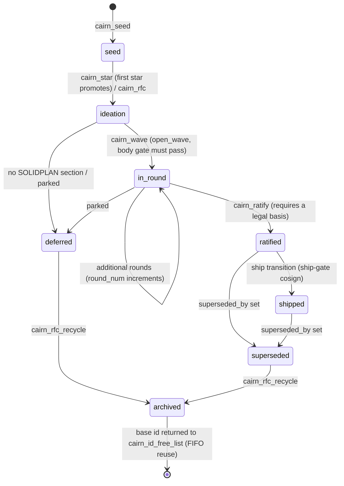

# Rebuild Guide: The Research and Development Process Layer

Scope: how the ZEROBRAIN cohort turned an observation into a ratified, shipped
design; how it reviewed itself; and how it turned failure into durable
institutional knowledge. This is the "intellectual engine" layer: CAIRN, the RFC
process, the LLM Council, design review and gates, the SWAT lane, the knowledge
lifecycle (KB, lessons, merit, failure episodes), the Spyglass derived index, and
the engineering doctrine that binds them.

This document is written for a future engineer or agent who must **rebuild** this
capability, not clone it. Where a mechanism is incidental, it is marked as such.
Where a mechanism is load-bearing, it is marked as such and stated as an
invariant in Section 11.

---

## 0. How to read this document

### 0.1 Evidence basis and limits

| Item | Value |
| --- | --- |
| Primary source | the coordinator repository reference implementation |
| Secondary source | Fleet shared specification tree (`specs/ideation`, `specs/ratified`, `specs/implemented`, `specs/living`, `specs/_templates`) |
| Tertiary source | Agent skill definitions (`skills/<name>/SKILL.md`) and their installed copies in node config directories |
| Live coordinator reads | **None performed.** Coordinator MCP tools were available but deliberately not called. No live CAIRN or KB record was sampled. Every claim below is from source code, DDL, spec Markdown, or skill Markdown on disk. |
| Secrets | None included. Node `fleet-identity.json` files were treated as read-restricted; no credential, token, or key value appears here. |

Repository-relative source anchors are included only where they help a
rebuilder find the reference implementation. They are **not** deployment
coordinates. Per `docs/source-reference-policy.md`, stable references in this
document are concept names, MCP tool names (`cairn_ratify`), data-model fields,
lifecycle states, and doctrine keys (`FIX_FORWARD`).

### 0.2 The three tiers, kept strictly separate

| Tier | Meaning | Where it appears |
| --- | --- | --- |
| **Verified** | Read directly in source at the cited location in the reference implementation, or read verbatim in a spec/skill file. | Sections 1-9, marked "Verified" |
| **Design intent** | The reconstructed *why*. Drawn from code comments, module docstrings, design-change notes embedded in comments, and spec decision logs. Inference is labeled. | Section 10, and "Intent" blocks in Sections 1-9 |
| **Assessment** | Engineering judgment. Not evidence. Not a contract. | Section 12 only |

This mirrors the vocabulary in `docs/source-hierarchy.md`: *normative* (what the
design of record says), *implemented* (what the code does), *deployed* (what is
running), *observed* (what someone saw). This document is predominantly
**implemented** plus **normative**, with almost no **observed** content because
no live reads were done.

### 0.3 Relationship to existing COHORT pages

This page **extends**; it does not replace. The following existing pages already
carry the architecture-level summary and should be read first:

| Existing page | What it already covers | What this page adds |
| --- | --- | --- |
| `docs/systems/cairn-rfc.md` | Lifecycle string, record types, the SQLite/PostgreSQL conflict | Full DDL field inventory, content-addressed revision mechanics, the five ratification legal bases, substance floors |
| `docs/systems/knowledge-lifecycle.md` | KB statuses, lesson concept | Write-gate implementation and origin, quarantine orthogonality, lesson boot cap enforcement, graduation validation ordering, sentinel thresholds |
| `docs/systems/spyglass.md` | What Spyglass is | Corruption quarantine budget, tier-weight mechanics, the derived/authoritative enforcement mechanism |
| `docs/systems/swatter.md` | Stages and verdicts | Triple-gate closure, tristate ancestry semantics, recusal predicates, refile kinds, corrections |
| `docs/systems/merit-and-lessons.md` | Merit levels and roles | The absence of a merit formula and why |
| `docs/systems/failure-episodes.md` | Incident stream | Ingest cursor and exactly-once dedupe |
| `docs/systems/review.md` | Review depth, axis counts | Cosign envelope schema, three-check reference validation |
| `docs/decisions/*` | Per-decision records (the governing design record, the governing design record, the governing design record, the governing design record, the governing design record) | Cross-linked from Section 9 and 10 |

---

## 1. The idea pipeline, end to end

### 1.1 State machine (Verified)

The lifecycle states are enforced by a `CHECK` constraint on the `rfcs` table:

```
status CHECK IN ('seed','ideation','in_round','ratified','shipped',
 'deferred','superseded','archived')
```

**Reference behavior:** the Cairn schema and migration path enforce the second state as `ideation`. One MCP schema description still lists `rfc`; that is a reference bug. A rebuild should use `ideation` consistently and fix the stale MCP enum.



Two structural facts about this machine:

1. **The transition table is data, not code.** `lifecycle_transitions` is a real
 table with primary key `(from_state, to_state)` and a `requires_role` column
 (`cairn.py`). Legality of a transition is a row, not an `if`.
2. **Every transition is appended to `lifecycle_audit`** (schema definition), which is
 append-only and carries an `execution_authority` column
 (`'deploy' | 'merge+deploy' | 'doctrine-only'`, introduced by the execution-authority doctrine). In
 v1 that column is audit-only: a social gate, recorded but not mechanically
 enforced.

### 1.2 Identifier model (Verified)

| Form | Meaning | Source |
| --- | --- | --- |
| `RFC{N}` | Base RFC | `cairn.py` `_next_versioned_id` |
| `RFC{N}c{M}` | Change/patch child of `RFC{N}` | `parse_versioned_id` |
| `RFC{N}x{M}` | Expansion child of `RFC{N}` | same |

`derive_rfc_type_and_parent` (schema definition) maps an id back to `(type, parent)`.
`cairn_rfc_reparent` validates the new parent exists. `cairn_rfc_rename` cascades the id across `rfc_revisions`, `rfc_waves`, `rfc_votes`,
`rfc_responses`, `lifecycle_audit`, and `source_seed_id` back-references, which
is the tell that ids are used as foreign keys everywhere and renaming is a
deliberate, audited, multi-table operation rather than an update.

`cairn_rfc_recycle` archives a relevant RFC and pushes its **base** id onto
`cairn_id_free_list` for FIFO reuse (schema definition). Child suffixes are not
recycled.

**Intent (inferred from the cascade + free list):** RFC numbers are treated as a
scarce, human-memorable namespace. Reuse is allowed but only after an explicit
archival act, and only for base ids, so that a citation can never
silently resolve to a different expansion.

### 1.3 Duplicate suppression (Verified)

Before a new RFC is accepted, `find_similar_seeds(threshold=0.7, days=90,
top_k=5)` runs. Separately, a taxonomy-parent guard
(`_TAXONOMY_BLOCK_STATUSES = ("ratified", "shipped")`, `cairn.py`)
blocks creating a new topic under a parent already ratified or shipped unless
the caller passes `force=True`.

**Intent:** prevent the "second RFC about the same thing" failure, in which two
parallel designs both ratify and the fleet has two designs of record.

### 1.4 Substance floors (Verified)

The RFC body is not free-form. The substance-floor doctrine introduced a four-section template stored
in dedicated columns on `rfc_revisions`: `body_origin`, `body_problem`,
`body_system`, `body_improvement`.

Per-section minimum character counts (`coordinator/cairn_substance_floors.py`):

| Primitive | Floor per section | Origin-section floor when `rfc_type` is patch/change/expansion with a parent |
| --- | --- | --- |
| `cairn_rfc` | 300 | 50 |
| `cairn_seed` | 150 | 25 |
| `cairn_kb_create` | 200 | n/a |
| `cairn_scratch` | 50 | n/a |

Whole-section sentinel tokens are hard-rejected (schema definition):
`tbd`, `todo`, `n/a`, `???`, `[fill in]`, `see body`, `see above`, `-`.
`wip` and `draft` produce a soft warning only.

Enforcement is staged per section via environment variables
`RFC549_STRICT_ENFORCE_<SECTION>`, each defaulting to `"1"` (strict on)
(`cairn.py`; check in the source block). Global validation constants
(`cairn.py`): `CAIRN_MIN_TITLE_LEN = 10`, `CAIRN_MIN_BODY_LEN = 100`,
with the rejection message "Include the problem context and your proposed
solution."

**Intent:** the floors are an anti-placeholder device. The lighter origin floor
for patches is an explicit acknowledgment that a child RFC inherits its origin
story from the parent and should not be forced to restate it - a concession
made so that the floor did not push authors toward filing everything as a new
base RFC.

### 1.5 SOLIDPLAN: the adoption gate (Verified)

`specs/implemented/001-solidplan-framework.md` defines a required RFC
section. Its stated problem is that the cohort was designing features without a
credible adoption path, creating unused knowledge records and repeated redesign.

The canonical seven questions:

| # | Question | Embedded rule |
| --- | --- | --- |
| 1 | Will we use it? | - |
| 2 | How will we use it? | If you cannot write the workflow in three sentences, it is too complex |
| 3 | How do we know we will use it? | - |
| 4 | Will we use it properly, to spec? | - |
| 5 | How do we know we will use it properly? | If you cannot measure compliance you cannot enforce it |
| 6 | What enforces proper usage? | Soft vs hard enforcement; if the feature needs hard enforcement to work, build that **into** the feature |
| 7 | What makes it stupid *not* to use it? | Stated as the gold standard |

Anti-patterns the framework names: The MOLT Pattern, The Dashboard Feature, The
Enforcement Fantasy, The Architecture Astronaut. Exemptions: bug fixes,
stability work, operator directives, security patches. Enforcement clause:
"RFCs missing this section are deferred until it's added."

Mechanically, the SOLIDPLAN is a first-class stored artifact, not prose inside
the body: `rfcs.solidplan`, `rfcs.solidplan_author`, `rfcs.solidplan_at`, plus a
`solidplan_revisions` table mirroring the shape of `rfc_revisions`
(`content`, `content_sha256`, `revision_note`). `cairn_solidplan` /
`attach_solidplan` **requires all waves to be closed** before a
SOLIDPLAN may be attached, and attachment is a precondition for ratification on
the non-override path.

**Intent:** the ordering is deliberate. You may not write the adoption argument
until the cohort has finished arguing about the design, and you may not ratify
until the adoption argument exists.

### 1.6 Worked example (illustrative reconstruction, not a transcript)

The following walkthrough is a **reconstruction** assembled from the verified
tool surface and gate rules. It is not a replay of a specific recorded RFC; no
live records were read. Tool names, gate names, and ordering constraints in it
are verified; the narrative content is illustrative.

1. **Observation.** A builder node notices that closing a SWAT with a commit
 that was never merged to the master-of-record still succeeded. That is a
 workflow pothole, so `FIX_FORWARD` applies: do not work around it, file it.
2. **Seed.** The node calls `cairn_seed` with a four-section body. The seed must
 clear the 150-character-per-section floor, so "TODO: fix close" is rejected
 outright.
3. **Promotion.** Another node calls `cairn_star` on the seed. The first star
 promotes `seed -> ideation` idempotently and the new RFC records
 `source_seed_id` (UNIQUE), so the seed can never be promoted twice into two
 RFCs.
4. **Framing.** The author calls `cairn_rfc` / `cairn_revise` to write the real
 body at the 300-character-per-section floor. Each revision inserts a row into
 `rfc_revisions` with `body_sha256` and increments `rev_number`;
 `rfcs.current_rev_id` and `rfcs.body_sha256` are updated in the same
 transaction. A duplicate-topic check runs against the last 90 days.
5. **Round 1.** `cairn_wave` opens wave `round_num = 1` in `mode='exploratory'`.
 Opening the wave is the transition `ideation -> in_round`, and
 `_check_body_gate_for_in_round` blocks promotion of an empty body.
 Wave-open fanout notifications are deduped by
 `cairn_wave_directives_sent(rfc_id, round_number, recipient, event_type)` so
 a recompute cannot re-notify.
6. **Responses and signals.** Each node calls `cairn_respond` once per wave
 (`UNIQUE(wave_id, author_id)`) with a stance in
 `support | object | nuance | defer`. Nodes react to *each other's* responses
 with `cairn_signal` (`support | object | nuance | defer | star`), which is a
 separate table keyed `(node_id, response_id, signal)`.
7. **Council (optional, or automatic).** If the author, operator, or the PM
 summons it - or if the autofire detector sees two stance reversals inside the
 wave - `cairn_summon_council` fires. A vessel node is drawn at random from a
 pool that hard-excludes the author. The vessel spawns five lens sub-agents in
 context-stripped sessions and appends their verbatim output as a
 `## Council Considerations` table via `cairn_revise`. See Section 4.
8. **Close the wave.** The PM calls `cairn_close_wave` with a **required,
 non-empty** synthesis. Synthesis is write-once; `synthesize_wave` refuses to
 overwrite with "Wave already has a synthesis. Cannot overwrite."
9. **SOLIDPLAN.** With all waves closed, the author attaches the SOLIDPLAN via
 `cairn_solidplan`.
10. **Ratify.** `cairn_ratify` requires status `in_round`, a non-empty body, a
 SOLIDPLAN, and a **legal basis** (Section 3.4). On success it computes the
 `cairn-ratify-binding-v1` digest over body + solidplan + wave synthesis and
 performs a compare-and-swap update guarded on `status='in_round'`.
11. **Gates and ship.** A `ship-gate` is opened; closing it requires cosign
 evidence references that both *exist* and *contain approval markers*
 (Section 5).
12. **Later life.** A superseding RFC sets `superseded_by`. When the topic is
 fully dead, `cairn_rfc_recycle` archives it and returns the base id to the
 free list.

---

## 2. CAIRN data model

All DDL below is from the cairn schema initialiser in
`coordinator/cairn.py` (in the Cairn implementation) in the reference implementation.

### 2.1 Physical storage, and a preserved conflict (Verified)

There are two physical databases:

| Database | Backend at HEAD | Evidence |
| --- | --- | --- |
| `coordinator.db` | **a PostgreSQL 16-class server** in production. `COORD_DB_BACKEND=postgres`; a boot guard `assert_backend_is_postgresql` (the PostgreSQL boot-guard doctrine) refuses to start on the wrong backend. Cutover the database cutover doctrine. SQLite retained only for the test fixture. | Coordinator `README.md` source block |
| `cairn.db` | **SQLite only.** Code comment at `cairn.py`: "cairn.db is SQLite-only (get_cairn_db uses aiosqlite); nothing to init on PG". | `cairn.py` |

**Conflict, labeled and not merged:** `specs/living/coordinator-overview.md` contradicts the coordinator README. The living doc is **stale** with
respect to `coordinator.db`. It happens to remain accurate about `cairn.db`.
Per the source hierarchy, the README plus the boot guard in code outrank the
living doc. Recorded here so a future reader who finds the living doc does not
"correct" the newer fact.

### 2.2 Record types

#### `rfcs` (schema definition)

| Column | Notes |
| --- | --- |
| `rfc_id` | Primary key, the stable citation handle |
| `title` | Minimum 10 characters |
| `status` | CHECK-constrained to the eight lifecycle states |
| `template` | Which body template applies |
| `domain` | Routing/ownership hint |
| `author_id` | Load-bearing: drives recusal and the revise allowlist |
| `current_rev_id` | Pointer into `rfc_revisions` |
| `body_sha256` | Denormalised content address of the current body |
| `superseded_by` | Set when another RFC replaces this one |
| `source_seed_id` | **UNIQUE** - a seed can be promoted exactly once |
| `solidplan`, `solidplan_author`, `solidplan_at` | Adoption gate artifact |
| `created_at`, `updated_at` | - |

#### `rfc_revisions` (schema definition)

| Column | Notes |
| --- | --- |
| `rev_id` | Primary key |
| `rfc_id`, `rev_number` | `UNIQUE(rfc_id, rev_number)` - a strict ordered chain |
| `body` | Full body text of this revision (not a diff) |
| `body_sha256` | **NOT NULL** - every revision is content-addressed |
| `edit_summary` | Human-readable reason for the change |
| `author_id`, `authored_at` | Who and when; `CAIRN` is used for system-authored revisions |
| `body_origin`, `body_problem`, `body_system`, `body_improvement` | the per-section RFC columns |

`solidplan_revisions` (schema definition) is the same shape with
`content` / `content_sha256` / `revision_note`.

#### `rfc_waves` (schema definition)

| Column | Notes |
| --- | --- |
| `wave_id`, `rfc_id`, `round_num` | `UNIQUE(rfc_id, round_num)` |
| `prompt` | The framing question put to the cohort |
| `mode` | Default `'exploratory'` |
| `opened_at`, `opened_by`, `closed_at`, `closed_by` | - |
| `synthesis` | Write-once. Its presence plus `closed_at` is what "quorum" means (Section 3.4) |

#### `rfc_responses` (schema definition)

`response_id`, `wave_id`, `author_id`, `stance`
CHECK IN `('support','object','nuance','defer')`, `body`, `is_starred`,
`is_late`, `UNIQUE(wave_id, author_id)`.

#### `rfc_signals` (schema definition)

Primary key `(node_id, response_id, signal)`; signal CHECK IN
`('support','object','nuance','defer','star')`.

A **signal is a reaction to another node's response**, not a position on the
RFC. This is the distinction most likely to be lost in a rebuild: responses are
first-class deliberation, signals are cheap agreement/disagreement weight on
someone else's argument.

#### `rfc_votes` (schema definition)

`verdict` CHECK IN `('approve','reject','abstain')`, `justification`,
`UNIQUE(rfc_id, voter_id)`.

**Important verified negative:** although `ratify_rfc` computes an approve count
(`_approve_count`) and a completed-round count (`_completed_rounds`), **no
numeric vote threshold gates ratification** in the reference implementation. Vote rows are
recorded and visible but are not the mechanism that authorises ratification.
See Section 3.4 and Section 13.

#### Supporting tables

| Table | Lines | Role |
| --- | --- | --- |
| `rfc_comments` | schema definition | Threaded commentary outside the wave structure |
| `rfc_tags`, `tag_synonyms` | schema definition | Taxonomy; synonyms fold variants together |
| `lifecycle_transitions` | schema definition | `(from_state,to_state)` PK plus `requires_role` - legality as data |
| `lifecycle_audit` | schema definition | Append-only; carries `execution_authority` (the execution-authority doctrine) |
| `rfc_deployments` | schema definition | Links a relevant RFC to a deployment event |
| `rfc_standing_opa` | schema definition | Per-RFC standing operational authority grant; `gate_scope` JSON, `reask_breakage` / `reask_health` default 1, status active/revoked (the standing-authority workflow) |
| `cairn_wave_directives_sent` | schema definition | PK `(rfc_id, round_number, recipient, event_type)`; notification dedupe |
| `cairn_scratch` | schema definition | Transient memos, 5-day expiry, pinnable |
| `cairn_kb`, `cairn_kb_history` | schema definition | Knowledge base; see Section 7 |
| `cairn_council_firings`, `cairn_council_annotations` | schema definition | The two council systems; see Section 4 |
| `cairn_fts` | schema definition | FTS5 virtual table over `(rfc_id, title, body, tags, author)` |

### 2.3 Content-addressed revisions (Verified)

The hash function is plain (`cairn.py`):

```python
def _sha256(text: str) -> str:
 return hashlib.sha256(text.encode("utf-8")).hexdigest()
```

It is applied on every revision insert (`body_hash = _sha256(body)`), and the
result is denormalised onto `rfcs.body_sha256` alongside
`current_rev_id` in the same update (schema definition).

Three consequences that a rebuild must understand:

1. **Cheap identity comparison.** Any consumer - Spyglass, a reviewer, a cosign
 envelope - can assert "the body I reviewed is the body that is current" by
 comparing 64 hex characters, with no body transfer.
2. **Tamper evidence without immutable storage.** The revision table is
 ordinary mutable SQL. The hash chain plus the append-only `lifecycle_audit`
 is what makes silent edits detectable.
3. **The gap the hash was invented to cover.** `rfc_votes` has **no** `rev_id`
 or `body_sha256` column. A vote is bound to a relevant RFC, not to a body. That gap is
 exactly why the ratified-immutability guard and the ratify binding digest
 exist (Sections 2.4 and 2.5).

### 2.4 Ratified immutability guard (Verified)

In `_revise_rfc_unlocked` (`cairn.py`), on the standard path, if the
RFC is already `ratified`, the new body must satisfy:

```python
new_body.startswith(current_body.rstrip())
```

That is: **ratified bodies are append-only.** The in-code comment states the
invariant as "ratified => cohort approved THIS body" and notes explicitly that
`rfc_votes` lacks rev/sha binding. The KB anchor cited in the comment is
`governance-integrity-ratified-artifact-immutability`.

The write allowlist for `revise` (schema definition) is: the original author, OR
`caller_role == "pm"` (the PM), OR `caller_role == "architect"` - plus one
narrow exception, the council vessel override (Section 4.5).

### 2.5 The ratify binding digest (Verified)

`cairn.py` defines a canonical JSON serialisation and a binding payload:

```python
# canonical bytes
json.dumps(obj, ensure_ascii=False, separators=(",", ":"), sort_keys=True).encode("utf-8")

# schema: "cairn-ratify-binding-v1"
# binds: rfc.id
# body.rev_id + body.content
# solidplan.rev_id + solidplan.content
# wave.round_num + wave.wave_id + wave.synthesis
# digest = "sha256:" + hexdigest
```

The builder returns `None` unless **all** parts are present. The digest is the
anti-tamper anchor that makes the sentence "ratified means the cohort approved
*this* body together with *this* SOLIDPLAN under *this* wave synthesis"
mechanically checkable after the fact.

**Intent (inferred):** the vote table could not be retrofitted with revision
binding without rewriting history, so the binding was moved to the ratification
event itself, where it could be computed once, correctly, from the three
artifacts that actually constitute the decision.

### 2.6 Concurrency control (Verified)

Per-RFC advisory locking (`cairn.py`):

```python
key = int.from_bytes(sha256(b"cairn-rfc-lock-v1\0" + rfc_id.encode())[-8:], "big", signed=True)
```

`acquire_cairn_rfc_tx_lock` **requires an already-open transaction**; it will not
acquire a lock outside one. The lock namespace is salted with a schema string so
that lock keys cannot collide with other advisory-lock users in the same
database.

Final ratification is a compare-and-swap:

```sql
UPDATE rfcs SET status='ratified', ... WHERE rfc_id = ? AND status = 'in_round'
```

`rowcount != 1` returns `ratify_conflict_state_changed` rather than proceeding.

---

## 3. Waves, signals, votes, and consensus

### 3.1 The four distinct input primitives (Verified)

| Primitive | Table | Cardinality | What it means |
| --- | --- | --- | --- |
| **Response** | `rfc_responses` | One per node per wave (`UNIQUE(wave_id, author_id)`) | This node's reasoned position on the RFC in this round |
| **Signal** | `rfc_signals` | One per `(node, response, signal)` | This node's reaction to *another node's response* |
| **Vote** | `rfc_votes` | One per node per RFC | A recorded verdict: approve / reject / abstain |
| **Synthesis** | `rfc_waves.synthesis` | One per wave, write-once | The PM's written distillation of the round |

Stars are a fifth, lighter signal: `cairn_star` is OPERATOR-only in the reference. On a **seed** it promotes to an ideation RFC on first star (idempotent); on a **response** it sets `is_starred = 1`.
The same verb does structurally different work depending on the target, which is
a rebuild hazard worth splitting into two verbs.

### 3.2 Opening and running a wave (Verified)

`open_wave` is legal only from status `ideation` or `in_round`, and
runs `_check_body_gate_for_in_round` before allowing entry to `in_round`, which
blocks promoting an empty-bodied RFC into deliberation.

Late responses are recorded with `is_late = 1` rather than rejected. The
information is kept; its tardiness is labeled.

### 3.3 Closing a wave (Verified)

`close_wave` (schema definition):

- PM-gated.
- Synthesis is **required and must be non-empty**; it is ASCII-sanitised.
- The synthesis is written **to the wave row only**.

An in-code note recorded in the source material records a deliberate behaviour
change: the synthesis is **no longer
appended to the RFC body**, because that was storage redundancy. Historical
bodies that already contain appended syntheses were **not** scrubbed.

`synthesize_wave` (schema definition) applies only to a closed, unsynthesised wave and
refuses overwrite: "Wave already has a synthesis. Cannot overwrite."

**Intent:** the synthesis is the durable record of what the round concluded. If
it could be rewritten after the fact, the ratification binding digest would bind
to a moving target.

### 3.4 Ratification and the five legal bases (Verified)

`ratify_rfc` preconditions:

| Check | Behaviour |
| --- | --- |
| `status == 'in_round'` | Otherwise error |
| Already ratified | Returns a no-op, not an error (idempotent) |
| Non-empty body | Required on the non-override path |
| SOLIDPLAN attached | Required on the non-override path |
| Operator override | Downgrades the two previous checks to `gate_warnings` |

`_determine_ratify_legal_basis` (schema definition) then requires **any one** of five
paths. All five failing produces `ratify_rejected_no_legal_basis` - and a
rejection row is still written to `lifecycle_audit`.

| # | Basis | Condition |
| --- | --- | --- |
| 1 | `wave_quorum` | The latest wave is *synthesised*: `closed_at` set **and** `synthesis` non-empty |
| 2 | `blanket_citation` | A blanket-authority citation found in the header block (`_find_blanket_citation`) |
| 3 | `opa_provenance_citation` | Header-line citation of an OPA grant's provenance |
| 4 | `family_child_citation` | Header line naming `parent:<RFC>`, a `directive/message-id #NNN`, and a `parent_basis` / `legal_basis` - valid only if the parent RFC is itself ratified |
| 5 | `operator_authored_call` | `operator_override` and `actor_id == "OPERATOR"` |

Citations are parsed by regular expression from `_header_block(body)` and
`_header_block(solidplan)`.

**This is what "quorum" actually means in this system.** There is no head count.
Quorum is the existence of a closed wave with a written synthesis - that is, the
assertion by the PM that the round was run and concluded. The other four bases
are explicit escape hatches for work that is derivative of, or directly
authorised by, an already-legitimate decision.

**Intent (inferred):** a numeric quorum in a fleet whose node population changes
(nodes molt, are added, are retired) is a denominator problem. Pegging legitimacy
to "a round was actually run and someone wrote down what it concluded" removes
the denominator entirely, at the cost of concentrating authority in the
synthesiser. The five-basis design then re-limits that authority by requiring
that every non-wave path leave a *citable* trace in the header block.

### 3.5 How disagreement is resolved (Verified mechanisms)

There is no vote-counting resolution. Disagreement is handled by four
mechanisms, in escalating order:

1. **Recorded dissent.** `object` and `nuance` stances persist in
 `rfc_responses` forever and are visible in the synthesis inputs. A dissent is
 never deleted, only outvoted by the synthesis.
2. **Another round.** `round_num` increments; the RFC stays `in_round`.
3. **Council autofire.** `coordinator/council_autofire.py` (the council-autofire concept)
 detects **ping-pong reversal**: N = 2 stance reversals within a wave
 (tracked in `rfc_response_versions`) or verdict reversals (tracked in
 `rfc353_verdict_history`) trigger a council firing automatically.
 Idempotency is by `UNIQUE(scope_type, scope_id, signal)` on
 `rfc353_council_autofire_fires`, enforced with INSERT-then-catch-IntegrityError
 rather than check-then-insert.
4. **Escalation to operator.** `operator_authored_call` is the terminal basis.

**Intent:** reversal, not disagreement, is the alarm signal. Two nodes who
disagree consistently are a healthy round. A node that flips its stance twice is
evidence that the argument is unstable or that the participants are anchoring on
each other - which is precisely what the Council was built to break.

---

## 4. The Council

### 4.1 Two systems, one noun (Verified - critical for a rebuild)

There are **two unrelated mechanisms called "council"**. The code says so
explicitly. `coordinator/council_worker.py` states that the LSG
council is "DISTINCT from `cairn_council_firings` (the vessel-host council concept, per-RFC,
max 2/RFC). No shared invariants between the two systems - same noun, different
layer."

| | System 1: the vessel-host council concept Council | System 2: LSG council |
| --- | --- | --- |
| Granularity | Per **RFC** | Per **response** |
| Lenses | 5: `outsider`, `first-principles`, `executor`, `expansionist`, `contrarian` | 3: `devils_advocate`, `invariant_checker`, `provenance_honesty` |
| Storage | `cairn_council_firings` | `cairn_council_annotations` |
| Output | Verbatim `## Council Considerations` table appended to the RFC body | Structured annotation rows with severity |
| Cap | Max 2 firings per RFC | Per-response, `UNIQUE(response_id, lens)` |
| Executor | A *vessel node* spawning sub-agent sessions | A coordinator-side worker |

A rebuild should rename one of them.

### 4.2 The five lenses (Verified, verbatim from the `council` skill)

Source: `skills/council/SKILL.md`, with full lens templates in that skill. Identical copies are installed into each node-local skills directory
directory.

| Lens | Stance it is instructed to take |
| --- | --- |
| `outsider` | Knows nothing about this fleet; attacks assumed context |
| `first-principles` | Rederives the need from scratch; attacks the premise |
| `executor` | Only cares whether it can actually be built and operated |
| `expansionist` | Pushes for the more ambitious version |
| `contrarian` | Argues the opposing position regardless of merit |

Every lens template contains the instruction: **"Lean fully into this angle. Do
NOT be balanced."**

Required output shape per row:

```
lens | <type> | <challenge> | <rationale>
```

where `<type>` is one of `failure-mode`, `alternative`, `edge-case`,
`open-question`.

### 4.3 Host versus councilor (Verified)

Hard rule **H1** in the skill: *"Vessel MUST NOT add first-person stance to the
artifact | Vessel = host, never councilor. Synthesis-drift = firing void."*

The vessel node's entire job is: draw the lenses, ferry payloads, capture
output, and append it. If the vessel editorialises, the firing is void.

Vessel selection (`cairn.py`):

1. `hard_excluded = {author}` - the RFC author can never host.
2. Prior vessels for the same RFC are excluded.
3. Soft anti-clustering over a K-window: `COUNCIL_K_WINDOW = 3`.
4. `random.SystemRandom().choice(sorted(pool))` - cryptographic RNG over a
 deterministically sorted pool.

`vessel_override` is operator-only (schema definition).

`cairn_get_firing` is a read-only tool that exists specifically for the
**ARCH-6 dual-vessel race guard**: after a session restart, the vessel re-reads
the firing row and confirms `vessel_node == self` before acting. This is
verify-at-source applied to the vessel's own identity.

### 4.4 Context stripping (Verified)

Hard rule **H4**. The payload sent to each lens sub-agent is strictly:

```
<lens_template_verbatim>
--- RFC BODY ---
<rfc_body_verbatim>
--- FRAMING QUESTION ---
<framing_question>
```

The skill continues: *"Nothing else. No 'by the way,' no fleet identity hints, no
vessel name, no 'previous waves said X'... Context-stripping is the load-bearing
anti-anchoring lever (Solidplan Q1)."*

**The failure mode this prevents.** Without stripping, five sub-agents spawned by
the same node, in the same fleet, with the same shared context, produce five
restatements of the fleet's existing consensus wearing different hats. The
output looks like five independent reviews and is in fact one review printed
five times - a *false independence* failure. It is worse than no review, because
it manufactures apparent corroboration. Stripping is what makes the lenses
actually orthogonal.

A client-side leak detector backs this up. `coordinator/court_leak_audit.py`
plus `scripts/court-leak-watch.ps1` report cross-councilor context leakage. The
coordinator **rejects any reported payload containing a UUID-shaped substring**
(token-shape reject) so that session tokens can never be stored in the
audit table. The table `court_leak_audit` has `UNIQUE(node_id, sid, line_no)`
and stores `raw_line_hash` with 90-day retention. Separately, INV-1 in
`coordinator/council_access.py` prevents a responder node from reading its own
council outputs.

### 4.5 The canary protocol (Verified)

Council skill source block. Before firing all five lenses:

1. Fire **one** lens first (recommended: `outsider`).
2. Verify two things: (a) the output shape is correct, and (b) the canary's
 **observed runtime version is exactly equal** to the fleet-canonical version,
 with auto-update off.
3. Then fire the remaining four in parallel. **Do not re-fire the canary.**

The skill names the reason: "the QC-REFRESH stale-binary trap applied to council
spawns" - a sub-agent spawned on a different or auto-updated binary is not the
reviewer you think you are getting.

### 4.6 Verbatim capture (Verified)

Council skill source block. Output is appended as a section:

```markdown
## Council Considerations

| lens | type | challenge | rationale |
| --- | --- | --- | --- |
| outsider | failure-mode | ... | ... |
```

Rows appear in fixed lens order. The **only** permitted transformations are:
escape `|` as `\|`, and collapse newlines to `<br>`. The skill states: *"Do NOT
renumber, de-duplicate, re-rank, or merge."*

A TOCTOU guard requires re-fetching the body immediately before
`cairn_revise` so that a concurrent revision is not clobbered by the append.

### 4.7 Firing records and the vessel write override (Verified)

`cairn_council_firings` (schema definition):

| Column | Notes |
| --- | --- |
| `firing_number` | CHECK IN (1, 2) - `COUNCIL_MAX_FIRINGS = 2` |
| `vessel_node` | Who hosts |
| `triggered_by` | CHECK IN (`'author'`, `'auto'`, `'operator'`) |
| `sla_deadline` | Firing must land by this time |
| `output_artifact_id` | NULL until the considerations are appended |
| `sla_met`, `lens_models` | Outcome and which models served which lens |
| | `UNIQUE(rfc_id, firing_number)` |

Summon authority (`cairn.py`): the author, operator, a PM-role node,
or a valid operator-issued OPA grant for `action_type='cairn_summon_council'`
(Verified).

`_check_vessel_revise_authorization` (schema definition) is the narrow exception to the
revise allowlist. All of these must hold:

- an active firing row exists with `output_artifact_id IS NULL`;
- `now <= sla_deadline + VESSEL_REVISE_GRACE_SECONDS`;
- RFC status not in `COUNCIL_TERMINAL_STATUSES = ("shipped", "reverted", "archived")`;
- the body change is append-only.

An **in-flight stub** (`_append_council_firing_stub`,
the targeted-fix hardening Part B) writes a system-authored revision
(`author_id='CAIRN'`) at firing time so that anyone reading the RFC can see a
council is in progress. It is best-effort and never rolls back the firing.

### 4.8 Kill switch (Verified)

`cairn_council_set_enabled` / `coordinator/council_toggle.py`, config key
`council_v1_enabled`, 5-second cache TTL, PM/architect gated.

---

## 5. Design review and gates

### 5.1 Gate kinds, states, dispositions (Verified)

From `coordinator/cairn_gate_constants.py` and `coordinator/cairn_gates.py`:

```python
GATE_KINDS = ("discussion-wave", "solidplan-section", "ship-gate", "review-pass", "custom")
GATE_STATES = ("open", "closed")
DISPOSITIONS = ("met", "deferred", "force_closed")
RESERVED_PREFIXES = ("discussion-wave-", "ship-gate", "review-pass-")
```

State machine: `open --(close_gate)--> closed`. **Closed is terminal in v1.**
The code comment (`cairn_gates.py`) records that reopen is
"DID-NOT-EXPLORE": a mistake gets a **new `gate_id`**, not a reopened one.

| Disposition | Requirement |
| --- | --- |
| `met` | The gate's evidence was supplied |
| `deferred` | **Requires `deferral_evidence_ref`** - you must cite where the deferral was decided |
| `force_closed` | operator escape hatch; for a `ship-gate` it requires an OPERATOR grant |

`RESERVED_PREFIXES` are auto-allocated by coordinator state-machine transitions.
`cairn_declare_gate` (author/PM facing) **rejects** reserved prefixes;
`cairn_open_gate` (system facing, idempotent) accepts them. That split is what
stops a human from hand-forging a `ship-gate` id.

Five MCP surfaces:

| Tool | Who | Role |
| --- | --- | --- |
| `cairn_declare_gate` | author / PM | Declare a custom gate |
| `cairn_open_gate` | system | Open a reserved-prefix gate; idempotent |
| `cairn_close_gate` | gate owner | Close with a disposition and evidence |
| `cairn_list_gates` | any | Read |
| `cairn_set_gate_state` | architect / PM | Audit-tagged escape hatch |

Validation happens at the handler layer with enum checks; there are **no DB
CHECK constraints** on gates, and errors are returned as `{"error": ...}` dicts
rather than raised.

`phase_label` is all-or-nothing per RFC (`_check_phase_label_all_or_nothing`,
the phase-label doctrine): either every gate on a relevant RFC carries a phase
label or none does, so a partially-labeled RFC cannot be misread as fully
phased.

### 5.2 The ship-gate marker requirement (Verified)

`cairn_gates.py`:

```python
SHIP_ARCHITECT_MARKERS = ("GREEN", "COSIGN", "APPROVE")
SHIP_BUILDER_MARKERS = ("VERIFIED", "GREEN", "TESTS-PASS")
```

Each cosign reference's **content** must contain at least one marker for its
role (case-insensitive, any-of). The comment states the reason directly:
otherwise "the evidence axis is HOLLOW (any builder message bound to the RFC,
even 'looking at it now', would satisfy it)."

This is the single clearest example of the doctrine in Section 10.3: an evidence
pointer that only proves *existence* proves nothing.

### 5.3 The cosign envelope (Verified)

`coordinator/cosign_envelope.py` defines seven fields:

| Field | Shape | Always required? |
| --- | --- | --- |
| `topology_reviewed` | `slug:sha256_prefix`, prefix >= 8 hex | Yes |
| `git_tracked_sha` | 40-hex | Yes |
| `axis_count` | >= 1; >= 2 if the target is a vital life-support surface | Yes |
| `blast_radius_class` | `single-machine` or `fleet-wide-shared-canonical` | Yes |
| `deadman_applied` | `{applied, reason}` | Vital-LS only |
| `observed_runtime_verify` | `{verified, evidence_ref}` | Vital-LS only |
| `rollback_tested` | `{tested, evidence_ref}` | Vital-LS only |

Enforcement is flag-controlled: `COORD_COSIGN_ENVELOPE_SCHEMA_ENFORCED`
(false = soft-warn, true = reject). The staged-enforcement pattern recurs
throughout this codebase (see also the strict-flag doctrine): ship the validator in
warn mode, measure the violation rate, then flip to reject.

### 5.4 Three-check reference validation (Verified)

`coordinator/cosign_ref.py` `validate_cosign_ref` (schema definition) enforces three
independent properties on any evidence reference:

| Check | Question it answers |
| --- | --- |
| **EXISTS** | Does this reference resolve to a real coordinator message? |
| **RIGHT-KIND** | Was it authored by the expected node/role, and does it carry attestation markers? |
| **BOUND-TO-TARGET** | Does it reference *this* git SHA / *this* RFC id? |

`sha_bound` uses `MIN_SHA_PREFIX = 7`, and `require_full_target=True`
(Verified) closes the short-prefix-collision class - a 7-character
prefix is enough to be readable but not enough to be *binding*.

### 5.5 Design review on the SWAT lane (Verified)

Design review is also attached to individual SWATs, implemented in
`coordinator/database.py`:

| Operation | Lines | Rules |
| --- | --- | --- |
| `open_design_review` | schema definition | Stage must be `open`. After this the swat cannot leave `open` until design input is closed |
| `design_input_invite` | schema definition | Returns `cannot_invite_author`: **"Authors cannot weigh in on their own swat's design."** |
| `design_input_respond` | - | Stance in `support / object / nuance / defer`; `UNIQUE(swat_id, node_id)` |
| `close_design_review` | schema definition | Requires at least one invitee response, else `no_responses` with the hint "Use skip_design_review if no input is forthcoming" |
| `skip_design_review` | - | Categorised skip; **no synthesis required** |

Skip categories (`swatter.py`):
`trivial_obvious_fix`, `regression_fix_only`, `operator_directive`,
`time_critical_incident`, `single_owner_domain`.

`DESIGN_INPUT_STATUSES = (None, "open", "closed")` is a **sub-state column,
deliberately not a fifth stage** - the reasoning is documented in a v2 escape
hatch note at `swatter.py`. Adding a fifth stage would have forced every
stage-transition predicate in the system to learn about design review.

`assert_design_input_closed` (schema definition) must be called by **any** path advancing
a swat to `in_review`, `fixed`, or `closed`; the comment says "otherwise design
review is silently bypassed."

Two supporting mechanisms:

- **Stale monitor** (`coordinator/design_input_stale_monitor.py`):
 `DESIGN_INPUT_STALE_THRESHOLD_SECONDS` default **48 hours**, scan tick 300 s.
 Single-shot idempotency via `design_input_stale_emitted_at_epoch_ms IS NULL`.
 Recipients: PM-role nodes plus the original invitees.
- **Cascade close** (`AUDIT_DESIGN_INPUT_CLOSED_CASCADE`, the targeted-fix hardening):
 closing a swat cascade-closes an open design review, otherwise the 48-hour
 sweeper nags forever about a thread that is already resolved. The cascade emits
 a **distinct audit event type** so that audit replay can tell a cascade close
 from an explicit one.

---

## 6. SWATTER: the targeted-fix lane

Source: `coordinator/swatter.py` (the governing design record), which contains the entire
contract, plus `close_swat` and the design-review operations in
`coordinator/database.py`.

### 6.1 The shape test and the canonical-owner invariant (Verified)

The module docstring makes two structural claims worth preserving verbatim in
spirit:

1. SWAT tables live in `coordinator.db`, **not** `cairn.db`. The `cairn_` table
 prefix denotes **knowledge-network membership** (participation in the
 citation graph and Spyglass indexing), not physical database location.
2. The **shape test** for where an artifact belongs: a swat has an assignee, a
 deadline, a stage machine, and a verdict, therefore it is a *coordination*
 artifact, not a *knowledge* artifact.
3. `INV-SWAT-CANONICAL`: the swat owns its state and verdict; the boomerang is
 **transport only**; write-back is atomic through the serialised-write
 envelope.

### 6.2 Stages, verdicts, severities (Verified)

```python
STAGES = ("open", "in_review", "fixed", "closed")
VERDICTS = ("approve", "request_changes", "reject")
SEVERITIES = ("critical", "high", "medium", "low")
```

`apply_verdict_to_stage` (schema definition):

| Stage | Verdict | Resulting stage |
| --- | --- | --- |
| `in_review` | `approve` | `fixed` |
| `in_review` | `request_changes` | `open` |
| `in_review` | `reject` | `closed` |
| anything else | any | **illegal** |

Verdicts are legal **only** in `in_review`. There is no way to approve something
that was never submitted for review.

`validate_reopen_transition` (schema definition) allows reopen from `closed` **or**
`fixed`. The second was added by the targeted-fix hardening: a swat that was marked
fixed but was not actually fixed was otherwise trapped in a non-closed,
non-reopenable state.

### 6.3 Closing without a fix: dispositions (Verified)

`SWAT_DISPOSITIONS` (schema definition), each with a documented rationale in the source block:

| Disposition | Meaning |
| --- | --- |
| `verified_no_fix` | Investigated at source; the reported defect does not exist |
| `audit_complete` | The swat was an audit task, not a defect |
| `pre_gate_archive` | Filed before a gate existed; archived rather than forced through |
| `resolved_elsewhere` | Fixed by other work; see the cited artifact |

A close must supply **either** a `fix_commit` **or** a disposition - never both,
never neither.

### 6.4 Refile kinds (Verified)

```python
SWAT_REFILE_KINDS = ("superseded", "refiled")
```

| Kind | Meaning |
| --- | --- |
| `superseded` | The original body was materially wrong; the root-cause analysis was falsified by at-source verification |
| `refiled` | A pre-build placeholder replaced by the swat that actually carries the fix |

The typed pointer `refile_target_swat_id` replaced a prose workaround - people
had been prefixing `closed_reason` with `"SUPERSEDED-AS X"`. That is a textbook
example of the doctrine in Section 10: when a convention emerges in free text,
promote it to a typed column so it can be queried and validated.

### 6.5 Recusal and pool composition (Verified)

Recusal predicates, in order (schema definition):

1. `author` - you cannot review your own swat.
2. `previous_reviewers` - a CSV exclusion set on the swat row, so a re-thrown
 swat cannot land back on the same reviewer (reviewer ping-pong).
3. `cluster_recused` - co-authors within a CODECRETE cluster.
4. `previous_design_input_invitees` - if you already gave design input, you are
 not an independent reviewer of the result.

`compose_eligible_pool` (schema definition) reports **full attribution**: a candidate
excluded for more than one reason appears under **all** of them, because,
per the comment, PM needs to see "exactly which recusal class drained it."
If the pool empties, the swat escalates to the PM node (PM).

**Intent:** a pool that returns "no eligible reviewers" with no explanation
produces a guess. A pool that says "the architect node: author; the reviewer node: previous reviewer,
cluster; a builder node: design-input invitee" produces a decision.

### 6.6 Triple-gate closure (Verified)

`close_swat` in `coordinator/database.py` runs three gates in a
deliberate order.

**Gate 1 - argument validation, before the DB envelope** (schema definition):

- `fix_commit` XOR `disposition`;
- disposition in the allowlist;
- refile pair: either-set-implies-both, kind in allowlist, target swat exists.

The comment states the ordering reason: this is "done before the DB envelope so
a malformed call doesn't claim the serialized_write lock for nothing."

**Gate 2 - git ancestry check, outside the write envelope** (schema definition):

The comment is the design rationale in one line: holding the single-writer lock
across a five-second subprocess "would be the exact write-wedge the write-wedge prevention doctrine exists to
kill."

The result is a **tristate**, and the three states are never conflated:

| Ancestry result | `verified` | Action |
| --- | --- | --- |
| Commit **is reachable** from the master-of-record | `1` | Allow |
| Commit **is not reachable** | `0` | **REJECT, fail-closed** (`fix_commit_not_in_master`), unless `bypass_master_ancestry_check` is passed - which is audited as `swat_closed_off_master` |
| Ancestry could not be determined (git unavailable, fetch failed, timeout) | `None` | **ALLOW, fail-open**, with a loud audit `swat_close_ancestry_unverified` |

The rationale given in code for the fail-open branch is
"safety-net-must-not-be-infra-gated": a broken git host must not be able to
block the fleet's ability to close work, but the fact that the check did not run
must be permanently visible.

**Gate 3 - state check inside the write envelope**: `validate_close_transition`
runs under the serialised write, so the stage cannot change between the checks
and the update.

### 6.7 Git reachability details (Verified)

`coordinator/git_reachability.py`:

- The **reference** is the *integration tip* `backup/master`, **not** the
 production checkout - because the production checkout fast-forward-follows on
 a coordinator restart and would give a stale answer.
- **Fetch-fresh is mandatory** (`git fetch --prune`); a frozen remote-tracking
 ref yields a false result.
- Never block the event loop: the subprocess runs under `asyncio.to_thread`.
- 20-second timeout. UNAVAILABLE is treated **fail-closed by the ship-gate
 caller** with a *distinct* signal - the opposite polarity from `close_swat`,
 deliberately, because shipping is higher-consequence than closing a swat.

The purpose is stated plainly: "A recorded commit that exists but was never
merged to the master-of-record is the false-close class this catches
(the targeted-fix hardening pattern)."

### 6.8 Corrections, not edits (Verified)

`correct_swat_fix_commit` (`database.py`):

- Legal only on a `closed` swat.
- Guarded against swats closed by disposition (there is no commit to correct).
- Re-runs the git ancestry check on the new commit.
- Audits old value to new value.

The corrections table itself is owned by `coordinator/corrections.py` (schema definition),
with `reactivate_correction` and `get_correction_history` as the read/reopen
surfaces. A correction **adds a row**; it does not overwrite the original. The
history of what was believed, and when, is preserved.

---

## 7. Knowledge lifecycle

### 7.1 The KB write gate (Verified)

`coordinator/mcp_handler.py` (`cairn_kb_create` and `cairn_kb_edit`) authorizes KB writes for PM or architect role, an explicit node allowlist, or a valid OPA grant. A denial writes an audit row `cairn_kb_write_denied` at severity `warning`. The MCP schema prose that says reviewer and analyst roles are generally allowed is stale relative to the handler.

Doctrine origin, verbatim from the `specs/living/topo-s.md` source block:

```
"KB_GATE": "only pm+arch write KB. engineers are not knowledge workers."
```

The design record is the KB write-gate concept (`specs/ideation/kb-write-role-gate.md`). The
motivation recorded there is **KB noise**: many engineer-created entries were
low-signal.

The mitigation for the obvious objection ("engineers learn things too") is the
**draft-exemption pattern**: all roles may draft; only knowledge workers
promote or retire. The gate is on *publication authority*, not on *authorship*.

### 7.2 KB record shape and statuses (Verified)

`cairn_kb` (schema definition):

| Column | Notes |
| --- | --- |
| `slug` | **Primary key** - the stable citation handle, not a number |
| `title`, `content` | - |
| `tags` | - |
| `author_id`, `published_by`, `last_editor_id` | Authorship and publication authority are separate fields |
| `status` | CHECK IN `('draft','published','flagged','archived')` |
| `display_rank` | Ordering hint |
| `temporal_class` | CHECK IN `('doctrine','reference','pattern','observation')` |
| `hit_count` | Usage telemetry |
| `content_*` | Per-section columns, mirroring the RFC section pattern |
| `quarantined`, `quarantined_by`, `quarantined_at`, `quarantined_reason` | **Orthogonal to `status`** |

`cairn_kb_history` stores `content_before` and `content_after` for
every edit.

**`temporal_class` is an underrated field.** It says how the article ages:
`doctrine` should outlive everything, `observation` is a dated snapshot. A
rebuild that drops it will end up with an undifferentiated pile in which an
incident note has the same apparent authority as a standing rule.

### 7.3 Status transitions and quarantine (Verified)

| Tool | Effect |
| --- | --- |
| `cairn_kb_publish` | `draft` or `flagged` -> `published` |
| `cairn_kb_flag` | `published` -> `flagged`; **cannot flag an archived article** |
| `cairn_kb_archive` | -> `archived`. No deletion, ever |
| `cairn_kb_set_status` | Any transition among the four (privileged) |
| `cairn_kb_quarantine` / `cairn_kb_unquarantine` | Sets/clears the orthogonal quarantine flag |

Quarantine (Verified) is a **soft suppression**: quarantined articles
disappear from read, search, and list results for non-privileged callers, but
the body is **preserved for forensics and never deleted**. Because quarantine
does not touch `status`, unquarantining is a clean restore - the article returns
to exactly the status it had.

**Intent:** the two axes answer different questions. `status` answers "is this
article correct and current?" `quarantined` answers "should anyone be reading
this right now?" Collapsing them - the obvious simplification - means
un-quarantining must guess which status to restore.

`cairn_kb_edit` enforces a **16 KB ceiling** as an MCP-proxy truncation guard: a
body larger than the transport can carry would be silently truncated, which is a
data-loss class, so it is rejected instead.

### 7.4 Lessons (Verified)

`coordinator/lessons.py`. Table `cairn_lessons`:

| Column | Notes |
| --- | --- |
| `subject`, `fact`, `citations`, `reason` | The lesson proper. `citations` is what makes it auditable |
| `scope` | FK to `cairn_lesson_scopes`: `node`, `domain`, `fleet` |
| `shape_version` | DEFAULT 2 - the record shape is itself versioned |
| `status` | DEFAULT `'ACTIVE'`; also `LEARNED`, `ARCHIVED` |
| `boot_cap_position` | Which of the 10 boot slots this lesson occupies |
| `lossy_backfill_tag` | Marks records migrated with known information loss |
| `hygiene_seed_check_failed` | Quality flag |
| `spyglass_indexed_at` | Derived-index watermark |
| `target_domain`, `author_node` | - |

**The boot cap is 10.** Only ten `ACTIVE` lessons may occupy boot slots, and it
is enforced by a **partial UNIQUE index** on `boot_cap_position` where
`status='ACTIVE' AND boot_cap_position IS NOT NULL`, plus a retry loop in
`store_lesson`. `cairn_lesson_revisions` uses the same trick to keep exactly one
`is_current = 1` row per lesson.

**Intent:** the boot cap is a *token-economy* constraint. Every lesson in the
boot set is read by every node on every boot. Enforcing it in the database
rather than in application code means it cannot be bypassed by a new code path.

Legal status transitions are in `LEGAL_TRANSITIONS`.

### 7.5 Lesson graduation (Verified)

`graduate_lesson` (`lessons.py`) is PM-only with `allow_opa=False` -
deliberately mirroring `cairn_ratify`. Graduation is a ratification-class act.

The validation **order** is deliberate and documented:

| Step | Check | Why this position |
| --- | --- | --- |
| schema definition | Evidence floor: `GRADUATE_EVIDENCE_MIN_CHARS = 20` | "Rubber-stamp evidence erodes the canonical quality filter" |
| 0.5 | Enum-validate `to_status` | **a builder node F7 doctrine**: format gates fire *before* privilege checks, so an unprivileged caller passing garbage gets `400 invalid_status`, not `403` plus a spurious denial audit |
| schema definition | `check_privileged` | - |
| schema definition | `LEGAL_TRANSITIONS` | - |
| schema definition | Transactional UPDATE + revision insert with atomic `is_current` swap | - |

Denials emit `graduate_lesson_denied`.

Step 0.5 is a subtle and genuinely good idea: putting the privilege check first
pollutes the security audit stream with noise from callers who were never going
to succeed anyway, which makes real denial patterns harder to see.

### 7.6 The lesson sentinel (Verified)

`coordinator/lesson_seed_sentinel.py`:

| Property | Value |
| --- | --- |
| Function | Daily age-based auto-archive of `ACTIVE` lessons older than a threshold |
| Config key | `lesson_auto_archive_threshold_days` |
| Default | 90 days |
| Bounds | `[7, 3650]` |
| Tuning tool | `cairn_lesson_auto_archive_set_threshold_days` (PM/architect, OPA-eligible) |
| Persistence | `coordinator_config` |
| Audit events | `lesson_sentinel_run`, `lesson_sentinel_archived`, `lesson_sentinel_threshold_set` |
| Idempotent | Yes |
| Timer | **None embedded.** The coordinator's scheduling layer owns cadence |

The doctrinal note in the source block is the important part: **the sentinel does not
graduate.** ACTIVE -> LEARNED graduation remains a human-authority act. A lesson
that deserved graduation but did not receive it becomes `ARCHIVED`, **not**
`LEARNED`.

**Intent:** an automatic promoter would eventually promote something nobody
vouched for, and the canonical set would drift into "things that survived long
enough" rather than "things we decided were true." Automation is allowed to
forget; it is not allowed to canonise.

The absence of an embedded timer is the optional-module doctrine applied
locally: the module does work when invoked and owns no lifecycle of its own.

### 7.7 Merit (Verified)

`coordinator/merit.py`:

```python
MERIT_LEVELS = {1: "Novice", 2: "Competent", 3: "Proficient", 4: "Expert", 5: "Master"}
VALID_ROLES = {"builder", "reviewer", "architect", "analyst", "pm", "designer", "knowledge-worker"}
```

| Table | Notes |
| --- | --- |
| `merit_badges` | PK `(node_id, role)`; `evidence_refs` JSON |
| `merit_audit_log` | Immutable; logs **successes and rejections**, with `rejection_reason` |
| `merit_nominations` | `CHECK (nominee_node_id != nominator_node_id)` - self-nomination is impossible at the schema level |

Write gate: PM or operator only; self-edits rejected; every attempt logged.

**There is no merit formula.** Merit is authority-assigned and
evidence-referenced. No metric is aggregated into a score.

**Intent (inferred):** any computed merit score in an agent fleet becomes an
optimisation target. Agents are extremely good at optimising measurable
proxies. Keeping merit as a judgment backed by `evidence_refs` means the thing
being rewarded is the evidence, which a reviewer reads, rather than a counter,
which a node can inflate.

### 7.8 Failure episodes (Verified)

`record_failure_episode_transition` ingests watchdog JSON artifacts
(`coord-UNHEALTHY-*.json`, `coord-RECOVERED-*.json`):

| Property | Value |
| --- | --- |
| Dedupe | Exactly-once, using the **filename as `dedupe_key`** |
| Cursor | Durable, `COORD_FAILURE_EPISODE_CURSOR_PATH`, default `logs/failure-episode-ingest-cursor.json` |
| Transitions | `degraded`, `recovered` |
| Flag | `COORD_FAILURE_EPISODES_ENABLED`, default on |
| Properties | Bounded directory scan, zero teeth, fail-soft |

**Intent:** the watchdog is external to the coordinator precisely so that it can
record the coordinator being wedged. A wedged coordinator cannot write its own
incident record. Ingest is one-way, from artifact to database, and the artifact
remains the source of truth - the same authoritative/derived split as Spyglass.

### 7.9 RFC documents versus KB records (Verified)

`specs/ratified/rfc-document-lifecycle.md` (the knowledge-base concept, the PM node).

**Metadata conflict, preserved:** the file lives in `specs/ratified/` but its own
header says `**Status:** ideation`. Location and header disagree. Flagged, not
merged.

Two document categories:

| Category | Path | Edit rule |
| --- | --- | --- |
| **RFC** (staged) | `specs/ideation/` -> `specs/ratified/` -> `specs/implemented/` | ideation: edit freely; ratified: minor clarifications only; implemented: reference-only |
| **Living reference** | `specs/living/` | Always editable; direct edit plus a changelog entry. **Never moves to implemented** |

File API: `POST /api/files/specs/{stage}/{filename}.md`.

Reopen flow: move the file back to `ideation/`, add a `## Reopened` section,
rerun the rounds, move it forward again.

**Bidirectional cross-referencing is required.** On ratification the KB record
becomes a **stub** pointing at the Markdown file
("Ratified. Living document: `specs/ratified/...md`") and the Markdown header
carries `**KB:** #697`. The decision log (schema definition) gives both reasons:

- "KB-as-stub (don't retire) - Preserves cross-references. the knowledge-base concept stays valid
 forever."
- "Bidirectional KB <-> .md links - operator requirement. Machine-searchable +
 human-readable."

The origin is recorded in the source block: the operator reported "None of your markdown
files are readable" - KB entries rendered as unformatted blobs because the
dashboard's `renderMarkdown()` was only applied to file-API content, not to KB
content. The entire two-track document model exists because of a rendering bug
that made durable knowledge unreadable to the human who needed to read it.

Living-document rules (schema definition): any node may propose edits; a changelog entry is
**mandatory**; PM reviews; operator may edit directly.

---

## 8. Spyglass

### 8.1 What it is (Verified)

`coordinator/spyglass.py` (the governing design record). A **separate SQLite + FTS5 database**,
`SPYGLASS_DB_PATH` (default `coordinator/spyglass.db`), with
`SPYGLASS_SIZE_CAP_MB = 50`.

Indexed document types: `rfc`, `seed`, `kb`, `scratch`, `swat`, plus a `lesson`
tier in the weighting table.

MCP surface: `spyglass_get`, `spyglass_tag`, `spyglass_stats` - all read-only
with respect to the sources.

### 8.2 The authoritative/derived invariant (Verified)

The module header in the Spyglass implementation
the source material) states it directly: a corrupt FTS5 index "must trigger a BOUNDED
rebuild/quarantine + alert, and must NEVER block coordinator startup/health/MCP
-- **Spyglass is a DERIVED, rebuildable search index** (the derived-index doctrine
already establishes this for durability; this closes the matching
corruption-isolation gap)."

Enforcement is **architectural, not a runtime guard**. Three properties together
make the invariant true:

1. Ingest is strictly one-way: source -> index.
2. The MCP tools are read-only.
3. **There is no reverse mutation path** from index to source. None exists to
 be misused.

This is the strongest form of the doctrine: the invariant is not checked,
because the code that would violate it was never written.

### 8.3 Corruption handling (Verified)

| Mechanism | Detail |
| --- | --- |
| Detection | `_MALFORMED_SIGNATURES`, matched case-insensitively and **deliberately broad** - a false positive costs a rebuild, a false negative costs a silently wrong index |
| Serialisation | `_quarantine_lock`, a plain `asyncio.Lock` - deliberately *not* the bounded lock, because this is an emergency path, not a hot path. It serialises close -> quarantine (rename) -> reopen **and** the cold-open path, which has the same race shape |
| Budget | `_QUARANTINE_WINDOW_S = 600`, `_QUARANTINE_MAX_IN_WINDOW = 3` |
| Budget exhaustion | Surfaces `budget_exhausted` rather than thrashing |

The concurrent-quarantine race that motivated the lock is documented in a
a builder-role review recorded in the source material.

### 8.4 Ranking (Verified)

`coordinator/search_tier_weights.py` applies a per-tier
multiplier to the BM25 rank after the FTS query.

**Critical implementation detail: FTS5 BM25 ranks are negative.** A weight
greater than 1.0 therefore *boosts*, and less than 1.0 *demotes*. Getting this
backwards silently inverts relevance.

| Constant | Value | Purpose |
| --- | --- | --- |
| `RECOGNIZED_TIERS` | `{rfc, seed, kb, scratch, lesson}` | Unknown tiers are rejected loudly |
| default weight | 1.0 | Neutral |
| `WEIGHT_MIN` | 0.05 | Floor - prevents silent total exclusion |
| `WEIGHT_MAX` | 5.0 | Ceiling - prevents accidental burial of everything else via a typo |

Tuned via `cairn_search_set_default_weights`, persisted to `coordinator_config`.
A typical tuning is `{"lesson": 1.2}`, because the boot-capped ACTIVE lesson
pool is small but high-signal.

**Intent:** the floor and ceiling are a *misconfiguration* guard, not a tuning
guard. A weight of `0` would make a whole tier invisible while the tool still
reported success.

### 8.5 A related but separate index (Verified)

`coordinator/session_search.py` (the governing design record section 2.1) is a **different** FTS5
index over `session_handoff` and `events`, tokenised `porter unicode61`. It is
not Spyglass. Two properties worth carrying into a rebuild:

- **ACL via identity gate.** Builders, reviewers, and architects without a PM
 grant see only their own node's rows; PM, architect-with-grant, and OPERATOR
 see fleet-wide.
- **Redaction of session-token UUIDs and bearer tokens from snippets**, plus a
 noise allowlist that excludes heartbeat, motd, `check_inbox`, `poll_and_ack`,
 `bb4_poll`, `topology_refresh`, and `workload_snapshot` events.

The noise allowlist is itself a design lesson: an index over an agent fleet's
event stream is 90 percent heartbeat unless you exclude heartbeat.

---

## 9. Engineering doctrine catalog

### 9.1 The doctrine block, verbatim (Verified)

`specs/living/topo-s.md`, the `pr` block, reproduced exactly:

```json
"7Cs": "CHECK, Communication, Coordination, Consensus, Continuity, Clean Code",
"TBV": "Trust intent, verify output",
"NIS": "Full focus, no shortcuts",
"READBACK": "destructive action > restate intent > confirm > execute",
"MOLT_RELAY": "OPA MOLT-REQUEST X = message X to self-MOLT via the knowledge-base concept. never external kill.",
"PM_BOUNDARY": "PM delegates, does not engineer. PM does not debug, build, or fix code.",
"KB_GATE": "only pm+arch write KB. engineers are not knowledge workers.",
"FIX_FORWARD": "pothole in workflow? fix it before moving forward. no workarounds."
```

**Discrepancy, not resolved:** "7Cs" lists **six** nouns. No seventh was found in
any source. It is recorded here as-is rather than invented.

The roles block (schema definition) assigns: pm = PM-role nodes; architect = architect-role nodes;
code = builder-role nodes; review = reviewer-role nodes; ops = operations-role nodes;
knowledge = PM-role and architect-role nodes.

### 9.2 Catalog

Each entry: statement, origin, failure prevented, and **how it was enforced
mechanically** as distinct from culturally.

| Principle | Statement | Origin | Failure prevented | Mechanical enforcement |
| --- | --- | --- | --- | --- |
| `FIX_FORWARD` | "pothole in workflow? fix it before moving forward. no workarounds." | topo_s `pr` block | Accumulated workaround debt; the same obstacle costing every node time forever | Partly cultural. Mechanised by the SWAT lane existing as a cheap, fast filing target, and by `SWAT_REFILE_KINDS.superseded` letting a wrong RCA be corrected rather than worked around |
| `READBACK` | "destructive action > restate intent > confirm > execute" | topo_s `pr` block | Destructive action on a misunderstood target | Cultural at the agent layer; mechanised at the service layer by the coordinator-restart skill minting a single-use invocation token, and by `force_closed` requiring an operator grant |
| `TBV` | "Trust intent, verify output" | topo_s `pr` block | Accepting a claim of completion as completion | `validate_cosign_ref` EXISTS/RIGHT-KIND/BOUND; ship-gate approval markers; `close_swat` git ancestry check; boomerang anti-pattern 4e ("`returned_complete` is an assignee claim, not acceptance") |
| `NIS` | "Full focus, no shortcuts" | topo_s `pr` block | Partial work reported as complete | Cultural |
| 7 Cs | CHECK, Communication, Coordination, Consensus, Continuity, Clean Code | topo_s `pr` block | - | Cultural framing for the other mechanisms |
| `KB_GATE` | "only pm+arch write KB. engineers are not knowledge workers." | topo_s `pr` block; KB write-gate concept | KB noise from low-signal engineer-created entries | `check_privileged(required_role=["pm","architect"], allowed_callers=[...])` on `cairn_kb_create` / `cairn_kb_edit`, with a `cairn_kb_write_denied` audit row on denial |
| `PM_BOUNDARY` | "PM delegates, does not engineer." | topo_s `pr` block | The coordinator role becoming a bottleneck implementer | Cultural, reinforced by PM-only gates (`close_wave`, `graduate_lesson`, `cairn_ratify`) being *authority* acts, not build acts |
| `MOLT_RELAY` | Self-molt by request, never an external kill | topo_s `pr` block, the knowledge-base concept | Killing an agent mid-write; losing in-flight state | `truemolt` skill Step 0: persist the work plan to a pinned `cairn_scratch` **and** node-root `WORKPLAN.md`; if `Write-NodeWorkplan` throws, **halt the molt** |
| Anti-confabulation / verify-at-source | Read the artifact; do not recall it | `specs/ideation/ideation-anti-confabulation.md` | Plausible fabrication that is wrong in ways that are not obviously wrong | Council context-stripping (H4); `cairn_get_firing` re-read after restart; boomerang "call `get_boomerangs(assignee=me)` on every session start, never assume state survived"; fail-LOUD `Read-NodeWorkplan` |
| SOLIDPLAN gate | Seven adoption questions required in every RFC | the governing design record | Building features nobody uses | `solidplan` required for non-override ratification; `attach_solidplan` requires all waves closed; "RFCs missing this section are deferred" |
| Substance floors | Every RFC section must contain real content | the governing design record | Placeholder RFCs entering deliberation | Per-section character floors and sentinel-token rejection in `cairn_substance_floors.py`, strict by default |
| Ratified immutability | A ratified body may only be appended to | the targeted-fix hardening | A ratified artifact being edited after approval, invalidating every vote | `new_body.startswith(current_body.rstrip())` in `_revise_rfc_unlocked` |
| Write-once synthesis | A wave's conclusion cannot be rewritten | `close_wave` / `synthesize_wave` | The ratification binding digest binding to a moving target | "Wave already has a synthesis. Cannot overwrite." |
| Derived vs authoritative | Derived indices are rebuildable and never authoritative | the derived-index doctrine; the governing design record | An index divergence being treated as a fact | One-way ingest; no reverse mutation path exists; corruption never blocks startup/health/MCP |
| Fail-closed vs fail-open, never conflated | A definitive negative blocks; an indeterminate result allows but audits loudly | `close_swat` gate 2 | Either a broken git host wedging the fleet, or an unmerged commit closing a swat | Tristate `verified` in `{1, 0, None}` with three distinct code paths and distinct audit events |
| Never hold the writer lock across subprocess I/O | Validation that can block goes outside the serialised write | the governing design record | The write-wedge: a slow subprocess holding the single-writer lock | Ancestry check is explicitly performed outside the DB envelope |
| Format before privilege | Enum/format validation fires before authorisation | a builder node F7, applied in `graduate_lesson` | Security audit noise from malformed calls that would never have succeeded | Step 0.5 ordering in `graduate_lesson` |
| Full-attribution exclusion | Report every reason a candidate is ineligible | `compose_eligible_pool` | An unexplained empty reviewer pool producing a guess | The pool composer lists a candidate under all applicable recusal classes |
| Typed pointers over prose conventions | If a convention appears in free text, promote it to a column | the targeted-fix hardening | `"SUPERSEDED-AS X"` prefixes in `closed_reason` that nothing can query | `refile_target_swat_id` + `SWAT_REFILE_KINDS` |
| Corrections, not edits | Fix by appending a correction record | `corrections.py` | Losing the record of what was believed and when | `correct_swat_fix_commit` audits old -> new; `get_correction_history` |
| Boot-core minimization | Normal boot must work with **zero** optional modules | the boot-core doctrine lineage | A convenience module becoming a boot dependency and taking down the fleet | Modules off by default, failure-isolated, fail-open; **none may become required transitively**. Classification KEEP/SHIM/RELOCATE/DELETE; Stage A boot is locally-live and network-free |
| Crash-safe recovery | Recovery does not depend on graceful shutdown | the crash-only doctrine lineage | Recovery works only after orderly exits | Planned restarts may use a graceful drain, but correctness is proven by crash-safe boot and replay |
| Draft exemption | Everyone may draft; only knowledge workers publish | the governing design record | The write gate suppressing knowledge capture | Gate applies to `create`/`edit` of published KB, not to drafting |
| `INV-SWAT-CANONICAL` | The swat owns its state; the boomerang is transport only | the governing design record | Two systems disagreeing about whether work is done | Atomic write-back through the serialised-write envelope |
| Idle is not work | Heartbeat, `check_inbox`, `poll_and_ack`, and ACKs do not clear the routing gate | `idle-routing-gate` skill | Idle polling being mis-read as productive work | Mixed HARD/ADVISORY gate: five node-side CAS primitives (`claim_swat`, `claim_build`, `claim_review`, `catch_boomerang`, `claim_relaunch_intent`) are HARD; PM routes are advisory. Flag-gated, default off. Exactly one `pm-sweep` schedule fleet-wide |

### 9.3 The anti-confabulation source in detail (Verified)

`specs/ideation/ideation-anti-confabulation.md` (operator seed and reviewer research) is the intellectual ancestor of several mechanisms above
and deserves direct quotation.

Origin: CHECK violations caused by fabricated protocol format and SOLIDPLAN
questions from memory instead of reading available docs.

The failure chain (schema definition): node remembers the gist -> generates plausible
content -> the content is wrong in ways that are not obviously wrong ->
The operator catches it -> trust is damaged.

Three research-backed findings recorded in the source block:

1. Prompt instructions such as "be accurate" have **no measurable effect**.
2. Longer chain-of-thought **increases** confabulation surface area.
3. Self-evaluation is unreliable; **separate auditor roles catch more**.

Operator directive: prefer accuracy over speed.

The fleet failure-mode table (schema definition) names:

| Failure mode | Description |
| --- | --- |
| Memory-over-lookup | Recalling instead of reading |
| Format drift | Reproducing a format approximately |
| **Phantom verification** | "Node claims 'I checked X' without a tool call reading X - completion pressure" |
| Confident extrapolation | Filling gaps with plausible content |
| **Post-crash confabulation** | "Node dies, reboots, reads stale last_session_summary, fabricates details of pre-crash state" |

Three options were recorded: (A) "Read Before Cite" tool-call audit trail;
(B) friction reduction - make reading cheaper than remembering; (C) a peer
verification norm.

Finding 1 is the most important sentence in the entire corpus for a rebuilder:
**telling an agent to be accurate does not make it accurate.** Every
verify-at-source mechanism in this system - the ancestry check, the cosign
three-check, the council context strip, the post-restart firing re-read, the
boomerang state re-query - exists because the cheap alternative was measured and
found not to work.

### 9.4 Skills as process encoding (Verified)

Process doctrine reaches the agents as **skills**: `skills/<name>/SKILL.md`
in the fleet-shared tree, installed into each node-local skills directory.

| Skill | What it encodes |
| --- | --- |
| `council` | The five lenses, H1 host/councilor separation, H4 context stripping, canary protocol, verbatim capture |
| `boomerang-usage` | Work-transport state machine and its anti-patterns |
| `coordinator-protocol` | S1-S6: bootstrap, messaging, task lifecycle, heartbeat, consensus, MOLT |
| `totemtask` | Manual-mode coordination; log proof lines only after the real action succeeded |
| `truemolt` | Agent-runtime recycling with a mandatory pre-flight work-plan persist |
| `idle-routing-gate`, `pm-sweep` | Node-side and PM-side halves of the idle gate |

**Distribution mechanism** (shared-scripts distribution doctrine). `install-skills.ps1`:

1. Reads canonical bytes from the **git `origin/master` blob, not the working
 tree** - so a dirty working copy cannot vend a skill.
2. Stages to a temp file **in the destination directory**, hash-verifies, then
 `Move-Item -Force` (atomic per file).
3. **Copy semantics, never mirror** - node-local skills are untouched.
4. Idempotent; best-effort and non-fatal (exits 0 on partial failure).
5. Host-aware path resolution; **zero network I/O** - it uses the cached
 remote-tracking ref, per the no-launch-time-fetch doctrine.

Note the deliberate polarity difference from `git_reachability.py`, which
*requires* a fresh fetch. Skill install must never block a boot on the network;
ancestry verification must never trust a stale ref. Same subsystem, opposite
rules, each justified by its consequence.

**`boomerang-usage`** (verified): state machine
`thrown -> caught -> in_progress -> returned_complete | returned_blocked`, plus
`escalated`, `preempted`, `expired`. You cannot return from `thrown` without
catching first. `returned_blocked` **requires** a `return_category` from
`{capacity, scope_change, blocked_by, needs_info, wrong_node,
deadline_unreasonable}`. WIP cap: 5 active per assignee. Post-MOLT hygiene: call
`get_boomerangs(assignee=me)` on every session start; never assume state
survived. Anti-pattern 4e: "Conflating `returned_complete` with real
verification - treat as assignee claim only, not acceptance."

**`coordinator-protocol` S5** describes consensus as
**R1 (ideation) -> R2 (synthesis + vote) -> Ratification -> Implementation**.
Note that the skill's mention of a vote in R2 is not matched by a vote-count
gate in `ratify_rfc`; see Section 13.

**`truemolt`** (verified): 6-hour minimum floor before even considering a molt;
bounded runtime and tool-use envelope. Step 0 is a
**mandatory** pre-flight persist of the work plan to a pinned `cairn_scratch`
record **and** a node-root `WORKPLAN.md`; if `Write-NodeWorkplan` throws, the
molt **halts**. Post-fire success is **not self-reportable** - an external
four-item check is required.

---

## 10. Design rationale: why this architecture

This section is **design intent**. Where a rationale is stated in a source
comment or decision log it is marked *(stated)*. Where I have reconstructed it
from structure plus incident identifiers it is marked *(inferred)*.

### 10.1 The governing problem

The cohort is a population of language-model agents that are individually
capable, individually confident, and individually unreliable in a specific way:
they produce plausible content from memory when reading would have been more
accurate, and they cannot tell when they have done it. Everything in this
process architecture is a response to that one property.

Three second-order consequences follow, and each generates a family of
mechanisms:

| Property | Consequence | Mechanism family |
| --- | --- | --- |
| Agents confabulate | A claim is not evidence | Verify-at-source; EXISTS/RIGHT-KIND/BOUND; ancestry checks; approval markers |
| Agents anchor on shared context | Parallel reviews are not independent reviews | Council context stripping; vessel/author exclusion; recusal predicates; cross-councilor leak audit |
| Agents are cheap and numerous | Volume floods the signal | Substance floors; the KB write gate; the lesson boot cap; the idle-routing gate; Spyglass noise allowlists |

### 10.2 Authoritative versus derived state

*(stated, the derived-index doctrine and the governing design record)* Every piece of state in this system is
explicitly one of:

| Class | Examples | Rules |
| --- | --- | --- |
| **Authoritative** | `rfcs` + `rfc_revisions`, `cairn_kb`, `cairn_swats`, `cairn_lessons`, the git master-of-record, watchdog artifacts | Written once through a gated path; never reconstructed; loss is unacceptable |
| **Derived** | `spyglass.db`, `cairn_fts`, `session_search` index, `rfcs.body_sha256` and `current_rev_id` (denormalised), `spyglass_indexed_at` watermarks | Rebuildable from authoritative state; corruption is a rebuild, not an incident; **must never block startup, health, or MCP** |

The enforcement insight is that the separation is maintained **structurally**
rather than by a rule: no code path exists from the index back to the source.
*(stated in the Spyglass header; inferred as a general principle from its
consistent application across `spyglass.py`, `session_search.py`, and the
failure-episode ingest.)*

The cost of getting this wrong is specific and severe: if a derived index can be
authoritative even once, then every future reader must ask "is this the fact or
a cached view of the fact?" and the answer requires investigation. The value of
the invariant is that the question never needs to be asked.

### 10.3 Evidence must be bound, not merely present

*(stated by the target-binding doctrine)*

The system passed through a recognisable maturity sequence on evidence:

| Generation | Evidence model | Failure that killed it |
| --- | --- | --- |
| schema definition | "The reviewer said it was fine" | Unverifiable |
| schema definition | "Here is a reference to a message" | Any message satisfied it - including "looking at it now". Fixed by approval markers (`SHIP_ARCHITECT_MARKERS`, `SHIP_BUILDER_MARKERS`) |
| schema definition | "Here is a reference containing an approval marker" | The marker could belong to a different target. Fixed by BOUND-TO-TARGET |
| schema definition | "...bound to this target by SHA" | A 7-character prefix can collide. Fixed by `require_full_target=True` (Verified) |
| schema definition | "...and the commit is actually reachable from the master-of-record" | A recorded commit that exists but was never merged. Fixed by `git_reachability` (the targeted-fix hardening pattern) |

Each step is scar tissue from a targeted-fix hardening cycle. A rebuild should
start at the final-generation mechanism rather than replay the intermediate
repairs.

### 10.4 Rules and the failures that produced them

Each rule paired with the failure mode that produced it. Read this section before
simplifying any of these rules away: the rule is the requirement, and the mechanism
that satisfies it is negotiable.

| Rule | The failure |
| --- | --- |
| Ratified bodies are append-only | A ratified RFC's body was changed after approval. Because `rfc_votes` has no revision binding, every vote silently became a vote for a document nobody had read |
| Ancestry check runs **outside** the write envelope | Holding the single-writer lock across a multi-second subprocess wedged writes fleet-wide |
| Ship-gate approval markers | A cosign reference resolved successfully to a message that said nothing approving. The gate was hollow |
| `require_full_target=True` | Short SHA prefixes can collide; a binding that can be satisfied by a collision is not a binding |
| Git reachability check on close | Swats were closed citing commits that existed locally but had never been merged to master. The fix was real and the bug was still live |
| Reopen allowed from `fixed` | A falsely-fixed swat was trapped: not closed, so not reopenable; not open, so not workable |
| Typed `refile_target_swat_id` | People encoded supersession as a prose prefix in `closed_reason`. Nothing could query it |
| Spyglass re-index on revise | `revise` was the only body-mutating path that did not re-index, so search results stayed pinned to the create-time body indefinitely |
| Council in-flight stub | A council firing was invisible in the RFC while it was running; readers could not tell a review was pending |
| Council summon via OPA grant | Authority to summon was too narrow to delegate |
| KB quarantine as an orthogonal flag | Suppressing a bad article by changing its status destroyed the information needed to restore it |
| Design-input cascade close | The 48-hour stale sweeper kept nagging about design reviews on swats that had already been closed |
| Skill install from the `origin/master` blob | A dirty working tree could vend a non-canonical skill to the whole fleet |
| KB write gate | Roughly half of KB entries were engineer-created noise, which degraded search for everyone |
| SOLIDPLAN | Repeated design of features that were never adopted |
| Anti-confabulation programme | Two CHECK violations: a fabricated HB.viz format and fabricated SOLIDPLAN questions, both produced from memory when the documents were available to read |
| Two-track document model + bidirectional KB links | KB entries rendered as unformatted blobs; durable knowledge was unreadable to the human who needed it |
| Idle-routing gate | Heartbeat, `check_inbox`, `poll_and_ack`, and bare ACKs were being counted as productive work, so idle nodes looked busy |
| Boot-core minimization | Optional modules had accumulated into de-facto boot requirements; a failure in a convenience module could prevent boot |
| Quarantine lock in Spyglass | Concurrent quarantine attempts raced on close/rename/reopen |
| Canary before the full council fire | Sub-agents spawned on a stale or auto-updated binary are not the reviewer you think you are getting |

### 10.5 Why a synthesis-based quorum rather than a vote count

*(inferred)* A numeric quorum requires a stable denominator. This fleet's node
population is not stable: nodes molt, are added, and are retired. Any fixed
threshold is either unreachable after attrition or trivially met after growth,
and a proportional threshold requires agreeing on who counts - which is itself a
governance question with no natural answer.

Binding legitimacy to "a wave was opened, run, and closed with a written
synthesis" removes the denominator entirely. The cost is that it concentrates
interpretive authority in the synthesiser (the PM). The system re-limits that
authority in three ways: the synthesis is **write-once**; it is **bound into the
ratification digest**, so it cannot be retrofitted; and dissenting responses
survive verbatim in `rfc_responses`, so a synthesis that misrepresents the round
is falsifiable against the record.

The four non-wave legal bases then exist to let derivative and directed work
proceed without ceremony, while still forcing a **citable header-block trace**,
so "why was this ratified?" always has a machine-findable answer.

### 10.6 Why council output is verbatim and never merged

*(stated in the skill; rationale inferred)* If the vessel were permitted to
summarise, the vessel's own model would become a sixth, unlabeled lens whose
output is indistinguishable from the five. Worse, summarisation systematically
removes exactly the content the mechanism exists to surface: the outlier
objection that no other lens raised. A merged summary regresses five deliberately
extreme positions toward a consensus mean - which is the anchoring failure the
council was built to break, reintroduced at the last step.

"Synthesis-drift = firing void" is therefore not a style rule. It is the
mechanism's correctness condition.

### 10.7 Why closed gates are terminal

*(stated: "reopen is DID-NOT-EXPLORE")* A reopenable gate has an ambiguous
history: "closed" no longer means "was closed then", it means "is closed now".
Forcing a mistake to allocate a **new `gate_id`** makes the sequence of attempts
legible: gate 1 closed as `met`, gate 2 opened, gate 3 closed as `met`. The
audit trail reads as a narrative rather than a final state.

The same reasoning produces corrections-not-edits in SWATTER and
append-only-after-ratification in CAIRN. It is one principle applied three
times: **the record of what was believed is itself valuable.**

### 10.8 Why enforcement is staged

*(inferred from repeated pattern)* Three separate subsystems ship their
validator in warn mode behind a flag before flipping to reject:
`RFC549_STRICT_ENFORCE_<SECTION>`, `COORD_COSIGN_ENVELOPE_SCHEMA_ENFORCED`, and
`IDLE_ROUTING_GATE_ENABLED` (default off). This is the operational answer to
SOLIDPLAN question 6 ("what enforces proper usage? soft vs hard"): ship soft,
measure the violation rate against real traffic, then harden. A validator turned
on hard at first deployment against unknown real-world input distribution blocks
legitimate work and gets disabled permanently.

---

## 11. Load-bearing invariants

These are the properties a reimplementation **must** preserve. Each is stated as
a testable assertion with the failure it prevents. The mechanism given is how
this system did it; an equivalent mechanism is acceptable, an absent one is not.

### 11.1 Record integrity

| # | Invariant | Failure if violated | This system's mechanism |
| --- | --- | --- | --- |
| I-1 | Every revision of a deliberation artifact is stored whole and content-addressed; revisions are append-only and ordered | Silent edits; no way to prove what was reviewed | `rfc_revisions` with NOT NULL `body_sha256` and `UNIQUE(rfc_id, rev_number)` |
| I-2 | A ratified artifact's body may only grow by appending | Every recorded approval becomes an approval of a document nobody read | `new_body.startswith(current_body.rstrip())` |
| I-3 | A wave's synthesis is write-once | The ratification binding binds to a moving target | `synthesize_wave` refuses overwrite |
| I-4 | Ratification produces a digest binding the RFC id, the exact body revision, the exact SOLIDPLAN revision, and the exact wave synthesis | "Ratified" becomes an unverifiable assertion | `cairn-ratify-binding-v1` over canonical sorted-key JSON |
| I-5 | A seed may be promoted into at most one RFC | Two designs of record for one idea | `rfcs.source_seed_id` UNIQUE |
| I-6 | Every lifecycle transition, including **rejections**, is appended to an immutable audit log | You cannot reconstruct why something is in its current state | `lifecycle_audit`; `ratify_rejected_no_legal_basis` still writes a row |
| I-7 | Terminal state changes use compare-and-swap on the expected prior state | Two concurrent ratifications both "succeed" | `UPDATE ... WHERE rfc_id=? AND status='in_round'`, `rowcount != 1` is an error |
| I-8 | Identifier reuse requires an explicit archival act and applies only to base identifiers | A citation silently resolves to a different artifact | `cairn_rfc_recycle` -> `cairn_id_free_list`, base ids only |

### 11.2 Legitimacy and authority

| # | Invariant | Failure if violated | Mechanism |
| --- | --- | --- | --- |
| I-9 | Ratification requires at least one **enumerated, citable** legal basis, and the enumeration is closed | Ratification by habit; no answer to "who authorised this?" | Five bases in `_determine_ratify_legal_basis`, all failures rejected and audited |
| I-10 | Non-wave bases must leave a machine-findable trace in the artifact's header block | The escape hatch becomes the normal path, untracked | Regex parse of `_header_block(body)` / `_header_block(solidplan)` |
| I-11 | No actor may review, cosign, or award their own work, at any layer | Self-approval | RFC author excluded from vessel pool; `cannot_invite_author`; `merit_nominations CHECK (nominee != nominator)`; `author` recusal predicate |
| I-12 | Authority to *publish canonical knowledge* is narrower than authority to *author* it | Either knowledge noise, or knowledge capture suppressed | KB write gate on create/edit + the draft exemption |
| I-13 | Automation may archive (forget) but may never canonise (graduate/publish) | The canonical set drifts to "what survived" rather than "what was vouched for" | Lesson sentinel archives; only `graduate_lesson` (PM-only, `allow_opa=False`) promotes |
| I-14 | Every privileged denial emits an audit record | Access-control failures are invisible | `cairn_kb_write_denied`, `graduate_lesson_denied`, merit rejection rows |
| I-15 | Format/enum validation executes **before** the privilege check | Security audit stream polluted with noise from calls that could never succeed | `graduate_lesson` step 0.5 (a builder node F7) |

### 11.3 Independent review

| # | Invariant | Failure if violated | Mechanism |
| --- | --- | --- | --- |
| I-16 | The host of a review is never a participant in it | The host's model becomes an unlabeled extra reviewer | H1: "Vessel = host, never councilor. Synthesis-drift = firing void." |
| I-17 | Context stripping is **total**: reviewers receive only the lens instruction, the artifact, and the question | False independence - one opinion printed N times, manufacturing apparent corroboration | H4 payload specification; `court_leak_audit`; `council_access` INV-1 |
| I-18 | Review output is captured verbatim: no renumbering, de-duplication, re-ranking, or merging | Summarisation deletes the outlier objection, which is the entire point | Only `\|` escaping and `<br>` newline collapse permitted |
| I-19 | Reviewer eligibility excludes author, prior reviewers, cluster co-authors, and prior design-input contributors | Reviewer ping-pong; a design's own advocates reviewing it | Ordered recusal predicates in `compose_eligible_pool` |
| I-20 | When an eligibility pool empties, report **every** reason each candidate was excluded, then escalate | An unexplained empty pool forces a guess | Full-attribution pool composition; escalate to PM |
| I-21 | Verify the runtime of spawned reviewers before trusting their output | A stale or differently-versioned binary silently substitutes a different reviewer | Canary protocol: one lens first, assert version equality, then fan out |
| I-22 | After any session restart, an actor re-reads its assignment from the authoritative store before acting | Dual-vessel race; acting on a role you no longer hold | `cairn_get_firing` (ARCH-6); `get_boomerangs(assignee=me)` on every session start |

### 11.4 Evidence

| # | Invariant | Failure if violated | Mechanism |
| --- | --- | --- | --- |
| I-23 | An evidence reference must satisfy all three of EXISTS, RIGHT-KIND, BOUND-TO-TARGET | A pointer to something proves nothing | `validate_cosign_ref` |
| I-24 | "Right kind" requires affirmative approval content, not merely correct authorship | The gate is hollow: "looking at it now" satisfies it | `SHIP_ARCHITECT_MARKERS` / `SHIP_BUILDER_MARKERS` |
| I-25 | Target binding uses the full identifier, not a prefix | Prefix collision defeats the binding | `require_full_target=True`; `MIN_SHA_PREFIX = 7` for display only |
| I-26 | A claimed fix must be **reachable from the master-of-record**, verified against a freshly-fetched integration tip | A real fix that was never merged closes the bug while the bug is live | `git_reachability` against `backup/master` with mandatory `git fetch --prune` |
| I-27 | A completion claim by the performer is a claim, not an acceptance | Self-certification | Boomerang anti-pattern 4e; separate verdict stage; `truemolt` post-fire success is not self-reportable |

### 11.5 Failure semantics

| # | Invariant | Failure if violated | Mechanism |
| --- | --- | --- | --- |
| I-28 | A **definitive negative** fails closed. An **indeterminate** result fails open with a loud, distinctly-typed audit. The two are never conflated | Either a broken tool wedges the fleet, or an unverified close is silently indistinguishable from a verified one | `close_swat` tristate `verified in {1, 0, None}`; `swat_closed_off_master` vs `swat_close_ancestry_unverified` |
| I-29 | Fail-open/fail-closed polarity is chosen per consequence, not globally | Uniform policy is wrong for at least one caller | Same ancestry check: fail-open for swat close, fail-closed for ship gate, with a distinct signal |
| I-30 | Bypasses exist, are explicit, and are audited under their own event type | Undocumented bypass, or no bypass and therefore an unrecoverable wedge | `bypass_master_ancestry_check`; `force_closed`; `operator_override` producing `gate_warnings` |
| I-31 | Every escape hatch's usage is queryable after the fact | Escape hatches silently become the normal path | Distinct audit event types throughout; cascade close emits a different type from explicit close |

### 11.6 Concurrency and availability

| # | Invariant | Failure if violated | Mechanism |
| --- | --- | --- | --- |
| I-32 | The single-writer lock is **never** held across subprocess or network I/O | The write-wedge: one slow subprocess stalls all writes | Argument validation before the envelope; ancestry check outside it; state check inside it |
| I-33 | Cheap argument validation runs before acquiring any lock | Malformed calls consume the scarcest resource | `close_swat` gate 1, stated in comment |
| I-34 | Per-artifact locking is namespaced by a schema-salted hash and requires an open transaction | Cross-subsystem advisory-lock collisions | `sha256(b"cairn-rfc-lock-v1\0" + rfc_id)`; `acquire_cairn_rfc_tx_lock` |
| I-35 | Notification fan-out is idempotent under recompute | Re-notification storms | `cairn_wave_directives_sent` PK `(rfc_id, round_number, recipient, event_type)` |
| I-36 | Idempotency is enforced by a unique constraint plus insert-then-catch, not check-then-insert | The check-then-act race | `rfc353_council_autofire_fires UNIQUE(scope_type, scope_id, signal)` |
| I-37 | An append to a shared artifact re-reads the artifact immediately before writing | TOCTOU clobber of a concurrent revision | Council capture step re-fetches the body before `cairn_revise` |

### 11.7 Derived state

| # | Invariant | Failure if violated | Mechanism |
| --- | --- | --- | --- |
| I-38 | Derived indices are rebuildable from authoritative state and are never authoritative | An index divergence is mistaken for a fact | One-way ingest; no reverse mutation path exists in code |
| I-39 | Corruption or unavailability of a derived index **never** blocks startup, health, or the tool surface | The search index takes down the fleet | Bounded quarantine/rebuild, alert, continue |
| I-40 | Self-healing is budgeted | Quarantine/rebuild thrash | `_QUARANTINE_WINDOW_S = 600`, `_QUARANTINE_MAX_IN_WINDOW = 3`, then `budget_exhausted` |
| I-41 | Every body-mutating path on an indexed artifact re-indexes | Search silently serves stale bodies forever | Re-index hook on `revise` (Verified) |
| I-42 | Ranking knobs have a floor and a ceiling | A typo makes a whole tier invisible while the call reports success | `WEIGHT_MIN = 0.05`, `WEIGHT_MAX = 5.0`, unknown tiers rejected loudly |
| I-43 | Incident evidence is recorded by something **outside** the component it observes | A wedged component cannot record its own wedge | External watchdog artifacts ingested exactly-once by filename with a durable cursor |

### 11.8 Volume control

| # | Invariant | Failure if violated | Mechanism |
| --- | --- | --- | --- |
| I-44 | Deliberation artifacts have per-section content floors and reject placeholder tokens | Placeholder RFCs enter and consume rounds | the governing design record floors; sentinel tokens hard-rejected |
| I-45 | Anything read on **every** boot is hard-capped, and the cap is enforced in the datastore | Boot context inflates without bound | Boot cap 10 via partial UNIQUE index on `boot_cap_position WHERE status='ACTIVE'` |
| I-46 | Polling, heartbeat, and acknowledgement activity is explicitly excluded from "work" | Idle nodes look busy; routing sends work to nobody | `idle-routing-gate` anti-goal; five HARD CAS claim primitives; session-search noise allowlist |
| I-47 | Payload size limits are enforced at the boundary, rejecting rather than truncating | Silent data loss at a transport boundary | 16 KB ceiling on `cairn_kb_edit` |

### 11.9 System shape

| # | Invariant | Failure if violated | Mechanism |
| --- | --- | --- | --- |
| I-48 | Normal boot succeeds with **zero** optional modules enabled; modules are off by default, failure-isolated, fail-open, and none may become required transitively | A convenience module becomes a boot dependency and a single failure prevents boot | the boot-core doctrine lineage; classification KEEP/SHIM/RELOCATE/DELETE; Stage A boot is locally-live and network-free |
| I-49 | Crash-safe recovery must not depend on graceful shutdown; graceful drains may still be used before planned restarts | Recovery works only after orderly exits | Crash-safe boot path, plus graceful drain for controlled restart |
| I-50 | Transition legality is data, not code | Changing governance requires a deployment | `lifecycle_transitions(from_state, to_state, requires_role)` |
| I-51 | Hard enforcement is staged: ship in warn mode behind a flag, measure, then flip to reject | A validator turned on hard against unknown input blocks legitimate work and is disabled permanently | `RFC549_STRICT_ENFORCE_*`, `COORD_COSIGN_ENVELOPE_SCHEMA_ENFORCED`, `IDLE_ROUTING_GATE_ENABLED` |
| I-52 | Canonical process definitions are vended from an immutable source, verified by hash, installed atomically, with zero network I/O at install time | A dirty working tree vends non-canonical doctrine fleet-wide; or a network hiccup blocks boot | `install-skills.ps1` reads the `origin/master` blob, stages in-destination, hash-verifies, `Move-Item -Force` |
| I-53 | An emerging convention expressed in free text is promoted to a typed field | Unqueryable prose conventions accumulate | `refile_target_swat_id` replacing `"SUPERSEDED-AS X"` prefixes |
| I-54 | A durable knowledge record and its human-readable document are bidirectionally cross-linked | One of the two becomes orphaned and unfindable | KB-as-stub pointing at the file; `**KB:** #NNN` in the file header |

---

## 12. Assessment

**This entire section is my opinion.** It is not evidence, it is not a contract,
and nothing in Sections 1-11 depends on it. It is included because the brief
asked for it.

### 12.1 What genuinely paid for itself

| Mechanism | Why |
| --- | --- |
| **Council context stripping (H4) plus verbatim capture (I-17, I-18)** | This is the single best idea in the system. Multi-agent review is worthless without it - you get one opinion wearing five hats and, worse, you get *apparent corroboration*, which is more dangerous than no review. The rule that the host may not editorialise is what keeps it honest. Any rebuild should keep this essentially unchanged |
| **Git reachability on close (I-26)** | Converts "I fixed it" into a machine-checkable fact for near-zero cost. The tristate handling is textbook |
| **Tristate fail-open/fail-closed discipline (I-28, I-29)** | Most systems pick one polarity globally and are wrong somewhere. Distinguishing "definitely not" from "could not tell" is worth more than most of the governance machinery above it |
| **Substance floors + sentinel tokens (I-44)** | The cheapest high-yield mechanism in the corpus. A few dozen lines that eliminate an entire class of junk |
| **Lesson boot cap enforced by a partial UNIQUE index (I-45)** | Enforcing a token-budget constraint in the schema rather than in application code means it survives every future code path. Elegant |
| **Corrections-not-edits and append-only ratified bodies (I-2, I-6)** | Keeps the record of what was believed. This is what makes post-hoc analysis possible at all |
| **Full-attribution recusal reporting (I-20)** | A tiny change in error reporting that converts a guess into a decision. Under-appreciated |
| **Staged enforcement behind flags (I-51)** | The only realistic way to add hard gates to a live system |
| **Format-before-privilege ordering (I-15)** | Small, subtle, correct |

### 12.2 What was over-engineered or ceremonial

| Mechanism | Assessment |
| --- | --- |
| **`rfc_votes` existing but not gating anything** | Ceremonial. A table of verdicts that no rule consults is a trap: readers assume ratification was vote-gated because votes exist. Either wire it in or delete it. As it stands it is the most misleading artifact in the schema |
| **Two systems named "council"** | Not over-engineering, but a genuine defect. The code has to say "no shared invariants between the two systems - same noun, different layer". If the code must explain the name, the name is wrong. Rename one |
| **The `signal` vocabulary overlapping the `stance` vocabulary** | `support / object / nuance / defer` means "my position on the RFC" as a stance and "my reaction to your argument" as a signal. Reusing the enum makes them look like the same act aggregated at different levels. They are not |
| **`cairn_star` doing two structurally different things** | Starring a seed performs a *lifecycle transition*. Starring a response sets a flag. One verb, two semantics. Split it |
| **Five ratification legal bases** | Four of the five are escape hatches. Escape hatches that are enumerated and audited are far better than undocumented ones, but four suggests the primary path was too heavy for the work the fleet actually did. usage data should be checked for heavy use of `family_child_citation` |
| **`execution_authority` as an audit-only column** | A social gate recorded in a governance-critical audit log invites the reader to believe it was enforced. Either enforce it or move it to a comment |
| **RFC id recycling with a FIFO free list** | Solves a namespace-exhaustion problem that a monotonic counter does not have, at the cost of making every historical citation conditionally ambiguous. The archival gate makes it safe, but the whole feature buys very little |
| **Seven-field cosign envelope** | Three fields are load-bearing (`git_tracked_sha`, `blast_radius_class`, `topology_reviewed`). `axis_count` is a number that asserts a process happened without evidence that it did. The vital-LS-only trio is reasonable |
| **The "7 Cs" listing six things** | Emblematic of doctrine that was memorable before it was checked |
| **Per-section RFC columns duplicated onto KB records** | The `content_*` mirroring of `body_*` looks like pattern propagation rather than a requirement. KB articles are not RFCs |

### 12.3 What a rebuild should strengthen

1. **Bind votes to revisions.** Add `rev_id` and `body_sha256` to any approval
 record. The ratified-immutability guard (I-2) is a workaround for the missing
 binding; with per-vote binding you could allow ordinary edits and simply
 invalidate the affected approvals. This is the highest-value single change.
2. **Make the ratify binding digest mandatory and verified on read.** Today it
 is computed at ratification. A `verify_ratification(rfc_id)` tool that
 recomputes and compares would turn the digest from a record into a check.
3. **Unify the evidence validator.** `validate_cosign_ref`, the ship-gate marker
 check, and `git_reachability` are three implementations of one idea:
 EXISTS / RIGHT-KIND / BOUND. One `Evidence` type with three predicates,
 used by every gate, would prevent the next gate from being hollow by default.
4. **Emit the audit event type taxonomy as data.** Distinct event types are used
 correctly and pervasively, but they are string literals spread across modules.
 A registry would make "show me every bypass ever used" a one-line query.
5. **Give lessons the same content-addressing as RFCs.** Lessons are the durable
 output of the whole machine and have revisions, but not the hash discipline.
6. **Use `ideation` as the lifecycle enum name**, and derive public schemas from the same source so stale `rfc` schema entries cannot recur.
7. **Publish gate-usage telemetry.** Several mechanisms exist to prevent
 failures that may no longer occur. Without counters on `force_closed`,
 `bypass_master_ancestry_check`, `operator_override`, and each legal basis,
 there is no way to retire ceremony safely.

### 12.4 What a rebuild should simplify

1. **Collapse stance/signal/vote into two primitives**: a *position* (one per
 actor per round, with a stance) and an *endorsement* (a weight on another
 actor's position). Delete the third unless it gates something.
2. **One council.** Keep the per-artifact, five-lens, context-stripped,
 verbatim-captured design. Make the per-response annotation flow a *mode* of
 it, or delete it.
3. **Drop RFC id recycling.** Use a monotonic counter. Ids are cheap.
4. **Reduce the cosign envelope to the fields that gate something**, plus an
 open `attestations` map for the rest.
5. **Make gates a single generic mechanism** with kind, evidence requirements,
 and disposition as *data*, mirroring how `lifecycle_transitions` is already
 data. Right now gate semantics are split between constants, handler
 validation, and per-kind special cases such as the ship-gate marker check.

### 12.5 Key advice to a rebuilder

The governance ceremony is not the valuable part. The valuable part is the
consistent, mechanical refusal to accept a claim in place of evidence -
implemented at every layer, with a specific incident behind each refusal. If you
rebuild only the ceremony you get bureaucracy. If you rebuild only the
verification you get most of the value. Start with Sections 11.3, 11.4, and
11.5 and add the rest as real failures demand it, exactly as this system did.

---

## 13. Unresolved and unverified

Everything in this section is explicitly **not** established by the evidence
gathered. A rebuilder should treat these as open questions, not as gaps to be
filled by inference.

### 13.1 Not verified at source

- **No live coordinator reads were performed.** Coordinator MCP tools were
 available but deliberately not called. No real RFC, KB article, lesson, or
 SWAT record was sampled. Every statement above derives from source code, DDL,
 spec Markdown, or skill Markdown. Actual usage distributions - how often each
 legal basis was used, how many councils fired, how many swats closed by
 disposition - are **unknown**.
- **`cairn_ship` has no standalone implementation** found by search. Shipping
 appears to be a status transition whose real gate is the ship-gate cosign
 validation in `cairn_gates._validate_ship_gate_cosign`.
 The full ship semantics are **partly unverified**.
- **The handler wiring for `cairn_search_set_default_weights`** was not located.
 The implementation exists in `search_tier_weights.py`; the exact call path
 from the MCP surface is low-confidence.
- **Which scheduler invokes the lesson sentinel** (`run_sentinel_once`) was not
 verified. The module deliberately embeds no timer.
- The following cairn tools were **not individually verified**: `finding_to_seed`,
 `cairn_interactions`, `cairn_get_for_routing`, `cairn_activation_auth_create`,
 `cairn_approval_event`, `cairn_edit_response`, `cairn_edit_rfc`,
 `cairn_list_active`, `cairn_set_related_rfcs`, `cairn_set_category`.
- **Merit level assignment criteria.** `MERIT_LEVELS` exists; no rule mapping
 evidence to a level was found. It appears to be pure judgment, but absence of
 evidence is not evidence of absence here.

### 13.2 Internal contradictions, preserved rather than resolved

| Contradiction | Sides | Status |
| --- | --- | --- |
| Production database | `specs/living/coordinator-overview.md` (the source material): "SQLite (via aiosqlite, WAL mode)" vs coordinator `README.md`: "PostgreSQL via asyncpg -- LIVE under the database-backend doctrine", with a boot guard | The living doc is stale for `coordinator.db`. It remains accurate for `cairn.db`, which is still SQLite-only. Both facts are true of different databases |
| Second lifecycle state name | Cairn schema and migrations use `ideation`; some prose and one MCP schema entry say `rfc` | Source resolves this to `ideation`; stale prose/schema entries should be corrected |
| `rfc-document-lifecycle.md` status | Lives in `specs/ratified/`; its own header says `**Status:** ideation` | Location and metadata disagree |
| "7 Cs" | Lists six nouns in the only source found | No seventh found; none invented |
| R2 vote | `coordinator-protocol` S5 describes "R2 (synthesis + vote)"; `ratify_rfc` enforces legal bases, not a vote threshold | Source resolves this mechanically: votes are recorded and counted for audit, while ratification is gated by legal basis |

### 13.3 Questions a rebuilder will want answered and cannot be, from this evidence

1. **Was the council mechanism actually load-bearing in practice, or ceremonial?**
 Firing counts, SLA-met rates, and whether council considerations ever changed
 an outcome are all in live data that was not read.
2. **Which of the five ratification legal bases carried the traffic?** If
 `wave_quorum` was rare, the wave machinery was ceremonial.
3. **How often was `bypass_master_ancestry_check` used**, and did its use
 correlate with later reopens?
4. **Did the 48-hour design-input stale threshold match real response latency**,
 or did it fire constantly?
5. **Did the KB write gate reduce noise or suppress capture?** the KB write-gate concept states low-signal knowledge noise as the motivation; no post-gate measurement was found.
6. **Was the lesson boot cap of 10 ever binding**, and what was evicted?
7. **Was the `execution_authority` social gate ever violated?** As an audit-only
 column, nothing would have stopped it.
8. **How much of the doctrine was actually followed?** Every mechanism above
 proves the rule existed. None proves it was obeyed.

### 13.4 Deliberately out of scope

This document covers the R&D process layer only. Not covered, and documented
elsewhere in this repository or not at all: the coordinator service architecture
and its HTTP/MCP transport; node lifecycle, leasing, and MOLT mechanics beyond
their interaction with process gates; the boomerang work-transport system beyond
its verification anti-patterns; the token economy; launch provenance; retention; and all operational runbooks.
