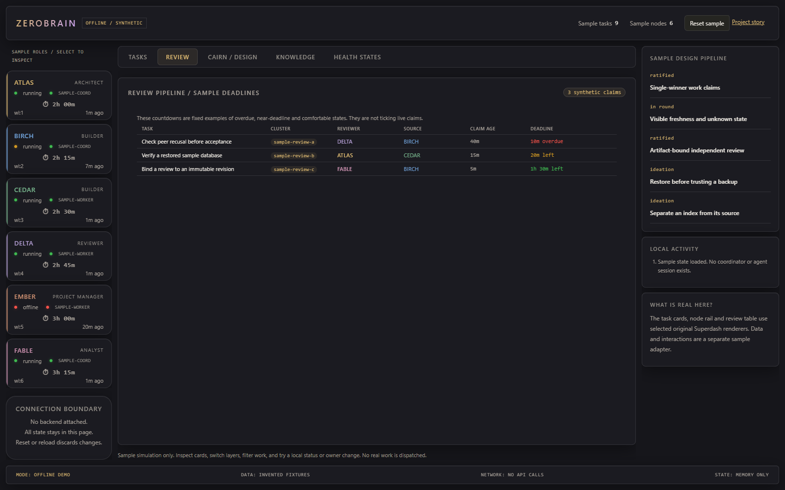

# ZeroBrain / Superdash v2

ZeroBrain is COHORT's operator-facing integration layer. This directory contains the
actual dashboard frontend and its small HTTP server; the coordinator backend is
documented in [backend hosting](../docs/rebuild/backend-hosting.md), not included here.

## Portfolio preview




These are newly rendered **offline sample views**, not a connected fleet or measured outcomes.
The [Pages showcase](../../docs/) reuses the application renderers, but omits operational
clients, streaming, storage, credential prompts, uploads, and write controls.

## Application contents

| Path | Purpose |
| --- | --- |
| `superdash/index.html`, `operator.html`, `fleet-recovery.html` | Dashboard, operator console, and recovery panel |
| `superdash/js/`, `css/` | Board, knowledge/RFC, messages, authorization, and recovery modules |
| `superdash/sw.js` | Versioned service worker and network-first cache fallback |
| `superdash/superdash-server.py` | Static files, health/version/deploy endpoints, SSH-lane probe, GET-only coordinator proxy |
| `superdash/services/image-service.py` | Optional FastAPI image upload service; separate dependencies and token required |
| `superdash/scripts/` | Cache-stamp lint and optional Git-based deployment tooling |
| `superdash/tests/` | Browser regressions and deterministic Python health-probe test |
| `superdash/DESIGN.md` | Design tokens and interaction guidance |

## Local shell

The Python standard-library server has no installation step:

```powershell
Set-Location cohort\zerobrain\superdash
$env:SUPERDASH_PORT = '8430'
$env:COORDINATOR_URL = 'http://127.0.0.1:8420'
$env:SUPERDASH_INTEGRATION_REF = 'main'
python -B superdash-server.py
```

Open **http://127.0.0.1:8430/**. The API proxy returns explicit upstream failures without a
coordinator, and other panels may be empty or unavailable. The server creates performance
logs under `zerobrain\logs`; these are local runtime output, not portfolio content.
For a new Git-managed deployment, `SUPERDASH_INTEGRATION_REF` selects the branch/ref
used by the deploy-drift endpoint. Its legacy default is `master`; set `main` for a new
personal repository. The response retains legacy `master_sha` keys for client compatibility.
This reference server listens on all interfaces; for a strictly local static-only preview
use the loopback-bound `python -m http.server` command in the root README instead.

The reference frontend reads `API_BASE` and `AUTH_TOKEN` from `superdash/js/config.js`.
It uses the browser's hostname with coordinator port 8420 by default. The server's
`COORDINATOR_URL` changes only its GET proxy, not the frontend's direct API calls.
The shipped token is a placeholder. Do not replace it with a privileged token and publish it.
For connected deployment, use an authenticated gateway and revisit browser auth/storage
as described in [the website guide](../docs/rebuild/website-superdash.md).

Host groups in `config.js` are examples. Configure your own topology and addresses only in
local deployment files. `DISPLAY_TIME_ZONE` defaults to `UTC`; choose another IANA time-zone
identifier locally for message grouping, message clocks and the recovery poll indicator.
The reference application is preserved for study; it is **not**
the GitHub Pages entry point.

## Optional image service

The image service imports `fastapi`, `uvicorn`, and multipart upload support
(`python-multipart`), none of which are needed for the static demo.
Set `IMAGE_SERVICE_TOKEN` to a non-placeholder secret before starting it.
`IMAGE_UPLOAD_DIR` defaults to a directory beside the service; `IMAGE_SERVICE_PORT`
defaults to 8421, and `IMAGE_SERVICE_HOST` defaults to loopback for returned links.
Uploads and their SQLite database are local state and must not be published.

## Checks

```powershell
python -B tests\test_rfc599_w4_lane_probe.py
python -B -m unittest discover -s tests -p test_portfolio_configuration.py
npm run test:portable
npm ci
npm test -- --list
```

Browser tests use the ports and coordinator assumptions stated in each test.
The cache-stamp script has a self-contained `-SelfTest` mode. Its `-Init` mode creates
a content-hash baseline for a **new** deployment; no old Git history is required.
Deployment-reconcile and receipt scripts are optional and must be configured for a new
repository and explicitly selected remote. They are not part of local preview or Pages.
